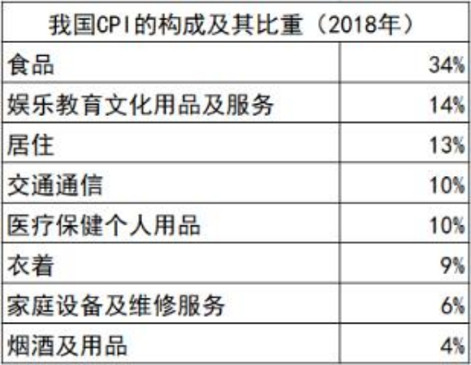

## 通货膨胀与房产投资

### 术语

* 存款类：定期存款、国债，只与钱有关
* 股权类：基金、股票、房产类，与实物有关
* 泡沫：东西的价格高于本身的价格

### 理财建议

* 接受一部分钱的通货膨胀，以备不时之需
* 做好保障，风险无处不在(例如保险)
* 把钱投到钱生钱的地方
* 自我提升

### 房贷结清是否有必要

假设贷款30利息是100万，按照每年通货膨胀率3%，4%，5%计算，30年后

1000000/(1.03^30)=411986.759
1000000/(1.04^30)=308318.667
1000000/(1.05^30)=231377.448

### CPI 居民消费价格指数

### 投资陷阱

* 用发展下线的方式来支付前面的投资者，当没有新人加入时，就会崩盘
* 崩盘之后用重启模式，即想要拿回原来的钱，就需要继续投钱，重启的实质是继续骗钱

### 防范投资陷阱

* 弄清每个投资背后的原理，清楚赚谁的钱
* 先学习再投资
* 不要相信太高的无风险投资收益率

## 保险

### 社保

* 养老保险：退休时拿
* 医疗保险：治病打折，不是所有的都能报销
* 工伤、生育、失业：因工受伤、生娃、失业

社保有用，但只能保障最基本的生活

### 商业人身保险

* 重大疾病险
    重大疾病险，只保障花费大、治疗时间长、严重影响日常工作的疾病
* 商业医疗险
    保障一些小病，需要先花钱，再报销
* 寿险
    死亡险，优先给家庭经济支柱买，谁赚的最多，给谁买
* 意外险
    意外死亡或伤残，1.意外来自外部，自己做的不算；2.意外是突然而来；3.意外不能是你的本意；4.不包括疾病
    
### 买保险的正确顺序

谁现在赚得多，就先给谁买保险，然后再为家里的老人孩子买保险
