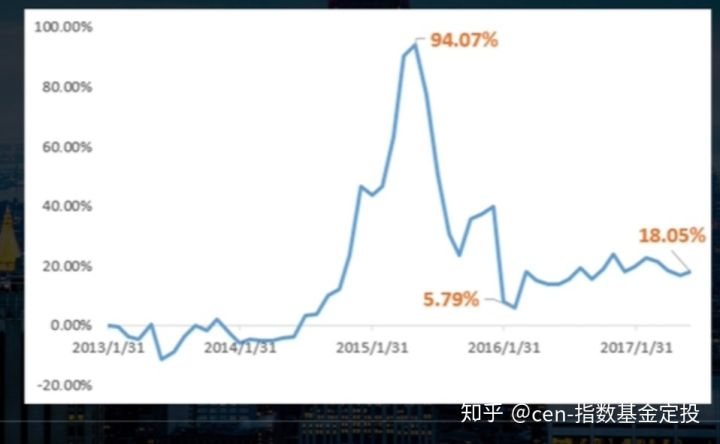
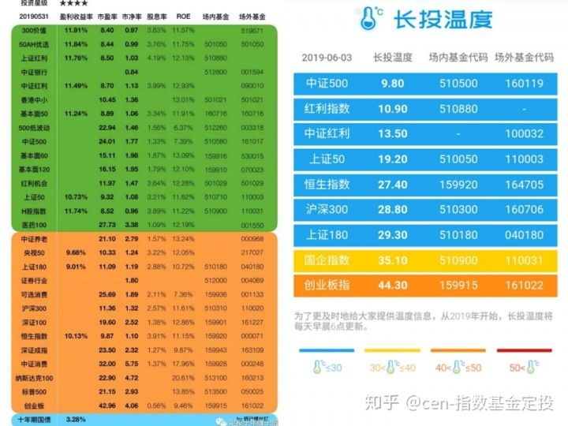
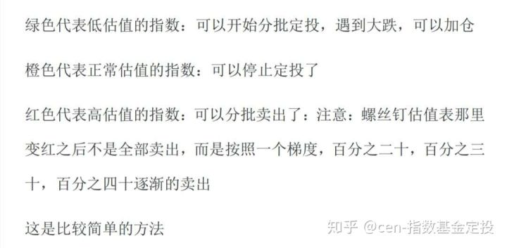

## 指数基金定投

#### 首先看第一个问题，普通人选择哪种理财方式比较好?

* 银行理财：起点高，利率低
* 货币基金：利率逐渐下降
* 信托产品、私募产品：门槛高
* 债券类投资：风险收益适中，时间不宜过短
* 基金、股票：需要时间精力，心态过硬，有知识储备
* 指数基金定投：波动明显低于基金和股票，最适合普通投资者的理财方式，中长期投资工具

#### 第二个问题：指数基金到底有什么优点呢？

长生不老、长期上涨、规避风险

#### 第三个问题：普通人如何选择指数基金?

实力强大的、成立时间久的、规模大的

掌握这些基金就可以战胜大部分基金经理
* 国内
    * 上证50
        * 场内：华夏上证50ETF代码：510050
        * 场外：易方达上证50指数A：110003
    * 沪深300
        * 场内：华泰博瑞沪深300ETF代码：510300
        * 场外：易方达沪深300联接A：110020
    * 中证500
        * 场内：南方中证500ETF代码：510500
        * 场外：南方中证500ETF联接A：160119
    * 创业版（风险高，建议初学者先不入）
        * 场内：易方达创业版ETF代码：159915
        * 场外：富国创业版指数分级：161022        
    * 红利指数
        * 场内：上证红利ETF代码：510880
        * 场外：富国中证红利指数增强：100032  
    * 其他
        * 50AH优选：501050
        * 华宝红利基金：501029
* 国外
    * 香港
        * 恒生指数基金
            * 场内：华夏公司恒生ETF代码：159920
            * 场外：汇添富恒生指数分级：164705          
        * 国企指数H股
            * 场内：易方达H股ETF代码：510900
            * 场外：易方达恒生中国企业ETF联接：110031  
    * 美国
        * 纳斯达克100指数
            * 场内：国泰纳斯达克100ETF：513100
            * 场外：国泰纳斯达克100指数：160213  
        * 标普500指数
            * 场内：博时标普500ETF：513500
            * 场外：博时标普500ETF联接：050025  
    * 德国
        * 德国的DX30指数基金
            * 场内：华安德国DX30ETF：513030
            * 场外：华安国际龙头(DAX)ETF联接：000614  

只要在低估值的时候开始定投，正常值停止定投，高估值卖出，轮动投资，定期调平， 相信你可以战胜大部分专业的基金经理。

#### 第四个问题：那么新手要如何购买指数基金呢，具体如何操作，买场内还是场外好呢，适合小白？

* 场内基金（购买场所：股票交易所内交易）
    * 优点
        * 交易迅速，当天卖了，第二天就能提现
        * 追踪指数更准确，场内基金基于实物购买
        * 费率低，大概万分之三左右
    * 缺点
        * 需要手动定投，无法自动定投
        * 可选数量有限，可选面不大
        * 类似股票买卖，最低要1手起，也就是100份额的基金
* 场外基金（购买场所：网络平台或者基金公司）
    * 优点
        * 可以自动定投，还可以基金间转换
        * 不需要开股票账户，场外基金通过基金公司，银行，第三方网站等开放式基金账户买卖
        * 品种丰富，满足需求
        * 门槛低，1元也可以
    * 缺点
        * 交易慢，赎回需要3-4天，节假日顺延
        * 交易费率略高

#### 第五个问题：我们新手到底要如何选择指数基金呢？

1. 要选择低估值的，估值表上处于绿色的位置，也就是说便宜的时候开始买入。

2. 要挑选规模通常在一个亿以上的基金才值得我们去投资。在哪里看一个亿呢？看下面的图片画红圈的部分。可看晨星网星级排名，如下图。

3. 尽量选择宽基指数基金，而不是窄基指数基金。 为什么呢？行业的指数基金周期性比较强，波动比较大。 投资风险和难度都要大一些。等操作熟练了再去操作其他的。

4. 新手先从场外购买指数基金，场外交易简单，开户也比较方便。

5. 新手投资指数基金，最好是分散一些，选择国内，国外低估值产品购买。都是处于低估值的情况下我们配置比例如下：美国市场>香港市场>国内市场，当然需要分散配置，鸡蛋不要只放到一个篮子里。

6. 如果是新手，去投资指数基金，那么从基金名字中带“红利”品种开始定投；

#### 第六个问题：定投指数基金一定挣钱吗?

购买时选择指数基金的配置和买卖的时机非常重要，设置止盈点和回撤点很重要。

#### 第七个问题：定投指数基金何时买，何时卖呢？

* 银行螺丝钉法

* 长投温度法

根据表格找到定投开始的时机，并且根据自己的情况设置止盈点和回撤点，不要太贪心，达到目标就要分批卖出