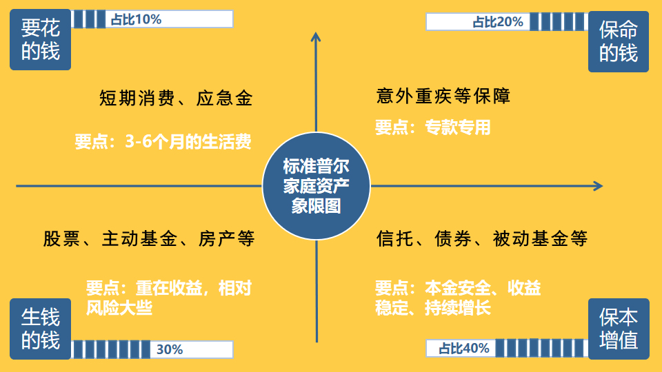
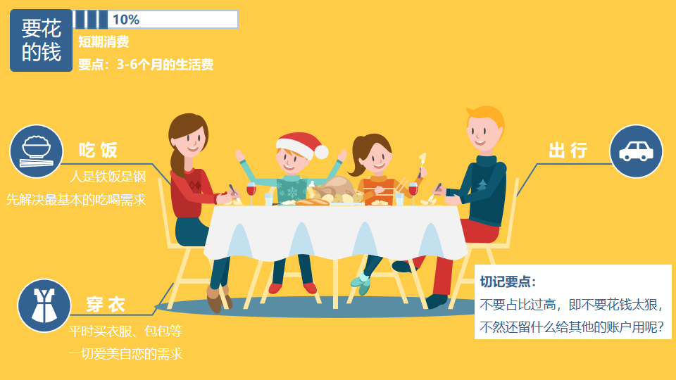
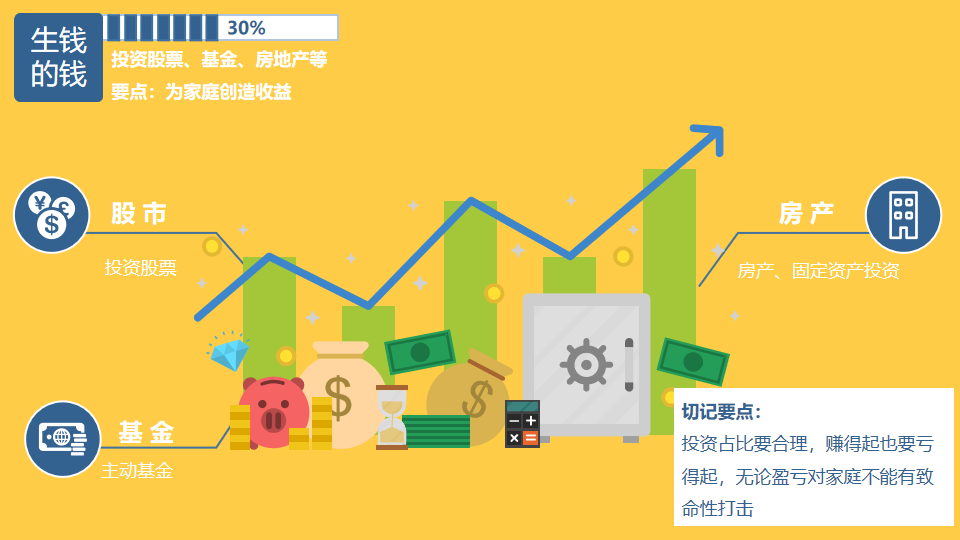
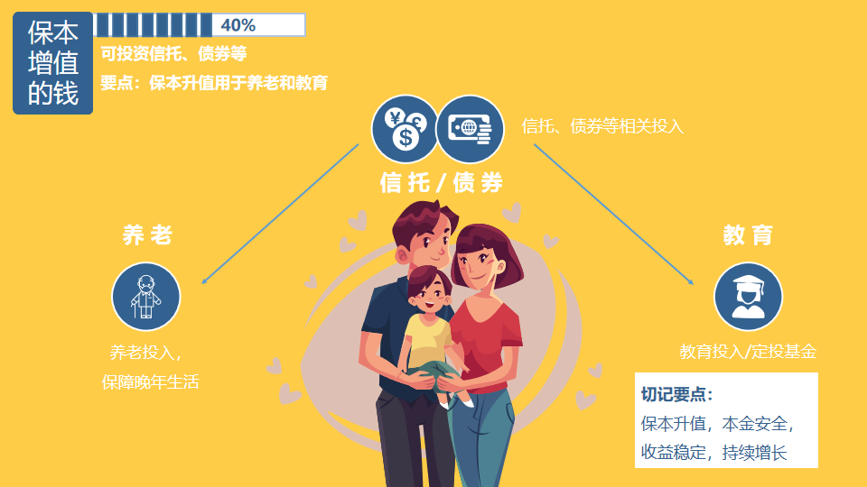

## 富人的思维

* 善用借来的钱，不讨厌负债
* 应当尽可能少的偿还贷款，也就是分期付款
* 增加被动收入，储蓄养鹅
* 投资自己

## 资产配置

* 要花的钱

要点：满足短期消费

* 保命的钱（杠杆账户）

要点：专款专用，保命的钱

* 生钱的钱（投资收益账户）

要点：为家庭创造收益

* 保本升值的钱

要点：保本升值用于养老、教育

## 股票

股票的本质是公司的一份所有权，股票的背后是实实在在的公司

### 股票怎么赚钱

* 公司分红
* 低买高卖，赚取差价