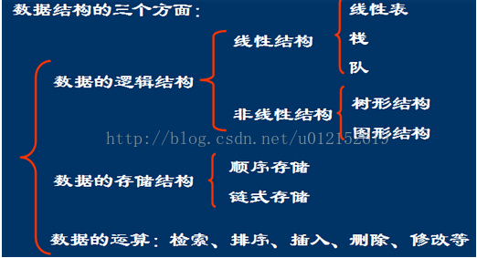

## 1.数据结构与算法概念解析

转载：[https://blog.csdn.net/wangshuminjava/article/details/80040673](https://blog.csdn.net/wangshuminjava/article/details/80040673)

### 1.1 数据结构

* 数据的逻辑结构
    * 线性结构
        * 线性表
        * 栈
        * 堆
    * 非线性结构
        * 树形结构
        * 图形结构
* 数据的存储结构
    * 顺序存储：用数据元素在存储器中的相对位置来表示数据元素之间的逻辑关系。 
    * 链式存储：在每一个数据元素中增加一个存放地址的指针，用此指针来表示数据元素之间的逻辑关系。
* 数据的运算
    * 检索、排序、插入、删除、修改等

### 1.2 逻辑结构    

数据之间的相互关系称为**逻辑结构**。通常分为四类基本结构： 

* **集合**：结构中的数据元素除了同属于一种类型外，别无其它关系。 
* **线性结构**：结构中的数据元素之间存在一对一的关系。 
* **树型结构**：结构中的数据元素之间存在一对多的关系。 
* **图状结构或网状结构**：结构中的数据元素之间存在多对多的关系。

### 1.3 时间复杂度

一个算法花费的时间与算法中语句的执行次数成正比例，哪个算法中语句执行次数多，它花费时间就多。一个算法中的语句执行次数称为语句频度或**时间频度**。记为**T(n)**

在刚才提到的时间频度中，n称为问题的规模，当n不断变化时，时间频度T(n)也会不断变化。但有时我们想知道它变化时呈现什么规律。为此，我们引入时间复杂度概念。

一般情况下，算法中基本操作重复执行的次数是问题规模n的某个函数，用T(n)表示，若有某个辅助函数f(n),使得当n趋近于无穷大时，T(n)/f(n)的极限值为不等于零的常数，则称f(n)是T(n)的同数量级函数。记作T(n)=O(f(n)),称O(f(n)) 为算法的渐进时间复杂度，简称时间复杂度。

有时候，算法中基本操作重复执行的次数还随问题的输入数据集不同而不同，如在冒泡排序中，输入数据有序而无序，其结果是不一样的。此时，我们计算平均值。

常见的算法的时间 复杂度之间的关系为：

O(1) < O(logn) < O(n) < O(nlog n) < O(n^2) < O(2^n) < O(n!) < O(n^n) 

### 1.4 空间复杂度

空间复杂度：算法所需存储空间的度量，记作： 

      S(n)=O( f(n) )           

其中 n 为问题的规模。

一个算法在计算机存储器上所占用的存储空间，包括存储算法本身所占用的存储空间，算法的输入输出数据所占用的存储空间和算法在运行过程中临时占用的存储空间这三个方面。如果额外空间相对于输入数据量来说是个常数，则称此算法是原地工作。

算法的输入输出数据所占用的存储空间是由要解决的问题决定的，是通过参数表由调用函数传递而来的，它不随本算法的不同而改变。存储算法本身所占用的存储空间与算法书写的长短成正比，要压缩这方面的存储空间，就必须编写出较短的算法。

### 1.5 实例

#### 1.5.1 实例1

    int sum = 0;                       // 1
    for (int i = 1; i <= n; i++)       // n
        for (int j = 1; j <= n; j++)   // n^2
            sum++;                     // n^2
            
T(n) = 1+n+2n^2= O(n^2)

#### 1.5.2 实例2

    int a = 0; int b = 1;          // 1
    for (int i = 1; i <= n; i++)   // n
    {
        int s = a + b;             // n
        b = a;                     // n 
        a = s;                     // n
    }
    
T(n) = 1+4n =O(n)

#### 1.5.3 实例3

    int i=1;         //（1）
    while (i<=n)
        i=i*2;       //（2）
        
设语句2的频度是f(n)，则：2^f(n)<=n;f(n)<=log2(n)   

取最大值f(n)= log2(n),

T(n)=O(log2(n))