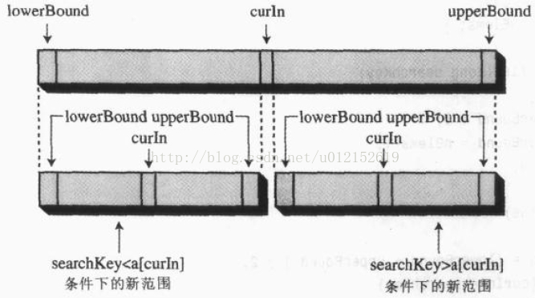

## 2.数据结构之数组

数组是应用最广泛的一种数据结构，常常被植入到编程语言中，作为基本数据类型使用，因此，在一些教材中，数组并没有被当做一种数据结构单独拿出来讲解（其实数组就是一段连续的内存，即使在物理内存中不是连续的，在逻辑上肯定是连续的）。其实没必要在概念上做纠缠，数组可以当做学习数据结构的敲门砖，以此为基础，了解数据结构的基本概念以及构建方法

数据结构不仅是数据的容器，还要提供对数据的操作方法，比如检索、插入、删除、排序等

### 2.1 无序数组

下面我们建立一个类，对数组的检索、插入、删除、打印操作进行封装，简便起见，我们假设数组中没有重复值（实际上数组可以包含重复值）

    public class Array {
        private String[] strArray;
        private int length = 0;       //数组元素个数
    
        //构造方法，传入数组最大长度
        public Array(int max) {
            strArray = new String[max];
        }
    
        //检测数组是否包含某个元素，如果存在返回其下标，不存在则返回-1
        public int contains(String target) {
            int index = -1;
            for (int i = 0; i < length; i++) {
                if (strArray[i].equals(target)) {
                    index = i;
                    break;
                }
            }
            return index;
        }
    
        //插入
        public void insert(String elem) {
            strArray[length] = elem;
            length++;
        }
    
        //删除某个指定的元素值，删除成功则返回true，否则返回false
        public boolean delete(String target) {
            int index = -1;
            if ((index = contains(target)) != -1) {
                for (int i = index; i < length - 1; i++) {
                    //删除元素之后的所有元素前移一位
                    strArray[i] = strArray[i + 1];
                }
                length--;
                return true;
            } else {
                return false;
            }
        }
    
        //列出所有元素
        public void display() {
            for (int i = 0; i < length; i++) {
                System.out.print(strArray[i] + "\t");
            }
        }
    }
    
**无序数组的优点**：插入快，如果知道下标，可以很快的存取

**无序数组的缺点**：查找慢，删除慢，大小固定。

### 2.2 有序数组

所谓的有序数组就是指数组中的元素是按一定规则排列的，其好处就是在根据元素值查找时可以是使用**二分查找**，查找效率要比无序数组高很多，在数据量很大时更加明显。当然缺点也显而易见，当插入一个元素时，首先要判断该元素应该插入的下标，然后对该下标之后的所有元素后移一位，才能进行插入，这无疑增加了很大的开销。

因此，有序数组适用于查找频繁，而插入、删除操作较少的情况

有序数组的封装类如下，为了方便，我们依然假设数组中是没有重复值的，并且数据是按照由小到大的顺序排列的 

    public class OrderArray {
        private int[] intArray;
        private int length = 0; // 数组元素个数
    
        // 构造方法，传入数组最大长度
        public OrderArray(int max) {
            intArray = new int[max];
        }
    
        // 用二分查找法定位某个元素，如果存在返回其下标，不存在则返回-1
        public int find(int target) {
            int lowerBound = 0; // 搜索段最小元素的小标
            int upperBound = length - 1; // 搜索段最大元素的下标
            int curIn; // 当前检测元素的下标
    
            if (upperBound < 0) { // 如果数组为空，直接返回-1
                return -1;
            }
    
            while (true) {
                curIn = (lowerBound + upperBound) / 2;
    
                if (target == intArray[curIn]) {
                    return curIn;
                } else if (curIn == lowerBound) { // 在当前下标与搜索段的最小下标重合时，代表搜索段中只包含1个或2个元素
                    // 既然走到该分支，证明上一个if分支不满足，即目标元素不等于低位元素
                    if (target == intArray[upperBound]) { // 等于高位元素，返回
                        return upperBound;
                    } else { // 高位元素也不等于目标元素，证明数组中没有该元素，搜索结束
                        return -1;
                    }
                } else {// 搜索段中的元素至少有三个，且当前元素不等于目标元素
                    if (intArray[curIn] < target) {
                        // 如果当前元素小于目标元素，则将下一个搜索段的最小下标置为当前元素的下标
                        lowerBound = curIn;
                    } else {
                        // 如果当前元素大于目标元素，则将下一个搜索段的最大下标置为当前元素的下标
                        upperBound = curIn;
                    }
                }
            }
        }
    
        // 插入
        public void insert(int elem) {
            int location = 0;
    
            // 判断应插入位置的下标
            for (; location < length; location++) {
                if (intArray[location] > elem) {
                    break;
                }
            }
            // 将插入下标之后的所有元素后移一位
            for (int i = length; i > location; i--) {
                intArray[i] = intArray[i - 1];
            }
    
            // 插入元素
            intArray[location] = elem;
    
            length++;
        }
    
        // 删除某个指定的元素值，删除成功则返回true，否则返回false
        public boolean delete(int target) {
            int index = -1;
            if ((index = find(target)) != -1) {
                for (int i = index; i < length - 1; i++) {
                    // 删除元素之后的所有元素前移一位
                    intArray[i] = intArray[i + 1];
                }
                length--;
                return true;
            } else {
                return false;
            }
        }
    
        // 列出所有元素
        public void display() {
            for (int i = 0; i < length; i++) {
                System.out.print(intArray[i] + "\t");
            }
            System.out.println();
        }
    
    }
    
有序数组最大的优势就是可以提高查找元素的效率，在上例中，find方法使用了二分查找法，该算法的示意图如下：

    
这个方法在一开始设置变量lowerBound和upperBound指向数组的第一个和最后一个非空数据项。通过设置这些变量可以确定查找的范围。然后再while循环中，当前的下标curIn被设置为这个范围的中间值

如果curIn就是我们要找的数据项，则返回下标，如果不是，就要分两种情况来考虑：如果curIn指向的数据项比我们要找的数据小，则证明该元素只可能在curIn和upperBound之间，即数组后一半中（数组是从小到大排列的），下轮要从后半段检索；如果curIn指向的数据项比我们要找的数据大，则证明该元素只可能在lowerBound和curIn之间，下一轮要在前半段中检索

按照上面的方法迭代检索，直到结束

**有序数组的优点**：查找效率高

**有序数组的缺点**：删除和插入慢，大小固定