## 6.数据结构之二叉树

通过前面的学习，我们知道，有序数组可以利用二分查找法快速的查找特定的值，时间复杂度为O(log2N)，但是插入数据时很慢，时间复杂度为O(N)；链表的插入和删除速度都很快，时间复杂度为O(1)，但是查找特定值很慢，时间复杂度为O(N)。

那么，有没有一种数据结构既能像有序数组那样快速的查找数据，又能像链表那样快速的插入数据呢？树就能满足这种要求。不过依然是以算法的复杂度为代价

在编程的世界里，有一个真理叫“**复杂度守恒定律**”（当然，这是我杜撰的），一个程序当它降低了一个方面的复杂度，必然会在其他方面增加复杂度。这就跟谈恋爱一样，也没有无缘无故的爱，没有无缘无故的恨，当你跟程序谈恋爱时，没有无缘无故的易用性，也没有无缘无故的复杂度

### 6.1 树的相关概念

我们先从广义上来讨论一下树的概念

树其实是范畴更广的图的特例

下面是一个普通的非二叉树

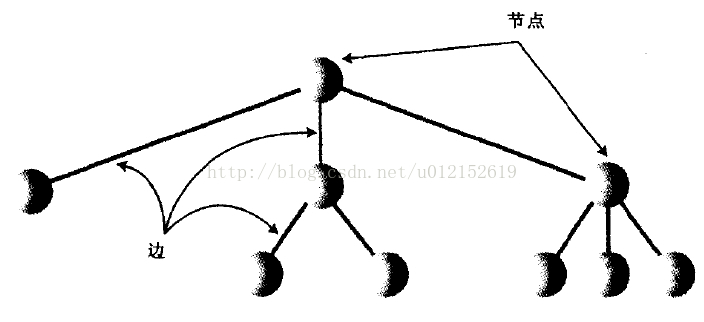

在程序中，节点一般用来表示实体，也就是数据结构里存储的那些数据项，在java这样的面向对象的编程语言中，常用节点来表示对象

节点间的边表示关联节点间的路径，沿着路径，从一个节点到另一个节点很容易，也很快，在树中，从一个节点到另一个节点的唯一方法就是顺着边前进。java语言中，常用引用来表示边（C/C++中一般使用指针）

树的顶层总是只有一个节点，它通过边连接到第二层的多个节点，然后第二层也可以通过边连接到第三层，以此类推。所以树的顶部小，底部大，呈倒金字塔型，这和现实世界中的树是相反的

如果树的每个节点最多有两个子节点，则称为**二叉树**。如果节点的子节点可以多余两个，称为**多路树**

有很多关于树的术语，在这里不做过多的文字解释，下面给出一个图例，通过它可以直观地理解树的路径、根、父节点、子节点、叶节点、子树、层等概念

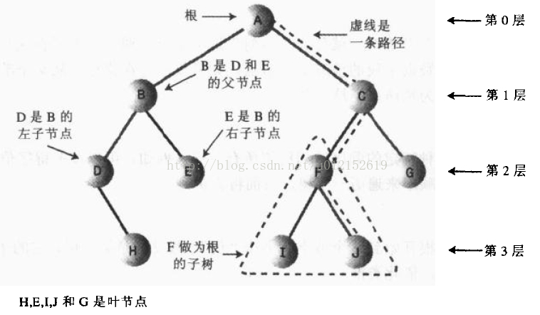

需要注意的是，**从树的根到任意节点有且只有一条路径可以到达**

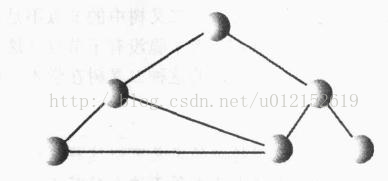

### 6.2 二叉搜索树

我们从一种特殊的、使用很广泛的二叉树入手：**二叉搜索树**。

二叉搜索树的特点是，一个节点的左子节点的关键字值小于这个节点，右子节点的关键字值大于或等于这个父节点。下图就是一个二叉搜索树的示例：

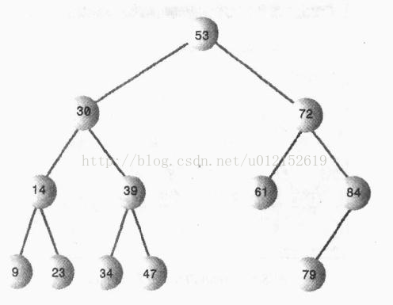

关于树，还有一个**平衡树**与**非平衡树**的概念。非平衡就是说树的大部分节点在根的一边，如下图所示：

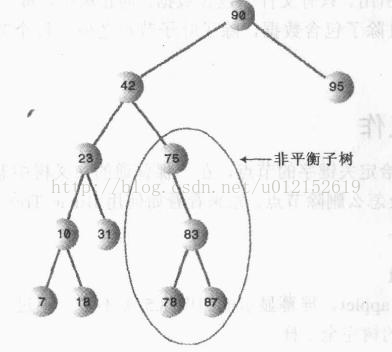

树的不平衡是由数据项插入的顺序造成的。如果关键字是随机插入的，树会更趋向于平衡，如果插入顺序是升序或者降序，则所有的值都是右子节点或左子节点，这样生成的树就会不平衡了。非平衡树的效率会严重退化

接下来我们就用java语言实现一个二叉搜索树，并给出查找、插入、遍历、删除节点的方法

首先要有一个封装节点的类，这个类包含节点的数据以及它的左子节点和右子节点的引用

    public class Node {
    
        int age;
        String name;
        Node leftChild;  //左子节点的引用
        Node rightChild; //右子节点的引用
    
        public Node(int age, String name) {
            this.age = age;
            this.name = name;
        }
    
        //打印该节点的信息
        public void displayNode() {
            System.out.println("name:" + name + ",age:" + age);
        }
    
    }
    
**查找**

我们已经知道，二叉搜索树的特点是左子节点小于父节点，右子节点大于或等于父节点。查找某个节点时，先从根节点入手，如果该元素值小于根节点，则转向左子节点，否则转向右子节点，以此类推，直到找到该节点，或者到最后一个叶子节点依然没有找到，则证明树中没有该节点

比如我们要在树中查找57，执行的搜索路线如下图所示：

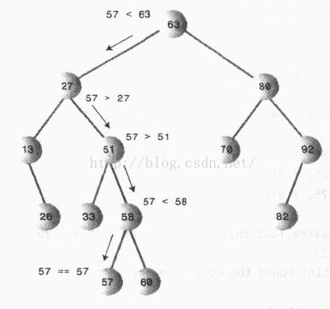

**插入**

插入一个新节点首先要确定插入的位置，这个过程类似于查找一个不存在的节点。如下图所示：

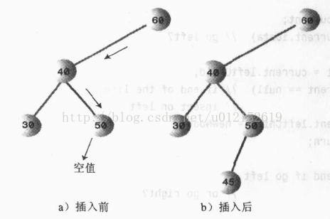

找到要插入的位置之后，将父节点的左子节点或者右子节点指向新节点即可

**遍历**

遍历的意思是根据一种特定顺序访问树的每一个节点

有三种简单的方法遍历树：**前序遍历**、**中序遍历**、**后序遍历**。二叉搜索树最常用的方法是中序遍历，中序遍历二叉搜索树会使所有的节点按关键字升序被访问到

遍历树最简单的方法是递归。用该方法时，只需要做三件事（初始化时这个节点是根）：

1、调用自身来遍历节点的左子树

2、访问这个节点

3、调用自身来遍历节点的右子树

遍历可以应用于任何二叉树，而不只是二叉搜索树。遍历的节点并不关心节点的关键字值，它只看这个节点是否有子节点

下图展示了中序遍历的过程：

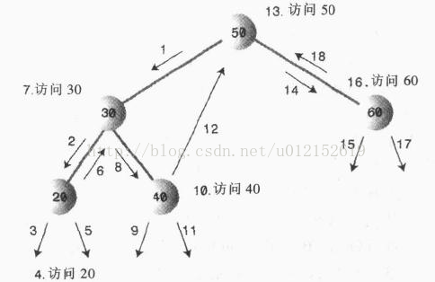

对于每个节点来说，都是先访问它的左子节点，然后访问自己，然后在访问右子节点

如果是前序遍历呢？就是先访问父节点，然后左子节点，最后右子节点；同理，后序遍历就是先访问左子节点，在访问右子节点，最后访问父节点。所谓的前序、中序、后序是针对父节点的访问顺序而言的

**查找最值**

在二叉搜索树中，查找最大值、最小是是很容易实现的，从根循环访问左子节点，直到该节点没有左子节点为止，该节点就是最小值；从根循环访问右子节点，直到该节点没有右子节点为止，该节点就是最大值

下图就展示了查找最小值的过程：

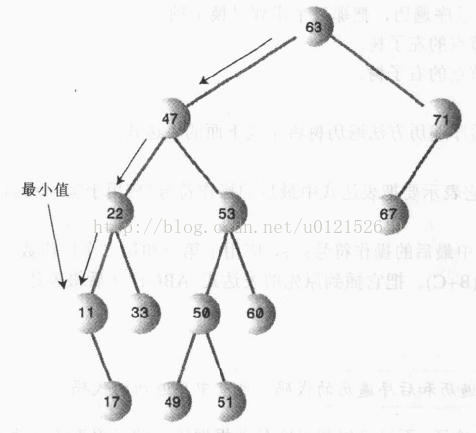

**删除节点**

树的删除节点操作是最复杂的一项操作。该操作需要考虑三种情况考虑：

1、该节点没有子节点

2、该节点有一个子节点

3、该节点有两个子节点

第一种没有子节点的情况很简单，只需将父节点指向它的引用设置为null即可：

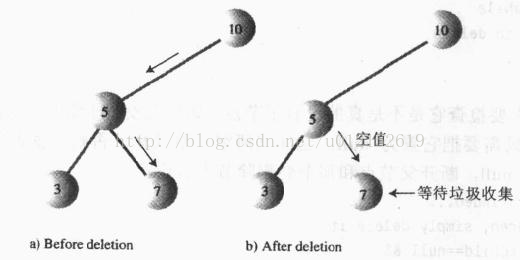

第二种情况也不是很难，这个节点有两个连接需要处理：父节点指向它的引用和它指向子节点的引用。无论要删除的节点下面有多复杂的子树，只需要将它的子树上移：

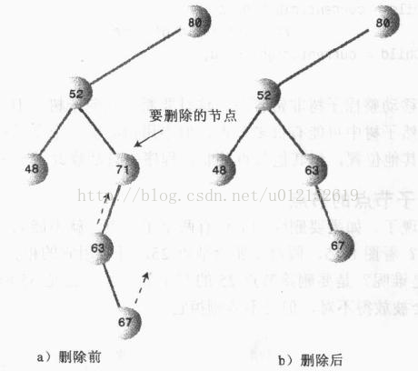

还有一种特殊情况需要考虑，就是要删除的是根节点，这时就需要把它唯一的子节点设置成根节点

下面来看最复杂的第三种情况：要删除的节点有两个子节点。显然，这时候不能简单地将子节点上移，因为该节点有两个节点，右子节点上移之后，该右子节点的左子节点和右子节点又怎么安排呢？

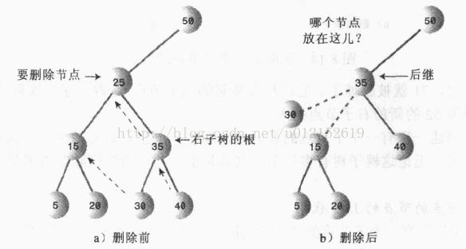

这是应该想起，二叉搜索树是按照关键升序排列，对每一个关键字来说，比它关键字值高的节点是它的中序后继，简称后继。删除有两个子节点的节点，应该用它的中序后继来替代该节点

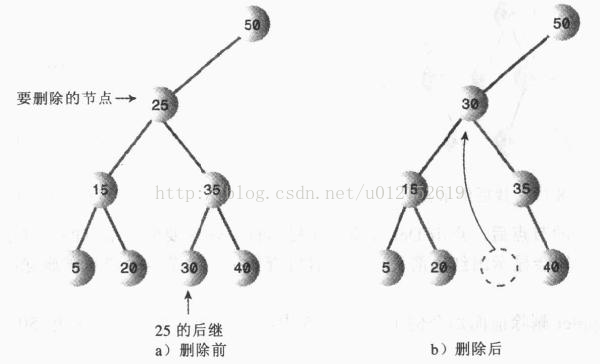

上图中，我们先列出中序遍历的顺序：

5    15   20  25   30   35   40

可以看到，25的后继是35，所以应该用30来替代25的位置。实际上就是找到比欲删除节点的关键字值大的集合中的最小值。从树的结构上来说，就是从欲删除节点的右子节点开始，依次跳到下一层的左子节点，直到该左子节点没有左子节点为止。下图就是找后继节点的示例：

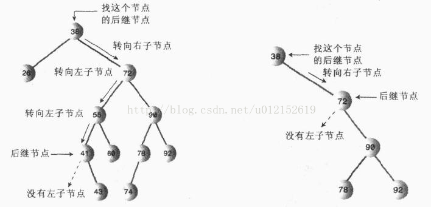

从上图中可以看到，后继结点有两种情况：一种是欲删除节点的右子节点没有左子节点，那么它本身就是后继节点，此时，只需要将以此后继节点为根的子树移到欲删除节点的位置：

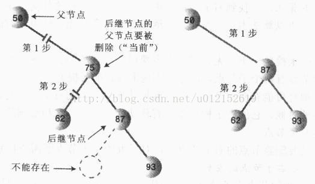

另一种情况是欲删除节点的右子节点有左子节点，这种情况就比较复杂，下面来逐步分析。首先应该意识到，后继节点是肯定没有左子节点的，但是可能会有右子节点

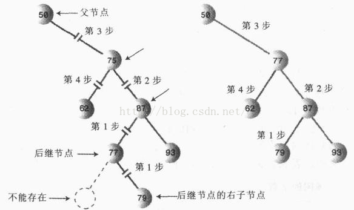

上图中，75为欲删除节点，77为它的后继节点，树变化的步骤如下：

1、把87的左子节点设置为79；

2、把77的右子节点设为以87为根的子树；

3、把50的右子节点设置为以77为根的子树；

4、把77的左子节点设置为62

到此为止，删除操作终于分析完毕，包含了所有可能出现的情况。可见，二叉树的删除是一件非常棘手的工作，那么我们就该反思了，删除是必须要做的任务吗？有没有一种方法避开这种烦人的操作？有困难要上，没有困难创造困难也要上的二货精神是不能提倡的

在删除操作不是很多的情况下，可以在节点类中增加一个布尔字段，来作为该节点是否已删除的标志。在进行其他操作，比如查找时，之前对该节点是否已删除进行判断。这种思路有点逃避责任，但是在很多时候还是很管用的。本例中为了更好的深入理解二叉树，会采用原始的、复杂的删除方法
