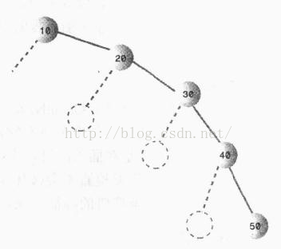
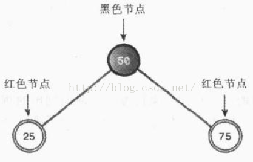
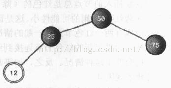
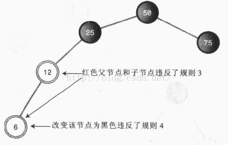
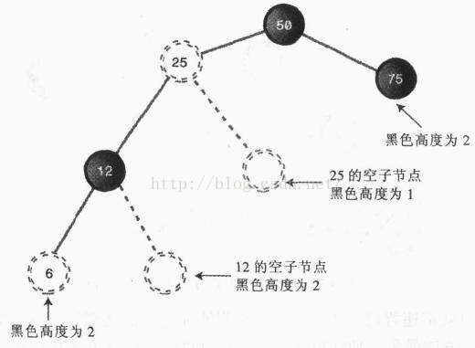
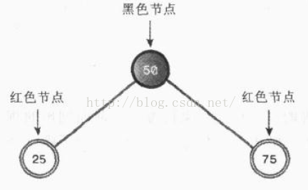
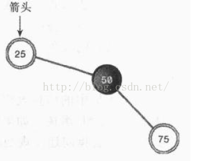
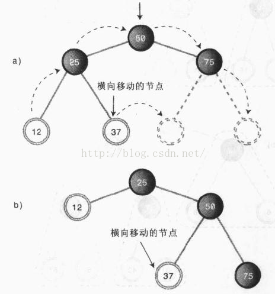
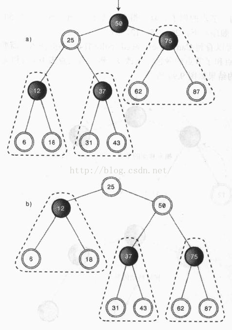

## 8.1.数据结构之红黑树-基础分析

在二叉树中已经探讨过，如果按照随机顺序插入树节点，绝大多数都会出现不平衡的情况。最坏的情况，插入的数据时有序的，二叉树将会变成链表，插入、删除的效率将会严重地降低

下图就是按照数据升序的顺序插入二叉树的情况：

红黑树就是一种解决非平衡树的方法，它是增加了某些特点的二叉搜索树

为了能较快的时间来搜索一颗树，需要保证树总是平衡的（或者至少大部分是平衡的），就是说对树中的每个节点，它左边的后代数量和它右边的后代数量应该大致相等

### 红黑规则

当插入（或者删除）一个节点时，必须遵循一定的规则，它们被称为红黑规则。如果遵循这些规则，树就是平衡的

1、每一个节点不是黑色就是红色

2、根总是黑色的

3、如果节点是红色的，则它的子节点必须是黑色的，反之则不一定成立

4、从根到叶节点或空子节点的每条路径，必须包含相同数目的黑色节点

规则4中的空子节点是指非叶节点可以接子节点的位置。换句话说，就是一个有右子节点的可能接左子节点的位置，或者是有左子节点的节点可能接右子节点的位置。

从根节点到叶节点路径上的黑色节点的数目被称为黑色高度

这些约束强制了红黑树的关键性质: 从根到叶子的最长的可能路径不多于最短的可能路径的两倍长。结果是这个树大致上是平衡的。因为操作比如插入、删除和查找某个值的最坏情况时间都要求与树的高度成比例，这个在高度上的理论上限允许红黑树在最坏情况下都是高效的，而不同于普通的二叉查找树。

要知道为什么这些特性确保了这个结果，注意到规则4导致了路径不能有两个毗连的红色节点就足够了。最短的可能路径都是黑色节点，最长的可能路径有交替的红色和黑色节点。因为根据规则4所有最长的路径都有相同数目的黑色节点，这就表明了没有路径能多于任何其他路径的两倍长。

### 算法分析

首先，当插入第一个节点时，这个节点就是根节点，所以必须是黑色的

在增加新的节点的时候，我们先默认新节点都是红色的。为什么呢？因为插入一个红色节点违背红黑规则的可能性比插入一个黑色节点的要小。插入一个红色节点，肯定不会改变树的黑色高度；另外，如果插入节点的父节点是黑色节点，不会违背父子节点同时为红色的规则，如果插入节点的父节点是红色节点才会违背这一规则，这个时候就需要对树进行变换来适应规则。还有一点就是，违背规则3（父子节点都是红色）比违背规则4（黑色高度不同）要容易修正

下面我们来进行一些实验，依次插入50，25，75，就得到了下面这可二叉树

### 颜色变换

接下来，我们再增加一个值为12的新节点。按照二叉搜索树的规则，12应该插入25的左子节点，但是，由于我们默认新节点都是红色的，而25也是红色的，父子节点不能同时都为红色，这时就需要对25的父节点和其父节点的右子节点进行颜色变换，为什么还要对其父节点的右子节点也进行变换呢？试想，如果我们只将25变换成黑色而75保持红色不变，那么插入新节点之后，根节点的左子树的黑色高度势必会比右子树大1，这就违背了红黑规则

实际上，这种情况下，一般也需要将25的父节点变换颜色，因为此时25的父节点是根节点，所以保持黑色不变

插入12之后，生成下面的红黑树：

这时二叉树显得有一点不平衡，但是仍然符合红黑规则

接下来，我们再插入一个值为6的新节点。

问题出现了，6的父节点为12，红色，而新节点也是红色，违背了红黑原则。如果将6变换成黑色，则6到跟的黑色高度为3，而75到跟的高度为2，同样违背了红黑规则

按照上面的经验，如果我们将12和25的颜色都变换掉呢？

可见，仍然违背了红黑规则

就是说，一棵树如果超过了两层不平衡（一边的子树比另一边的子树高两层以上），是不可能满足红黑规则的，因为如果一条路径上的节点数比另一条路径上的节点数多一个以上，那它或者有更多的黑色节点，或者有两个相邻的红色节点，都会违背红黑规则。

我们陷入了一个困境，看来仅靠颜色变换是无法走出这个死胡同的。这时候就需要通过另外的途径来对红黑树进行变换了。

### 旋转

为了平衡一棵树，需要重新手动地排列节点，如果大部分节点都在某个参照点左侧，就需要把一些节点移到右侧，成为右旋；如果大部分节点都在某个参照点右侧，就需要把一些节点移到左侧，成为左旋。这里所说的左旋与右旋是相对于参照点而言的

来看一个实例：

以根为中心，进行一次右旋之后的结果如下：

右旋的时候，以50为中心，周围的节点进行了顺时针旋转

如果我们已上图中的25为中心，进行一次逆向操作——左旋，将25周围的节点进行逆时针旋转，就又回到了旋转之前的样子

需要注意的时，旋转的时候仍然要遵循搜索二叉树的规则。比如在对第一幅图中的树进行右旋的时候，节点25以50为中心顺时针旋转，只能旋转到50的左上方，因为25比50小；而75比50大，不能再沿着顺时针方向转动了，所以它仍然在50的右下方保持相对位置不变。

无论是左旋还是右旋，比该节点小的值只能在该节点则左下方或者左上方；比该节点大的值只能在该节点的右下方或者右上方。这样才符合搜索二叉树的规则。

其实，旋转远比上面的简单例子要复杂，再来看一个例子：

我们对一个两层、五个节点的树进行右旋，75比50大，仍然在50的右下方，而25比50小，从50的左下方移到了50的左上方，12作为25的左子节点没有变，但是所在层数有第三层变成了第二层。可以发现，以50为中心右旋之后，50右侧的节点都下降了一个层级（包括50本身），而50左侧的节点都上升了一个层级。

但是，其中发生了一件奇怪的事，就是37从直观上来看，放生了横向移动，从左子树移动到了右子树。让我们分析一下出现这种情况的原因：左子树集体升高了一个层级，37作为25的右子节点，本来也应该水涨船高，随着50上升一个层级，但是，此时25的右子节点已经被50先入为主的占据了，如此一来，37只好沿着右子树重新找家，最后就只能委屈地在50的左下方扎根。

在上例中中，37就被称为50节点右旋操作的内侧子孙，而12就是外侧子孙。

其实，整棵子树也会发生集体的移动，比如：

