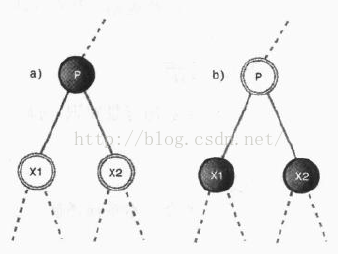
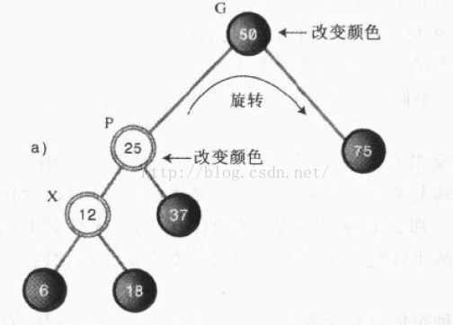
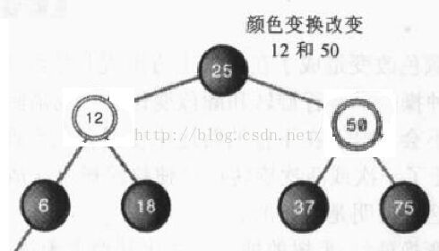
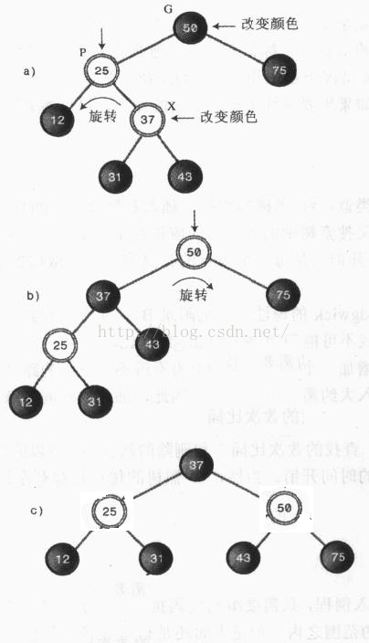
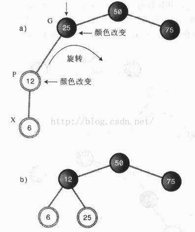
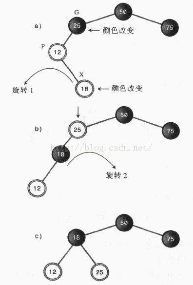

# 8.2.数据结构之红黑树-插入操作

插入或删除操作，都有可能改变红黑树的平衡性，利用**颜色变化**与**旋转**这两大法宝就可应对所有情况，将不平衡的红黑树变为平衡的红黑树。

在进行颜色变化或旋转的时候，往往要涉及祖孙三代节点：X表示操作的基准节点，P代表X的父节点，G代表X的父节点的父节点。

我们先来大体预览一下插入的过程：

1、沿着树查找插入点，如果查找过程中发现某个黑色节点的两个子节点都是红色，则执行一次颜色变换（父节点变为红色，而两个红色子节点变为黑色）。

2、第1步中，不会改变子树的黑色高度，但是可能会出现颜色冲突（红-红颜色冲突），执行一次或两次旋转即可解决。设红色子节点为X，红色父节点为P，旋转次数由X是G的内侧子孙还是外侧子孙决定。

3、找到插入点之后，设X为新插入的节点。如果P是黑色的，则不需要做任何改变，插入完成。

4、如果P是红色的，则发生了红-红颜色冲突，需要做两次颜色变化，如果X为G的外侧子孙，再进行一次旋转；如果X为G的内侧子孙，再进行两次旋转。最终都可使树变为平衡的红黑树。

现在看不懂没关系，为何要这么做，我们接下来慢慢分析。

第1步与第2步看似与插入新节点没关系，其实为了给新节点的插入扫清道路，到后面插入新节点时就会体现出来。

上图中，查找到P点，发现它的两个子节点都是红色，则进行颜色变换（如果P是根，则保持黑色不变）。这种变换并不会改变从根节点经P到叶节点或者空节点的路径上的黑色节点总数，即不会改变其黑色高度。将P、X1、X2看做三角形的三个顶点，颜色变换之前，经过此三角形时会增加一个黑色节点，颜色变换之后，P变成了红色，X1、X2变成了黑色，不论是经过X1还是经过X2，还是会增加一个黑色节点。

如果P的父节点是黑色，则不会出现任何问题，但是，如果P的父节点也是红色，就会发生红-红颜色冲突，需要通过旋转来修正。发生颜色冲突时有两种情况需要区别对待。

注意，这时候我们选定红-红颜色冲突父子节点中的子节点作为基准节点，即X。如果X在P的一侧与P在G的一侧相同，X即为G的外侧子孙，反之，则为内侧子孙。

情况1：X为外侧子孙节点。

上图中，表示的是颜色变换之后的情况，12跟25节点发生了颜色冲突，12为50的外侧子孙。

在这种情况需要采取三步操作：

1、改变G的颜色；

2、改变P的颜色

3、以G为中心进行向X上升的方向旋转（本例中是右旋）。

奇迹发生了，树突然之间平衡了，而且是符合红黑规则的。

需要注意的是，在本例中，由于25是50的左子节点，进行的是右旋操作，加入它是右子节点，则需要进行左旋操作。无论是左旋还是右旋，都是向着X上升的方向旋转。

情况2：X为内侧子孙节点。

修正这种情况比较复杂一点，如果我们采取跟内侧子孙一样的做法，X不会上移而是发生横向移动，使树变得更加不平衡。因此需要一种不同的方法来解决。

我们先要用一次旋转让X成为外侧子孙，然后再用一次旋转使树平衡。

这种情况需要进行四步操作：

1、改变G的颜色；

2、改变X的颜色；

3、以P为中心向X上升的方向旋转；

4、以G为中心向X上升的方向旋转。

至此，前期工作已经完成，下面进行新节点的插入。在插入环节，我们以新节点为基准点，即X。

在前面已经说过，我们总是默认新节点为红色。那么，找到插入点的时候，会有两种情况，一种是X的父节点为P为黑色，直接插入即可（因为插入一个红色新节点既不会影响树的黑色高度，也不会发生颜色冲突）；另一种情况是X的父节点P也为红色，插入后会发生红-红颜色冲突，需要通过颜色变换与旋转来修正。

发生颜色冲突的时候，根据X是内侧子孙还是外侧子孙分别对待，处理方法与上面提到的方法类似。

外侧子孙：

内侧子孙：

下面我们来讨论一下，是否还有其他情况。

假如X有一个兄弟节点S，即P的另一个子节点，会使任何需要的旋转更加复杂。如果P为黑色，无论X有没有兄弟节点，都不需要旋转；如果P为红色，则插入之前，P不可能有一个单独的黑色子节点，因为这样会使S和空子节点的黑色高度不一样。综上，插入新节点之后，不会出现X存在兄弟节点而且需要旋转修正的情况。

假如P有一个兄弟节点，即X的叔节点U，也会使任何需要的旋转更加复杂。如果P为黑色，X插入后不要要做任何旋转；如果P为红色，则U必须为红色，否则，G到P的黑色高度与G到U的黑色高度就不同了。但是，有两个红色子节点的父节点在插入之前我们已经处理掉了，所以这种情况也不会存在。综上，插入新节点之后，不会出现P存在兄弟节点且需要旋转修正的情况。

到现在，就明白为什么要在寻找插入点的过程中，把有两个红色子节点的父节点的颜色变换掉，一方面是为了使树更加平衡，另一方面是大大简化了插入后的旋转操作。
