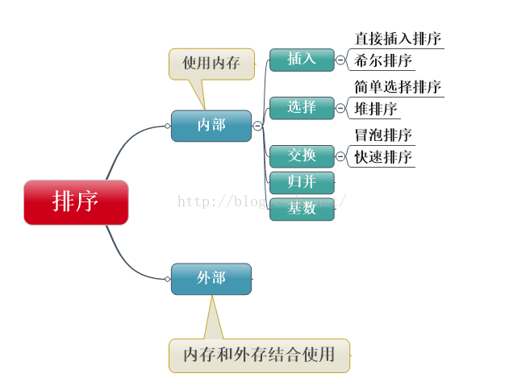
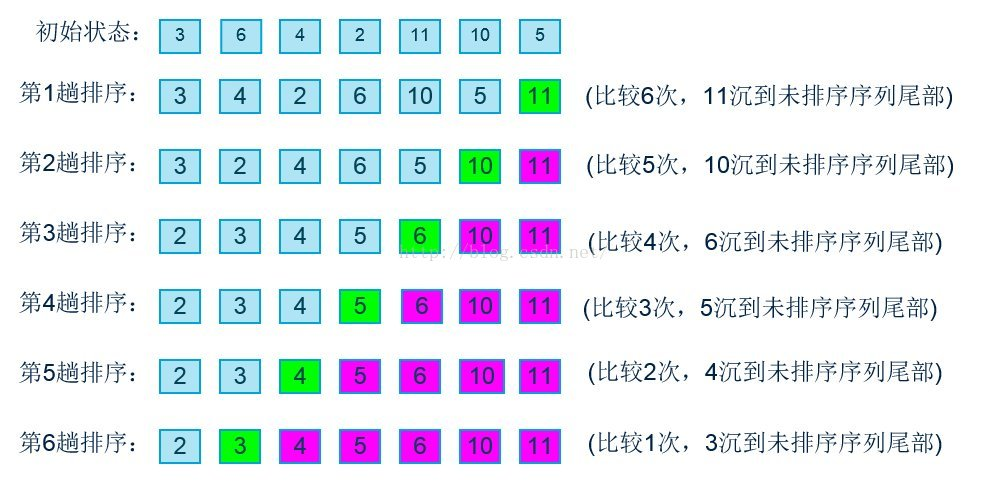

# 9.1.排序算法-冒泡排序

## 9.1.1 排序算法概述

所谓排序，就是使一串记录，按照其中的某个或某些关键字的大小，递增或递减的排列起来的操作。排序算法，就是如何使得记录按照要求排列的方法。排序算法在很多领域得到相当地重视，尤其是在大量数据的处理方面。

稳定性：一个排序算法是稳定的，就是当有两个相等记录的关键字R和S，且在原本的列表中R出现在S之前，在排序过的列表中R也将会是在S之前。

如果算法是稳定的有什么好处呢？排序算法如果是稳定的，那么从一个键上排序，然后再从另一个键上排序，第一个键排序的结果可以为第二个键排序所用。基数排序就是这样，先按低位排序，逐次按高位排序，低位相同的元素其顺序再高位也相同时是不会改变的。

排序算法根据是否需要访问外存分为内部排序和外部排序。

内部排序是指待排序列完全存放在内存中所进行的排序过程，适合不太大的元素序列。

外部排序指的是大文件的排序，即待排序的记录存储在外存储器上，待排序的文件无法一次装入内存，需要在内存和外部存储器之间进行多次数据交换，以达到排序整个文件的目的。



我们现在要讨论的排序都是内部排序。

## 9.1.2 冒泡排序

冒泡排序的效率很低，但是算法实现起来很简单，因此很适合作为研究排序的入门算法。

### 9.1.2.1 基本思想

对当前还未排好序的范围内的全部数，自上而下对相邻的俩个数依次进行比较和调整，让较大的数下沉，较小的数往上冒。即：每当俩相邻的数比较后发现他们的排序与排序的要求相反时，就将他们交换。每次遍历都可确定一个最大值放到待排数组的末尾，下次遍历，对该最大值以及它之后的元素不再排序（已经排好）。



```
protected void sort() {
    for (int j = 0; j < sort.length - 1; j++) {
        int max = sort[0];
        for (int i = 0; i < sort.length - 1 - j; i++) {
            if (max < sort[i + 1]) {
                max = sort[i + 1];
            } else {
                sort[i] = sort[i + 1];
                sort[i + 1] = max;
            }
        }
    }
}
```

## 9.1.3 算法分析

上面的例子中，待排数组中一共有7个数，第一轮排序时进行了6次比较，第二轮排序时进行了5比较，依次类推，最后一轮进行了一次比较。

加入元素总数为N，则一共需要的比较次数为：

(N-1)+ (N-2)+ (N-3)+ ...1=N*(N-1)/2

这样，算法约做了N2/2次比较。因为只有在前面的元素比后面的元素大时才交换数据，所以交换的次数少于比较的次数。如果数据是随机的，大概有一半数据需要交换，则交换的次数为N2/4（不过在最坏情况下，即初始数据逆序时，每次比较都需要交换）。

交换和比较的操作次数都与N2成正比，由于在大O表示法中，常数忽略不计，冒泡排序的时间复杂度为O(N2)。

O(N2)的时间复杂度是一个比较糟糕的结果，尤其在数据量很大的情况下。所以冒泡排序通常不会用于实际应用。

## 9.1.4 冒泡排序的改进

上面已经分析过，冒泡排序的效率比较低，所以我们要通过各种方法改进。

最简单的改进方法是加入一标志性变量exchange，用于标志某一趟排序过程中是否有数据交换，如果进行某一趟排序时并没有进行数据交换，则说明数据已经按要求排列好，可立即结束排序，避免不必要的比较过程

在上例中，第四轮排序之后实际上整个数组已经是有序的了，最后两轮的比较没必要进行。

改进后的代码如下：

```
protected void sort() {
    for (int j = 0; j < sort.length - 1; j++) {
        int max = sort[0];
        boolean exchange = false;  //设置交换变量
        for (int i = 0; i < sort.length - 1 - j; i++) {
            if (max < sort[i + 1]) {
                max = sort[i + 1];
            } else {
                sort[i] = sort[i + 1];
                sort[i + 1] = max;
                if (!exchange) {
                    exchange = true;  //发生了交换操作
                }
            }
        }
        if (!exchange) {
            break;  //如果上一轮没有发生交换数据，证明已经是有序的了，结束排序
        }
    }
}
```

对的算法来说，没有最好，只有更好。上面的两种改进方法其实治标不治本，是一种“扬汤止沸”的改进，下面我们来一次“釜底抽薪”的改进。

传统的冒泡算法每次排序只确定了最大值，我们可以在每次循环之中进行正反两次冒泡，分别找到最大值和最小值，如此可使排序的轮数减少一半。

改进代码如下：

```
protected void sort() {
    for (int j = 0; j < sort.length / 2; j++) {
        int min = sort[j];
        int max = sort[sort.length - 1 - j];
        if (min > max) {
            sort[j] = max;
            sort[sort.length - 1 - j] = min;
            min = sort[j];
            max = sort[sort.length - 1 - j];
        }
        for (int i = j; i < sort.length - 1 - j; i++) {
            if (min > sort[i + 1]) {
                min = sort[i + 1];
                sort[i + 1] = sort[j];
                sort[j] = min;
            }
            if (max < sort[i + 1]) {
                max = sort[i + 1];
                sort[i + 1] = sort[sort.length - 1 - j];
                sort[sort.length - 1 - j] = max;
            }
        }
    }
}
```
