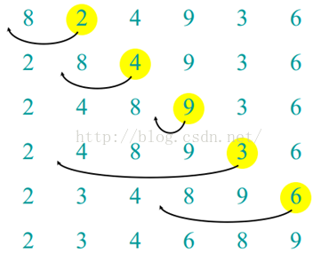

# 9.3.排序算法-插入排序

## 基本思想

在要排序的一组数中，假设前面(n-1)[n>=2] 个数已经是排好顺序的，现在要把第n个数找到相应位置并插入，使得这n个数也是排好顺序的。如此反复循环，直到全部排好顺序。



```
protected void sort() {
    int len = sort.length;
    for (int i = 1; i < len; i++) {
        int temp = sort[i];  //存储待排序的元素值
        int insertPoint = i - 1;  //与待排序元素值作比较的元素的下标
        while (insertPoint >= 0 && sort[insertPoint] > temp) { //当前元素比待排序元素大
            sort[insertPoint + 1] = sort[insertPoint];  //当前元素后移一位
            insertPoint--;
        }
        sort[insertPoint + 1] = temp;  //找到了插入位置，插入待排序元素
    }
}
```

## 算法分析

在第一趟排序中，插入排序最多比较一次，第二趟最多比较两次，依次类推，最后一趟最多比较N-1次。因此有：

1+2+3+...+N-1 =N*N(N-1)/2

因为在每趟排序发现插入点之前，平均来说，只有全体数据项的一半进行比较，我们除以2得到：

N*N(N-1)/4

复制的次数大致等于比较的次数，然而，一次复制与一次比较的时间消耗不同，所以相对于随机数据，这个算法比冒泡排序快一倍，比选择排序略快。

与冒泡排序、选择排序一样，插入排序的时间复杂度仍然为O(N2)，这三者被称为简单排序或者基本排序，三者都是稳定的排序算法。

如果待排序数组基本有序时，插入排序的效率会更高。

## 插入排序的改进

在插入某个元素之前需要先确定该元素在有序数组中的位置，上例的做法是对有序数组中的元素逐个扫描，当数据量比较大的时候，这是一个很耗时间的过程，可以采用二分查找法改进，这种排序也被称为二分插入排序。

改进后的代码如下：

```
protected void sort() {
    int len = sort.length;
    for (int i = 1; i < len; i++) {
        int temp = sort[i];  //存储待排序的元素值
        int insertPoint = i - 1;  //与待排序元素值作比较的元素的下标
        while (insertPoint >= 0 && sort[insertPoint] > temp) { //当前元素比待排序元素大
            sort[insertPoint + 1] = sort[insertPoint];  //当前元素后移一位
            insertPoint--;
        }
        sort[insertPoint + 1] = temp;  //找到了插入位置，插入待排序元素
    }
}
```