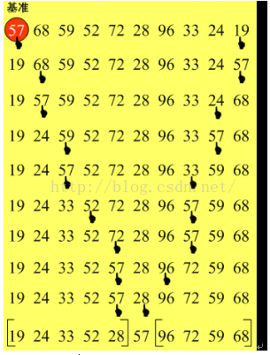

# 9.5.排序算法-快速排序

## 基本思想

快速排序也是基于分治算法得。步骤如下：

（1）选择一个基准元素，通常选择第一个元素或者最后一个元素；

（2）通过一趟排序讲待排序的记录分割成独立的两部分，其中一部分记录的元素值均比基准元素值小。另一部分记录的元素值比基准值大；

（3）此时基准元素在其排好序后的正确位置；

（4）然后分别对这两部分记录用同样的方法继续进行排序，直到整个序列有序。



上图中，演示的是第一轮快速排序的过程，首先将第一个元素选为基准点，从右端第一个元素开始扫描，找到第一个比57小的元素（19）时停止，两者交换位置，然后从左端开始扫描，找到第一个比57大的元素（68）时停止，两者交换位置，周而复始，直到57找不到可交换的元素为止，至此一轮快速排序结束。

这时，比57小的元素都在左边，比57大的元素都在右边，分别对两边的数组段继续进行快速排序，依次类推，最终使整个数组有序。

## java实现

```
protected void sort() {
    recursiveQuikSort(0, sort.length - 1);
}

/**
 * 递归的快速排序
 * @param low  数组的最小下标
 * @param high 数组的最大下标
 */
private void recursiveQuikSort(int low, int high) {
    if (low >= high) {
        return;
    } else {
        int pivot = sort[low];  //以第一个元素为基准
        int partition = partition(low, high, pivot);  //对数组进行划分，比pivot小的元素在低位段，比pivot大的元素在高位段
        recursiveQuikSort(low, partition - 1);  //对划分后的低位段进行快速排序
        recursiveQuikSort(partition + 1, high);  //对划分后的高位段进行快速排序
    }
}

/**
 * 以pivot为基准对下标low到high的数组进行划分
 * @param low   数组段的最小下标
 * @param high  数组段的最大下标
 * @param pivot 划分的基准元素
 * @return 划分完成后基准元素所在位置的下标
 */
private int partition(int low, int high, int pivot) {
    while (low < high) {
        while (low < high && sort[high] >= pivot) {  //从右端开始扫描，定位到第一个比pivot小的元素
            high--;
        }
        swap(low, high);
        while (low < high && sort[low] <= pivot) {  //从左端开始扫描，定位到第一个比pivot大的元素
            low++;
        }
        swap(low, high);
    }
    return low;
}

/**
 * 交换数组中两个元素的数据
 * @param low  欲交换元素的低位下标
 * @param high 欲交换元素的高位下标
 */
private void swap(int low, int high) {
    int temp = sort[high];
    sort[high] = sort[low];
    sort[low] = temp;
}
```

## 算法分析

在归并排序中，我们详细推算了时间复杂度，快速排序与归并排序一样采取了分治算法，它的时间复杂度也是O(N*log2N)。

对于分治算法一般都是如此，用递归的方法把数据项分为两组，然后调用自身来分别处理每一组数据。算法实际上是以2为底，运行时间与N*log2N成正比。

对于快速排序来说，最理想的状态是随机分布的数据，即我们任意选定的枢纽处于中间位置，有一半元素小于它，有一半元素大于它。当数据时由小到大排列或者由大到小排列时，快速排序的效率最低，时间复杂度扩大为O(N2)。

选定第一个元素为枢纽实现起来确实很简单，但是当它为最大值或最小值时，快速排序的效率会严重降低。假如选中的元素为数组的中值，自然是最好的选择，但是却要遍历整个数组来确定中值，这个过程可能比排序花费的时间还长，得不偿失。折衷的方法是找到数组中的第一个、最后一个以及处于中间位置的元素，选出三者的中值作为枢纽，既避免了枢纽是最值的情况，也不会像在全部元素中寻找中值那样费时间。这种方法被称为“三项取中法”(median-of-three)。