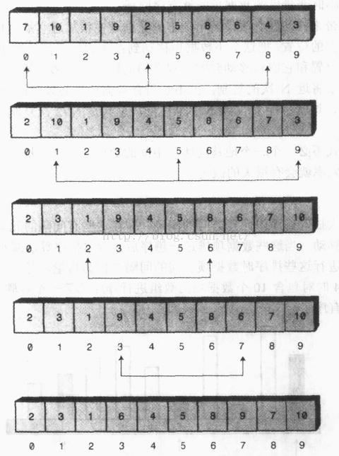

# 9.6.排序算法-希尔排序

## 基本思想

希尔排序是基于插入排序的，又叫缩小增量排序。

在插入排序中，标记符左边的元素是有序的，右边的是没有排过序的，这个算法取出标记符所指向的数据，存入一个临时变量，接着，在左边有序的数组中找到临时变量应该插入的位置，然后将插入位置之后的元素依次后移一位，最后插入临时变量中的数据。

试想，假如有一个很小的数据项在靠近右端的位置上，把这个数据项插入到有序数组中时，将会有大量的中间数据项需要右移一位，这个步骤对每一个数据项都执行了将近N次复制。虽然不是所有数据项都必须移动N个位置，但是，数据项平均移动了N/2个位置，一共N个元素，总共是N2/2次复制，这实际上是一个很耗时的过程，希尔排序就是对这一步骤进行了改进，不必一个个的移动所有中间数据项，就能把较小的数据项移动到左边，大大提高了排序效率。

希尔排序通过加大插入排序时元素之间的间隔，并对这些间隔的元素进行插入排序，从而使数据能大跨度地移动。数据项之间的间隔被称为增量，习惯上还用h表示。

下图表示的是增量为4时对10个数据项进行第一轮希尔排序的过程：



此时，数据已经基本有序，所有元素离它在最终有序序列中的位置相差都不超过2个单元，通过创建这种交错的内部有序的数据项集合，把完成排序所需的工作量降到了最小，这也是希尔排序的精髓所在。

在用java实现希尔排序之前，还有一个问题需要弄清楚，就是这个增量该怎么选择？

最简单的方法是第一轮排序的间隔为N/2，第二趟排序的间隔为N/4，依次类推。但是，实践证明，这种方法有时会使运行时间降到O(N2)，并不比插入排序的效率更高。

保持间隔序列中的数字互质很重要，也就是说，除了1之外它们没有公约数。简单地取间隔为N/2，N/4，N/8...1时，没有遵循这一约束，所以使希尔排序的效率降低。

有很多种有效地生成间隔序列的方法，本文提供一种，下一节的java代码也是按照这种方法来生成间隔序列的。

这种序列生成方法是由Donald Knuth(可以百度一下，图灵奖获得者，一位计算机领域的大牛)提出来的。

数列以逆向的形式从1开始，通过递归表达式：

h=3*h+1

来产生后面的间隔。

比如，我们有1000个数据项需要排序，利用h=3*h+1产生的间隔序列为：1,4,13,40,12,121,364,1093,3280...

第八个数1093显然超出了要排序的元素总数，所以第一轮排序，应该选取的间隔为364，第二轮为121，第三轮为12……

## java实现

```
protected void sort() {
    int len = sort.length;
    int h = 1;
    while (3 * h + 1 < len) {  //确定第一轮排序时的间隔
        h = 3 * h + 1;
    }
    while (h > 0) {
        for (int i = 0; i < h; i++) {
            shellInsertSort(i, h);  //对间隔为h的元素进行插入排序
        }
        h = (h - 1) / 3;  //下一轮排序的间隔
    }
}

/**
 * 希尔排序内部使用的插入排序:
 * 需要进行插入排序的元素为array[beginIndex]、array[beginIndex+increment]、array[beginIndex+2*increment]...
 * @param beginIndex 起始下标
 * @param increment  增量
 */
private void shellInsertSort(int beginIndex, int increment) {
    int targetIndex = beginIndex + increment;  //欲插入元素的下标
    while (targetIndex < sort.length) {
        int temp = sort[targetIndex];
        int previousIndex = targetIndex - increment;  //前一个元素下标，间隔为increment
        while (previousIndex >= 0 && sort[previousIndex] > temp) {
            sort[previousIndex + increment] = sort[previousIndex];  //比欲插入数据项大的元素后移一位
            previousIndex = previousIndex - increment;
        }
        sort[previousIndex + increment] = temp;  //插入到合适的位置
        targetIndex = targetIndex + increment;  //插入下一个元素
    }
}
```

## 算法分析

希尔排序不像其他时间复杂度为O(N*log2N)的排序算法那么快，但是比选择排序和插入排序这种时间复杂度为O(N2)的排序算法还是要快得多，而且非常容易实现。它在最坏情况下的执行效率和在平均情况下的执行效率相比不会降低多少，而快速排序除非采取特殊措施，否则在最坏情况下的执行效率变得非常差。

迄今为止，还无法从理论上精准地分析希尔排序的效率，有各种各样基于试验的评估，估计它的时间级介于O(N3/2)与O(N7/6)之间。我们可以认为希尔排序的平均时间复杂度为O(N*(logN)2)。