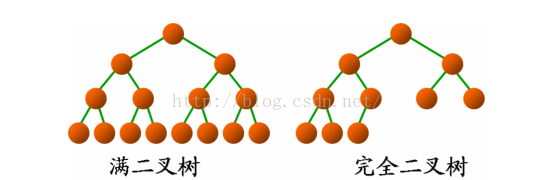
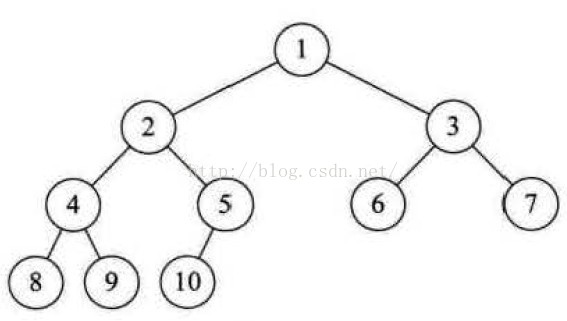
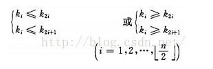
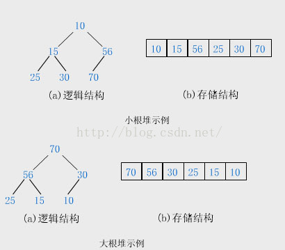
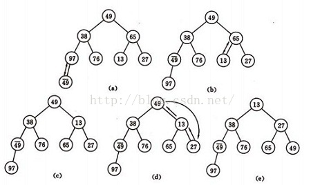

# 9.7.排序算法-堆排序

## 基本思想

堆排序是一种树形选择排序，是对直接选择排序的改进。

首先，我们来看看什么是堆（heap）：

（1）堆中某个节点的值总是不大于或不小于其父节点的值；

（2）堆总是一棵完全二叉树（Complete Binary Tree）。

完全二叉树是由满二叉树（Full Binary Tree）而引出来的。除最后一层无任何子节点外，每一层上的所有结点都有两个子结点的二叉树称为满二叉树。

如果除最后一层外，每一层上的节点数均达到最大值；在最后一层上只缺少右边的若干结点，这样的二叉树被称为完全二叉树。



一棵完全二叉树，如果某个节点的值总是不小于其父节点的值，则根节点的关键字是所有节点关键字中最小的，称为小根堆（小顶堆）；如果某个节点的值总是不大于其父节点的值，则根节点的关键字是所有节点关键字中最大的，称为大根堆（大顶堆）。

从根节点开始，按照每层从左到右的顺序对堆的节点进行编号：



可以发现，如果某个节点的编号为i，则它的子节点的编号分别为：2i、2i+1。据此，推出堆的数学定义：

具有n个元素的序列（k1,k2,...,kn)，当且仅当满足



时称之为堆。

需要注意的是，堆只对父子节点做了约束，并没有对兄弟节点做任何约束，左子节点与右子节点没有必然的大小关系。

如果用数组存储堆中的数据，逻辑结构与存储结构如下：



初始时把要排序的n个数看作是一棵顺序存储的完全二叉树，调整它们的存储顺序，使之成为一个堆，将堆顶元素输出，得到n 个元素中最小（最大）的元素，这时堆的根节点的数最小（或者最大）。然后对前面(n-1)个元素重新调整使之成为堆，输出堆顶元素，得到n 个元素中次小(或次大)的元素。依次类推，直到只有两个节点的堆，并对它们作交换，最后得到有n个节点的有序序列。这个过程就称为堆排序。

写代码之前，我们要解决一个问题：如何将一个不是堆的完全二叉树调整为堆。

例如我们要将这样一个无序序列：

49，38，65，97，76，13，27，49

建成堆，将它直接映射成二叉树，结果如下图的(a)：



(a)是一个完全二叉树，但不是堆。我们将它调整为小顶堆。

堆有一个性质是：堆的每个子树也是堆。

调整的核心思想就是让树的每棵子树都成为堆，以某节点与它的左子节点、右子节点为操作单位，将三者中最小的元素置于子树的根上。

(a)中最后一个元素是49，在树中的序号为8，对应的数组下标则为7，它的父节点对应的数组下标为3（如果一个元素对应的存储数组的下标为i，则它的父节点对应的存储数组的下标为(i-1)/2），49小于97，所以两者交换位置。

此时，以第三层元素为根节点的所有子树都已是堆了，下一步继续调整以第二层元素为根节点的子树。

先调整以65为根的子树，再调整以38为根的子树（满足堆的要求，实际上不用调整）。

然后调整以第一层元素为根的子树，即以49为根，以38为左子节点，以13为右子节点的子树，交换13与49的位置。

一旦交换位置，就有可能影响本来已经是堆的子树。13与49交换位置之后，破坏了右子树，将焦点转移到49上面来，继续调整以它为根节点的子树。如果此次调整又影响了下一层的子树，继续调整，直至叶子节点。

以上就是由数组建堆的过程。

堆建好之后开始排序，堆顶就是最小值，取出放入数组中的最后一个位置，将堆底（数组中的最后一个元素）放入堆顶。这一操作会破坏堆，需要将前n-1个元素调整成堆。

然后再取出堆顶，放入数组的倒数第二个位置，堆底（数组中的倒数第二个元素）放入堆顶，再将前n-2个元素调整成堆。

按照上面的思路循环操作，最终就会将数组中的元素按降序的顺序排列完毕。

如果想要升序排列，利用大顶堆进行类似的操作即可。下面的java实现就是使用大顶堆完成的。

## java实现

```
protected void sort() {
    buildHeap();
    System.out.println("建堆：");
    printTree(sort.length);
    int lastIndex = sort.length - 1;
    while (lastIndex > 0) {
        swap(0, lastIndex);  //取出堆顶元素，将堆底放入堆顶。其实就是交换下标为0与lastIndex的数据
        if (--lastIndex == 0) {
            break;  //只有一个元素时就不用调整堆了，排序结束
        }
        adjustHeap(0, lastIndex);  //调整堆
        System.out.println("调整堆：");
        printTree(lastIndex + 1);
    }
}

private void swap(int rootIndex, int lastIndex) {
    int temp = sort[rootIndex];
    sort[rootIndex] = sort[lastIndex];
    sort[lastIndex] = temp;
}

/**
 * 用数组中的元素建堆
 */
private void buildHeap() {
    int lastIndex = sort.length - 1;
    for (int i = (lastIndex - 1) / 2; i >= 0; i--) { //(lastIndex-1)/2就是最后一个元素的根节点的下标，依次调整每棵子树
        adjustHeap(i, lastIndex);  //调整以下标i的元素为根的子树
    }
}

/**
 * 调整以下标是rootIndex的元素为根的子树
 * @param rootIndex 根的下标
 * @param lastIndex 堆中最后一个元素的下标
 */
private void adjustHeap(int rootIndex, int lastIndex) {
    int biggerIndex = rootIndex;
    int leftChildIndex = 2 * rootIndex + 1;
    int rightChildIndex = 2 * rootIndex + 2;
    if (rightChildIndex <= lastIndex) {  //存在右子节点，则必存在左子节点
        if (sort[rootIndex] < sort[leftChildIndex] || sort[rootIndex] < sort[rightChildIndex]) { //子节点中存在比根更大的元素
            biggerIndex = sort[leftChildIndex] < sort[rightChildIndex] ? rightChildIndex : leftChildIndex;
        }
    } else if (leftChildIndex <= lastIndex) {  //只存在左子节点
        if (sort[leftChildIndex] > sort[rootIndex]) {  //左子节点更大
            biggerIndex = leftChildIndex;
        }
    }
    if (biggerIndex != rootIndex) {  //找到了比根更大的子节点
        swap(rootIndex, biggerIndex);
        //交换位置后可能会破坏子树，将焦点转向交换了位置的子节点，调整以它为根的子树
        adjustHeap(biggerIndex, lastIndex);
    }
}

/**
 * 将数组按照完全二叉树的形式打印出来
 */
private void printTree(int len) {
    int layers = (int)Math.floor(Math.log((double)len) / Math.log((double)2)) + 1;  //树的层数
    int maxWidth = (int)Math.pow(2, layers) - 1;  //树的最大宽度
    int endSpacing = maxWidth;
    int spacing;
    int numberOfThisLayer;
    for (int i = 1; i <= layers; i++) {  //从第一层开始，逐层打印
        endSpacing = endSpacing / 2;  //每层打印之前需要打印的空格数
        spacing = 2 * endSpacing + 1;  //元素之间应该打印的空格数
        numberOfThisLayer = (int)Math.pow(2, i - 1);  //该层要打印的元素总数
        int j;
        for (j = 0; j < endSpacing; j++) {
            System.out.print("  ");
        }
        int beginIndex = (int)Math.pow(2, i - 1) - 1;  //该层第一个元素对应的数组下标
        for (j = 1; j <= numberOfThisLayer; j++) {
            System.out.print(sort[beginIndex++] + "");
            for (int k = 0; k < spacing; k++) {  //打印元素之间的空格
                System.out.print("  ");
            }
            if (beginIndex == len) {  //已打印到最后一个元素
                break;
            }
        }
        System.out.println();
    }
    System.out.println();
}
```

## 算法分析

它的运行时间主要是消耗在初始构建堆和在重建堆时的反复筛选上。

在构建堆的过程中，因为我们是完全二叉树从最下层最右边的非终端结点开始构建，将它与其孩子进行比较和若有必要的互换，对于每个非终端结点来说，其实最多进行两次比较和互换操作，因此整个构建堆的时间复杂度为O(n)。

在正式排序时，第i次取堆顶记录重建堆需要用O(logi)的时间（完全二叉树的某个结点到根结点的距离为log2i＋1），并且需要取n-1次堆顶记录，因此，重建堆的时间复杂度为O(nlogn)。

所以总体来说，堆排序的时间复杂度为O(nlogn)。由于堆排序对原始记录的排序状态并不敏感，因此它无论是最好、最坏和平均时间复杂度均为O(nlogn)。这在性能上显然要远远好过于冒泡、简单选择、直接插入的O(n2)的时间复杂度了。

空间复杂度上，它只有一个用来交换的暂存单元，也非常的不错。不过由于记录的比较与交换是跳跃式进行，因此堆排序是一种不稳定的排序方法。
