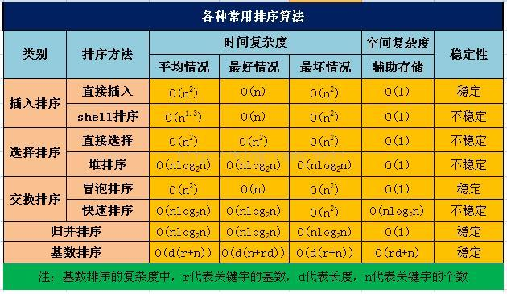

# 9.9.排序算法-八大排序算法总结

八大排序算法的稳定性及复杂度总结如下：

## 选择排序算法准则

每种排序算法都各有优缺点。因此，在实用时需根据不同情况适当选用，甚至可以将多种方法结合起来使用。

影响排序的因素有很多，平均时间复杂度低的算法并不一定就是最优的。相反，有时平均时间复杂度高的算法可能更适合某些特殊情况。同时，选择算法时还得考虑它的可读性，以利于软件的维护。一般而言，需要考虑的因素有以下四点：

1．待排序的记录数目n的大小；

2．记录本身数据量的大小，也就是记录中除关键字外的其他信息量的大小；

3．关键字的结构及其分布情况；

4．对排序稳定性的要求。

设待排序元素的个数为n。

1）当n较大，则应采用时间复杂度为O(nlog2n)的排序方法：快速排序、堆排序或归并排序序。

快速排序：是目前基于比较的内部排序中被认为是最好的方法，当待排序的关键字是随机分布时，快速排序的平均时间最短；

堆排序：如果内存空间允许且要求稳定性的，

归并排序：它有一定数量的数据移动，所以我们可能过与插入排序组合，先获得一定长度的序列，然后再合并，在效率上将有所提高。

2）当n较大，内存空间允许，且要求稳定性，推荐归并排序

3）当n较小，可采用直接插入或直接选择排序。

直接插入排序：当元素分布有序，直接插入排序将大大减少比较次数和移动记录的次数。

直接选择排序 ：元素分布有序，如果不要求稳定性，选择直接选择排序

5）一般不使用或不直接使用传统的冒泡排序。

6）基数排序

它是一种稳定的排序算法，但有一定的局限性：

　　1、关键字可分解。

　　2、记录的关键字位数较少，如果密集更好

　　3、如果是数字时，最好是无符号的，否则将增加相应的映射复杂度，可先将其正负分开排序。