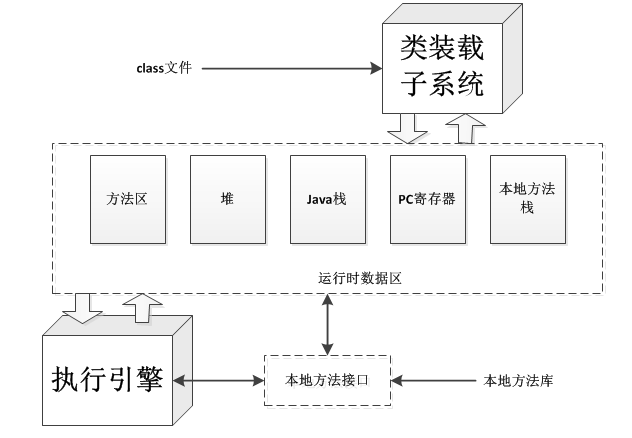
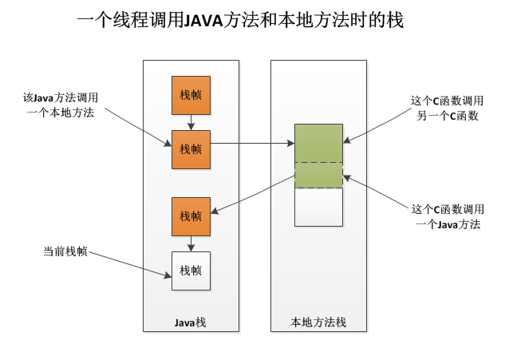
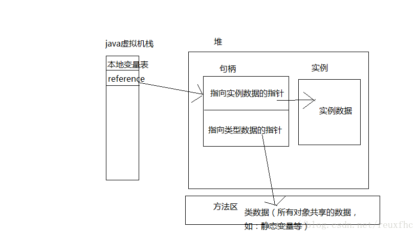

# Java虚拟机

## 什么是Java虚拟机

Java虚拟机是一个想象中的机器,在实际的计算机上通过软件模拟来实现。Java虚拟机有自己想象中的硬件,如处理器、堆栈、寄存器等,还具有相应的指令系统。

## 为什么要使用它

Java语言的一个非常重要的特点就是与平台的无关性。而使用Java虚拟机是实现这一特点的关键。一般的高级语言如果要在不同的平台上运行,至少需要编译成不同的目标代码。而引入Java语言虚拟机后,Java语言在不同平台上运行时不需要重新编译。Java语言使用模式Java虚拟机屏蔽了与具体平台相关的信息,使得Java语言编译程序只需生成在Java虚拟机上运行的目标代码(字节码),就可以在多种平台上不加修改地运行。Java虚拟机在执行字节码时,把字节码解释成具体平台上的机器指令执行。

## 什么人需要使用JAVA虚拟机？

Java虚拟机是Java语言底层实现的基础,对Java语言感兴趣的人都应对Java虚拟机有个大概的了解。这有助于理解Java语言的一些性质,也有助于使用Java语言。对于要在特定平台上实现Java虚拟机的软件人员,Java语言的编译器作者以及要用硬件芯片实现Java虚拟机的人来说,则必须深刻理解Java虚拟机的规范。另外,如果你想扩展Java语言,或是把其它语言编译成Java语言的字节码,你也需要深入地了解Java虚拟机。

## JAVA虚拟机的体系结构

下图是JAVA虚拟机的结构图，每个Java虚拟机都有一个类装载子系统，它根据给定的全限定名来装入类型（类或接口）。同样，每个Java虚拟机都有一个执行引擎，它负责执行那些包含在被装载类的方法中的指令。



当JAVA虚拟机运行一个程序时，它需要内存来存储许多东西，例如：字节码、从已装载的class文件中得到的其他信息、程序创建的对象、传递给方法的参数，返回值、局部变量等等。Java虚拟机把这些东西都组织到几个“运行时数据区”中，以便于管理。

某些运行时数据区是由程序中所有线程共享的，还有一些则只能由一个线程拥有。每个Java虚拟机实例都有一个方法区以及一个堆，它们是由该虚拟机实例中所有的线程共享的。当虚拟机装载一个class文件时，它会从这个class文件包含的二进制数据中解析类型信息。然后把这些类型信息放到方法区中。当程序运行时，虚拟机会把所有该程序在运行时创建的对象都放到堆中。

当每一个新线程被创建时，它都将得到它自己的PC寄存器（程序计数器）以及一个Java栈，如果线程正在执行的是一个Java方法（非本地方法），那么PC寄存器的值将总是指向下一条将被执行的指令，而它的Java栈则总是存储该线程中Java方法调用的状态——包括它的局部变量，被调用时传进来的参数、返回值，以及运算的中间结果等等。而本地方法调用的状态，则是以某种依赖于具体实现的方法存储在本地方法栈中，也可能是在寄存器或者其他某些与特定实现相关的内存区中。

Java栈是由许多栈帧（stack frame）组成的，一个栈帧包含一个Java方法调用的状态。当线程调用一个Java方法时，虚拟机压入一个新的栈帧到该线程的Java栈中，当该方法返回时，这个栈帧被从Java栈中弹出并抛弃。

Java虚拟机没有寄存器，其指令集使用Java栈来存储中间数据。这样设计的原因是为了保持Java虚拟机的指令集尽量紧凑、同时也便于Java虚拟机在那些只有很少通用寄存器的平台上实现。另外，Java虚拟机这种基于栈的体系结构，也有助于运行时某些虚拟机实现的动态编译器和即时编译器的代码优化。

下图描绘了Java虚拟机为每一个线程创建的内存区，这些内存区域是私有的，任何线程都不能访问另一个线程的PC寄存器或者Java栈。


上图展示了一个虚拟机实例的快照，它有三个线程正在执行。线程1和线程2都正在执行Java方法，而线程3则正在执行一个本地方法。

Java栈都是向下生长的，而栈顶都显示在图的底部。当前正在执行的方法的栈帧则以浅色表示，对于一个正在运行Java方法的线程而言，它的PC寄存器总是指向下一条将被执行的指令。比如线程1和线程2都是以浅色显示的，由于线程3当前正在执行一个本地方法，因此，它的PC寄存器——以深色显示的那个，其值是不确定的。

### 数据类型

Java虚拟机是通过某些数据类型来执行计算的，数据类型可以分为两种：基本类型和引用类型，基本类型的变量持有原始值，而引用类型的变量持有引用值。

Java语言中的所有基本类型同样也都是Java虚拟机中的基本类型。但是boolean有点特别，虽然Java虚拟机也把boolean看做基本类型，但是指令集对boolean只有很有限的支持，当编译器把Java源代码编译为字节码时，它会用int或者byte来表示boolean。在Java虚拟机中，false是由整数零来表示的，所有非零整数都表示true，涉及boolean值的操作则会使用int。另外，boolean数组是当做byte数组来访问的，但是在“堆”区，它也可以被表示为位域。

Java虚拟机还有一个只在内部使用的基本类型：returnAddress，Java程序员不能使用这个类型，这个基本类型被用来实现Java程序中的finally子句。该类型是jsr, ret以及jsr_w指令需要使用到的，它的值是JVM指令的操作码的指针。returnAddress类型不是简单意义上的数值，不属于任何一种基本类型，并且它的值是不能被运行中的程序所修改的。

Java虚拟机的引用类型被统称为“引用（reference）”，有三种引用类型：类类型、接口类型、以及数组类型，它们的值都是对动态创建对象的引用。类类型的值是对类实例的引用；数组类型的值是对数组对象的引用，在Java虚拟机中，数组是个真正的对象；而接口类型的值，则是对实现了该接口的某个类实例的引用。还有一种特殊的引用值是null，它表示该引用变量没有引用任何对象。

### JAVA中方法参数的引用传递

java中参数的传递有两种，分别是按值传递和按引用传递。

### 类装载子系统

在JAVA虚拟机中，负责查找并装载类型的那部分被称为类装载子系统。

JAVA虚拟机有两种类装载器：启动类装载器和用户自定义类装载器。前者是JAVA虚拟机实现的一部分，后者则是Java程序的一部分。由不同的类装载器装载的类将被放在虚拟机内部的不同命名空间中。

类装载器子系统涉及Java虚拟机的其他几个组成部分，以及几个来自java.lang库的类。比如，用户自定义的类装载器是普通的Java对象，它的类必须派生自java.lang.ClassLoader类。ClassLoader中定义的方法为程序提供了访问类装载器机制的接口。此外，对于每一个被装载的类型，JAVA虚拟机都会为它创建一个java.lang.Class类的实例来代表该类型。和所有其他对象一样，用户自定义的类装载器以及Class类的实例都放在内存中的堆区，而装载的类型信息则都位于方法区。

类装载器子系统除了要定位和导入二进制class文件外，还必须负责验证被导入类的正确性，为类变量分配并初始化内存，以及帮助解析符号引用。这些动作必须严格按以下顺序进行：

（1）装载——查找并装载类型的二进制数据。

（2）连接——指向验证、准备、以及解析（可选）。

●　验证　　确保被导入类型的正确性。

●　准备　　为类变量分配内存，并将其初始化为默认值。

●　解析　　把类型中的符号引用转换为直接引用。

（3）初始化——把类变量初始化为正确初始值。

每个JAVA虚拟机实现都必须有一个启动类装载器，它知道怎么装载受信任的类。

每个类装载器都有自己的命名空间，其中维护着由它装载的类型。所以一个Java程序可以多次装载具有同一个全限定名的多个类型。这样一个类型的全限定名就不足以确定在一个Java虚拟机中的唯一性。因此，当多个类装载器都装载了同名的类型时，为了惟一地标识该类型，还要在类型名称前加上装载该类型（指出它所位于的命名空间）的类装载器标识。

### 方法区

在Java虚拟机中，关于被装载类型的信息存储在一个逻辑上被称为方法区的内存中。当虚拟机装载某个类型时，它使用类装载器定位相应的class文件，然后读入这个class文件——1个线性二进制数据流，然后它传输到虚拟机中，紧接着虚拟机提取其中的类型信息，并将这些信息存储到方法区。该类型中的类（静态）变量同样也是存储在方法区中。

JAVA虚拟机在内部如何存储类型信息，这是由具体实现的设计者来决定的。

当虚拟机运行Java程序时，它会查找使用存储在方法区中的类型信息。由于所有线程都共享方法区，因此它们对方法区数据的访问必须被设计为是线程安全的。比如，假设同时有两个线程都企图访问一个名为Lava的类，而这个类还没有被装入虚拟机，那么，这时只应该有一个线程去装载它，而另一个线程则只能等待。

对于每个装载的类型，虚拟机都会在方法区中存储以下类型信息：

●　这个类型的全限定名

●　这个类型的直接超类的全限定名（除非这个类型是java.lang.Object，它没有超类）

●　这个类型是类类型还是接口类型

●　这个类型的访问修饰符（public、abstract或final的某个子集）

●　任何直接超接口的全限定名的有序列表

除了上面列出的基本类型信息外，虚拟机还得为每个被装载的类型存储以下信息：

●　该类型的常量池

●　字段信息

●　方法信息

●　除了常量以外的所有类（静态）变量

●　一个到类ClassLoader的引用

●　一个到Class类的引用

#### 常量池
虚拟机必须为每个被装载的类型维护一个常量池。常量池就是该类型所用常量的一个有序集合，包括直接常量和对其他类型、字段和方法的符号引用。池中的数据项就像数组一样是通过索引访问的。因为常量池存储了相应类型所用到的所有类型、字段和方法的符号引用，所以它在Java程序的动态连接中起着核心的作用。

#### 字段信息
对于类型中声明的每一个字段。方法区中必须保存下面的信息。除此之外，这些字段在类或者接口中的声明顺序也必须保存。

○　字段名

○　字段的类型

○　字段的修饰符（public、private、protected、static、final、volatile、transient的某个子集）

#### 方法信息
对于类型中声明的每一个方法，方法区中必须保存下面的信息。和字段一样，这些方法在类或者接口中的声明顺序也必须保存。

○　方法名

○　方法的返回类型（或void）

○　方法参数的数量和类型（按声明顺序）

○　方法的修饰符（public、private、protected、static、final、synchronized、native、abstract的某个子集）

除了上面清单中列出的条目之外，如果某个方法不是抽象的和本地的，它还必须保存下列信息：

○　方法的字节码（bytecodes）

○　操作数栈和该方法的栈帧中的局部变量区的大小

○　异常表

#### 类（静态）变量
类变量是由所有类实例共享的，但是即使没有任何类实例，它也可以被访问。这些变量只与类有关——而非类的实例，因此它们总是作为类型信息的一部分而存储在方法区。除了在类中声明的编译时常量外，虚拟机在使用某个类之前，必须在方法区中为这些类变量分配空间。

而编译时常量（就是那些用final声明以及用编译时已知的值初始化的类变量）则和一般的类变量处理方式不同，每个使用编译时常量的类型都会复制它的所有常量到自己的常量池中，或嵌入到它的字节码流中。作为常量池或字节码流的一部分，编译时常量保存在方法区中——就和一般的类变量一样。但是当一般的类变量作为声明它们的类型的一部分数据面保存的时候，编译时常量作为使用它们的类型的一部分而保存。

#### 指向ClassLoader类的引用
每个类型被装载的时候，虚拟机必须跟踪它是由启动类装载器还是由用户自定义类装载器装载的。如果是用户自定义类装载器装载的，那么虚拟机必须在类型信息中存储对该装载器的引用。这是作为方法表中的类型数据的一部分保存的。

虚拟机会在动态连接期间使用这个信息。当某个类型引用另一个类型的时候，虚拟机会请求装载发起引用类型的类装载器来装载被引用的类型。这个动态连接的过程，对于虚拟机分离命名空间的方式也是至关重要的。为了能够正确地执行动态连接以及维护多个命名空间，虚拟机需要在方法表中得知每个类都是由哪个类装载器装载的。

#### 指向Class类的引用
对于每一个被装载的类型（不管是类还是接口），虚拟机都会相应地为它创建一个java.lang.Class类的实例，而且虚拟机还必须以某种方式把这个实例和存储在方法区中的类型数据关联起来。

在Java程序中，你可以得到并使用指向Class对象的引用。Class类中的一个静态方法可以让用户得到任何已装载的类的Class实例的引用。
```
public static Class<?> forName(String className)
```
比如，如果调用forName("java.lang.Object")，那么将得到一个代表java.lang.Object的Class对象的引用。可以使用forName()来得到代表任何包中任何类型的Class对象的引用，只要这个类型可以被（或者已经被）装载到当前命名空间中。如果虚拟机无法把请求的类型装载到当前命名空间，那么会抛出ClassNotFoundException异常。

另一个得到Class对象引用的方法是，可以调用任何对象引用的getClass()方法。这个方法被来自Object类本身的所有对象继承：
```
public final native Class<?> getClass();
```
比如，如果你有一个到java.lang.Integer类的对象的引用，那么你只需简单地调用Integer对象引用的getClass()方法，就可以得到表示java.lang.Integer类的Class对象。

#### 方法区使用实例
为了展示虚拟机如何使用方法区中的信息，下面来举例说明：

```
class Lava {

    private int speed = 5;
    void flow(){
        
    }
}

public class Volcano {
    
    public static void main(String[] args){
        Lava lava = new Lava();
        lava.flow();
    }
}
```
不同的虚拟机实现可能会用完全不同的方法来操作，下面描述的只是其中一种可能——但并不是仅有的一种。

要运行Volcano程序，首先得以某种“依赖于实现的”方式告诉虚拟机“Volcano”这个名字。之后，虚拟机将找到并读入相应的class文件“Volcano.class”，然后它会从导入的class文件里的二进制数据中提取类型信息并放到方法区中。通过执行保存在方法区中的字节码，虚拟机开始执行main()方法，在执行时，它会一直持有指向当前类（Volcano类）的常量池（方法区中的一个数据结构）的指针。

注意：虚拟机开始执行Volcano类中main()方法的字节码的时候，尽管Lava类还没被装载，但是和大多数（也许所有）虚拟机实现一样，它不会等到把程序中用到的所有类都装载后才开始运行。恰好相反，它只会需要时才装载相应的类。

main()的第一条指令告知虚拟机为列在常量池第一项的类分配足够的内存。所以虚拟机使用指向Volcano常量池的指针找到第一项，发现它是一个对Lava类的符号引用，然后它就检查方法区，看Lava类是否已经被加载了。

这个符号引用仅仅是一个给出了类Lava的全限定名“Lava”的字符串。为了能让虚拟机尽可能快地从一个名称找到类，虚拟机的设计者应当选择最佳的数据结构和算法。

当虚拟机发现还没有装载过名为“Lava”的类时，它就开始查找并装载文件“Lava.class”，并把从读入的二进制数据中提取的类型信息放在方法区中。

紧接着，虚拟机以一个直接指向方法区Lava类数据的指针来替换常量池第一项（就是那个字符串“Lava”），以后就可以用这个指针来快速地访问Lava类了。这个替换过程称为常量池解析，即把常量池中的符号引用替换为直接引用。

终于，虚拟机准备为一个新的Lava对象分配内存。此时它又需要方法区中的信息。还记得刚刚放到Volcano类常量池第一项的指针吗？现在虚拟机用它来访问Lava类型信息，找出其中记录的这样一条信息：一个Lava对象需要分配多少堆空间。

JAVA虚拟机总能够通过存储与方法区的类型信息来确定一个对象需要多少内存，当JAVA虚拟机确定了一个Lava对象的大小后，它就在堆上分配这么大的空间，并把这个对象实例的变量speed初始化为默认初始值0。

当把新生成的Lava对象的引用压到栈中，main()方法的第一条指令也完成了。接下来的指令通过这个引用调用Java代码（该代码把speed变量初始化为正确初始值5）。另一条指令将用这个引用调用Lava对象引用的flow()方法。

#### 堆
Java程序在运行时创建的所有类实例或数组都放在同一个堆中。而一个JAVA虚拟机实例中只存在一个堆空间，因此所有线程都将共享这个堆。又由于一个Java程序独占一个JAVA虚拟机实例，因而每个Java程序都有它自己的堆空间——它们不会彼此干扰。但是同一个Java程序的多个线程却共享着同一个堆空间，在这种情况下，就得考虑多线程访问对象（堆数据）的同步问题了。

JAVA虚拟机有一条在堆中分配新对象的指令，却没有释放内存的指令，正如你无法用Java代码区明确释放一个对象一样。虚拟机自己负责决定如何以及何时释放不再被运行的程序引用的对象所占据的内存。通常，虚拟机把这个任务交给垃圾收集器。

#### 数组的内部表示
在Java中，数组是真正的对象。和其他对象一样，数组总是存储在堆中。同样，数组也拥有一个与它们的类相关联的Class实例，所有具有相同维度和类型的数组都是同一个类的实例，而不管数组的长度（多维数组每一维的长度）是多少。例如一个包含3个int整数的数组和一个包含300个整数的数组拥有同一个类。数组的长度只与实例数据有关。

数组类的名称由两部分组成：每一维用一个方括号“[”表示，用字符或字符串表示元素类型。比如，元素类型为int整数的、一维数组的类名为“[I”，元素类型为byte的三维数组为“[[[B”，元素类型为Object的二维数组为“[[Ljava/lang/Object”。

多维数组被表示为数组的数组。比如，int类型的二维数组，将表示为一个一维数组，其中的每一个元素是一个一维int数组的引用，如下图：

在堆中的每个数组对象还必须保存的数据时数组的长度、数组数据，以及某些指向数组的类数据的引用。虚拟机必须能够通过一个数组对象的引用得到此数组的长度，通过索引访问其元素（期间要检查数组边界是否越界），调用所有数组的直接超类Object声明的方法等等。

#### 程序计数器
对于一个运行中的Java程序而言，其中的每一个线程都有它自己的PC（程序计数器）寄存器，它是在该线程启动时创建的，PC寄存器的大小是一个字长，因此它既能够持有一个本地指针，也能够持有一个returnAddress。当线程执行某个Java方法时，PC寄存器的内容总是下一条将被执行指令的“地址”，这里的“地址”可以是一个本地指针，也可以是在方法字节码中相对于该方法起始指令的偏移量。如果该线程正在执行一个本地方法，那么此时PC寄存器的值是“undefined”。

#### Java栈
每当启动一个新线程时，Java虚拟机都会为它分配一个Java栈。Java栈以帧为单位保存线程的运行状态。虚拟机只会直接对Java栈执行两种操作：以帧为单位的压栈和出栈。

某个线程正在执行的方法被称为该线程的当前方法，当前方法使用的栈帧称为当前帧，当前方法所属的类称为当前类，当前类的常量池称为当前常量池。在线程执行一个方法时，它会跟踪当前类和当前常量池。此外，当虚拟机遇到栈内操作指令时，它对当前帧内数据执行操作。

每当线程调用一个Java方法时，虚拟机都会在该线程的Java栈中压入一个新帧。而这个新帧自然就成为了当前帧。在执行这个方法时，它使用这个帧来存储参数、局部变量、中间运算结果等数据。

Java方法可以以两种方式完成。一种通过return返回的，称为正常返回；一种是通过抛出异常而异常终止的。不管以哪种方式返回，虚拟机都会将当前帧弹出Java栈然后释放掉，这样上一个方法的帧就成为当前帧了。

Java帧上的所有数据都是此线程私有的。任何线程都不能访问另一个线程的栈数据，因此我们不需要考虑多线程情况下栈数据的访问同步问题。当一个线程调用一个方法时，方法的的局部变量保存在调用线程Java栈的帧中。只有一个线程能总是访问那些局部变量，即调用方法的线程。

#### 本地方法栈
前面提到的所有运行时数据区都是Java虚拟机规范中明确定义的，除此之外，对于一个运行中的Java程序而言，它还可能会用到一些跟本地方法相关的数据区。当某个线程调用一个本地方法时，它就进入了一个全新的并且不再受虚拟机限制的世界。本地方法可以通过本地方法接口来访问虚拟机的运行时数据区，但不止如此，它还可以做任何它想做的事情。

本地方法本质上时依赖于实现的，虚拟机实现的设计者们可以自由地决定使用怎样的机制来让Java程序调用本地方法。

任何本地方法接口都会使用某种本地方法栈。当线程调用Java方法时，虚拟机会创建一个新的栈帧并压入Java栈。然而当它调用的是本地方法时，虚拟机会保持Java栈不变，不再在线程的Java栈中压入新的帧，虚拟机只是简单地动态连接并直接调用指定的本地方法。

如果某个虚拟机实现的本地方法接口是使用C连接模型的话，那么它的本地方法栈就是C栈。当C程序调用一个C函数时，其栈操作都是确定的。传递给该函数的参数以某个确定的顺序压入栈，它的返回值也以确定的方式传回调用者。同样，这就是虚拟机实现中本地方法栈的行为。

很可能本地方法接口需要回调Java虚拟机中的Java方法，在这种情况下，该线程会保存本地方法栈的状态并进入到另一个Java栈。

下图描绘了这样一个情景，就是当一个线程调用一个本地方法时，本地方法又回调虚拟机中的另一个Java方法。这幅图展示了JAVA虚拟机内部线程运行的全景图。一个线程可能在整个生命周期中都执行Java方法，操作它的Java栈；或者它可能毫无障碍地在Java栈和本地方法栈之间跳转。



该线程首先调用了两个Java方法，而第二个Java方法又调用了一个本地方法，这样导致虚拟机使用了一个本地方法栈。假设这是一个C语言栈，其间有两个C函数，第一个C函数被第二个Java方法当做本地方法调用，而这个C函数又调用了第二个C函数。之后第二个C函数又通过本地方法接口回调了一个Java方法（第三个Java方法），最终这个Java方法又调用了一个Java方法（它成为图中的当前方法）。


## Java内存区域

### 线程私有

* 虚拟机栈：主要是来描述java方法的内存模型。每个方法在执行时都会创建一个栈帧，用户存储局部变量表，操作数栈，动态链接，方法出口的信息。每一个方法从调用直至完成的过程，就对应着一个栈帧在虚拟机栈中入栈到出栈的过程。 
* 本地方法栈：为虚拟机使用到的Native方法服务 
* 程序计数器：当前线程所执行的字节码的行号指示器 

### 线程公有 

* 堆：JVM所管理的内存中最大的一块。唯一目的就是存放实例对象。几乎所有对象实例都在这里分配。java堆是垃圾收集器管理的主要区域 
* 方法区：用户存储已被虚拟机加载的类信息，常量，静态常量，即时编译器编译后的代码等数据 
* 常量池：用户存放编译器生成的各种字面量和符号引用。

## Java内存分配 

java程序需要通过栈上的reference数据来操作堆上的对象 

对象的访问定位：句柄访问、直接指针访问 

（1）句柄访问 

Java堆中会划分出一块内存来作为句柄池，reference中存储的就是对象的句柄地址，而句柄中包含了对实例数据与类型数据的各自具体的地址信息 



（2）直接指针访问 

reference中存储的直接就是对象地址 


### 方法区中的常量池 

1、静态常量池：即*.class文件中的常量池，class文件中的常量池不仅仅包含字符串字面量，还包含类、方法的信息，占用class文件绝大部分空间。 

2、运行时常量池，则是jvm虚拟机在完成类装载后，将class问文件中的常量池载入到内存中，并保存在方法区中，我们常说的常量池，就是指方法区中的运行时常量池。 

```
String s1 = "Hello";
String s2 = "Hello";
String s3 = "Hel" + "lo";
String s4 = "Hel" + new String("lo");
String s5 = new String("Hello");
String s6 = s5.intern();
String s7 = "H";
String s8 = "ello";
String s9 = s7 + s8;

System.out.println(s1 == s2);  // true
System.out.println(s1 == s3);  // true
System.out.println(s1 == s4);  // false
System.out.println(s1 == s9);  // false
System.out.println(s4 == s5);  // false
System.out.println(s1 == s6);  // true
```

s1 == s2 : s1、s2在赋值时，均使用的字符串字面量。在编译期间，这种字面量会直接放入class文件中的常量池中，从而实现复用，载入运行时常量池后，s1、s2指向的是同一内存地址，所以相等。 

s1 == s3:s3虽然是动态拼接出来的字符串，但是所有参与拼接的部分都是已知的字面量，在编译期间，这种拼接会被优化，编译器直接帮拼好，因此s3 = “Hel” + “lo” 最终被优化成s3 = “Hello”，所以相等。 

s9 是由s7与s8两个变量拼接好的。s7与s8在方法区中，拼接后s9被分配到了堆内存中。所以s1与s9不等 

s1 == s6是因为intern方法，s5在堆中，intern会将hello字符串添加到常量池中，并返回其在常量池中的地址，因为常量池中已经有了hello字符串，所以intern方法直接返回地址。所以s1与s6相等

必须要关注编译期的行为，才能更好的理解常量池。 

运行时常量池中的常量，基本来源于class文件中的常量 

程序运行时，除非手动向常量池中添加常量（比如调用intern方法），否则JVM不会自动添加常量到常量池。

## JVM原理

JVM是Java Virtual Machine（Java虚拟机）的缩写，它是整个java实现跨平台的最核心的部分，所有的Java程序会首先被编译为.class的类文件，这种类文件可以在虚拟机上执行，也就是说class并不直接与机器的操作系统相对应，而是经过虚拟机间接与操作系统交互，由虚拟机将程序解释给本地系统执行。JVM是Java平台的基础，和实际的机器一样，它也有自己的指令集，并且在运行时操作不同的内存区域。JVM通过抽象操作系统和CPU结构，提供了一种与平台无关的代码执行方法，即与特殊的实现方法、主机硬件、主机操作系统无关。JVM的主要工作是解释自己的指令集（即字节码）到CPU的指令集或对应的系统调用，保护用户免被恶意程序骚扰。JVM对上层的Java源文件是不关心的，它关注的只是由源文件生成的类文件（.class文件）。

## 内存泄漏与溢出的区别

内存泄漏是指分配出去的内存无法回收了。

内存溢出是指程序要求的内存，超出了系统所能分配的范围，从而发生溢出。比如用byte类型的变量存储10000这个数据，就属于内存溢出。

内存溢出是提供的内存不够；内存泄漏是无法再提供内存资源。

## 何时产生内存泄漏

静态集合类：在使用Set、Vector、HashMap等集合类的时候需要特别注意，有可能会发生内存泄漏。当这些集合被定义成静态的时候，由于它们的生命周期跟应用程序一样长，这时候，就有可能会发生内存泄漏。

监听器：在Java中，我们经常会使用到监听器，如对某个控件添加单击监听器addOnClickListener()，但往往释放对象的时候会忘记删除监听器，这就有可能造成内存泄漏。好的方法就是，在释放对象的时候，应该记住释放所有监听器，这就能避免了因为监听器而导致的内存泄漏。

各种连接：Java中的连接包括数据库连接、网络连接和io连接，如果没有显式调用其close()方法，是不会自动关闭的，这些连接就不能被GC回收而导致内存泄漏。一般情况下，在try代码块里创建连接，在finally里释放连接，就能够避免此类内存泄漏。

外部模块的引用：调用外部模块的时候，也应该注意防止内存泄漏。如模块A调用了外部模块B的一个方法，如：public void register(Object o)。这个方法有可能就使得A模块持有传入对象的引用，这时候需要查看B模块是否提供了去除引用的方法，如unregister()。这种情况容易忽略，而且发生了内存泄漏的话，比较难察觉，应该在编写代码过程中就应该注意此类问题。

单例模式：使用单例模式的时候也有可能导致内存泄漏。因为单例对象初始化后将在JVM的整个生命周期内存在，如果它持有一个外部对象（生命周期比较短）的引用，那么这个外部对象就不能被回收，而导致内存泄漏。如果这个外部对象还持有其它对象的引用，那么内存泄漏会更严重，因此需要特别注意此类情况。这种情况就需要考虑下单例模式的设计会不会有问题，应该怎样保证不会产生内存泄漏问题。