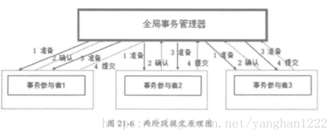

# 分布式事务的一致性

## 分布式事务介绍

在我们平时写的代码中，我们可以用一个事务包含许多个SQL调用，如果某一个数据库操作发生异常，就可以将之前的SQL操纵全部进行回滚，只有当所以的SQL操作全部成功，才进行提交，这就保证了事务的一致性。

但是在分布式环境下，多个数据库操作可能被拆分到独立的三个数据库访问服务中，此时原来的本地SQL调用就演变成了远程服务调用，事务的一致性无法得到保证，抠张图来看

假如服务A和服务B调用成功，则A和B的SQL会被提交，最后执行服务C，它的SQL操作失败，那么C进行回滚，在这里，就导致了事务的不一致。

## 分布式事务设计方案

通常，分布式事务基于两阶段实现，它的工作原理示意图如下：

阶段1：全局事务管理器向所有事务参与者发送准备请求，事务参与者向全局事务管理器回复自己是否准备就绪。

阶段2：全局事务管理器接收到所以事务参与者的回复之后做判断，如果所有事务参与者都可以提交，则向所有事务提交者发送提交申请，否则进行回滚。事务参与者根据全局事务管理器的指令进行提交或者回滚操作。

分布式事务回滚图如下：

两个阶段采用的是悲观锁策略，由于各个事务参与者需要等待响应最慢的参与者，因此性能比较差。 而且整个过程都是需要加锁的，并且当协调者出现故障，则整个事务需要等到协调者回复后才能继续执行。

所以可以用最终一致性替代传统的强一致性，尽量避免使用分布式事务。

## 分布式事务优化

在实践中常用的最终一致性方案就是使用带有事务功能的MQ做中间人角色，工作原理如下：

在做本地事务之前，先向MQ发送一个preapre消息，然后执行本地事务，本地事务提交成功的话，向MQ发送一个commit消息，否则发送一个rollback消息，取消之前的消息。MQ只会在收到commit确认才会将消息投递出去，所以这样的形式可以保证在一切正常的情况下，本地事务和MQ可以达到一致性。

但是如果系统执行事务成功后，还没来得及发送commit给MQ，或者说网络超时等问题导致MQ没有收到commit，那么MQ就不会把prepare消息投递出去。MQ会根据策略去尝试询问（回调）发消息的系统进行检查该消息是否应该投递出去或者丢弃，得到系统的确认后，MQ会做投递还是丢弃，这样就完全保证了MQ和发消息的系统的一致性，从而保证了接收消息系统的一致性。