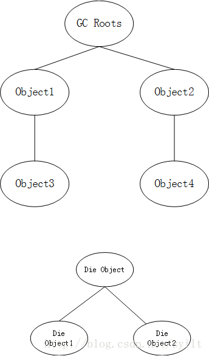

# 垃圾回收机制

## 垃圾收集算法

* 标记-清除（Mark-and-sweep）—sun前期版本就是用这个技术。 原理：对于“活”的对象，一定可以追溯到其存活在堆栈、静态存储区之中的引用。这个引用链条可能会穿过数个对象层次。第一阶段：从GC roots开始遍历所有的引用，对有活的对象进行标记。第二阶段：对堆进行遍历，把未标记的对象进行清除。这个解决了循环引用的问题。 缺点：1、暂停整个应用；2、会产生内存碎片。

* 复制（copying） 原理：为了提升效率，把内存空间划分为2个相等的区域，每次只使用一个区域。垃圾回收时，遍历当前使用区域，把正在使用的对象复制到另外一个区域。优点：不会出现碎片问题。 缺点：1、暂停整个应用。2、需要2倍的内存空间。

* 标记-整理（Mark-Compact） 原理：第一阶段标记活的对象，第二阶段把为标记的对象压缩到堆的其中一块，按顺序放。即将所有存活的对象都向一端移动，然后直接清除掉端边界以外的内存。优点：1、避免标记扫描的碎片问题；2、避免停止复制的空间问题。 具体使用什么方法GC，Java虚拟机会进行监视，如果所有对象都很稳定，垃圾回收器的效率低的话，就切换到“标记-扫描”方式；同样，Java虚拟机会跟踪“标记-扫描”的效果，要是堆空间碎片出现很多碎片，就会切换回“停止-复制”模式。这就是自适应的技术。

* 分代（generational collecting）—–J2SE1.2以后使用此算法 原理：基于对象生命周期分析得出的垃圾回收算法。把对象分为年轻代、年老代、持久代，对不同的生命周期使用不同的算法（2-3方法中的一个即4自适应）进行回收。

    * 新生代：每次垃圾收集都有大量对象死去，只有少量存活，就选择复制算法

    * 老年代：对象存活率高、没有额外空间对它进行分配担保，就必须使用“标记-清理”，或者“标记-整理”算法来进行回收。

* 自适应算法(Adaptive Collector)在特定的情况下，一些垃圾收集算法会优于其它算法。基于Adaptive算法的垃圾收集器就是监控当前堆的使用情况，并将选择适当算法的垃圾收集器。

## HotSpot实现的复制算法流程如下:

1. 当Eden区满的时候,会触发第一次Minor gc,把还活着的对象拷贝到Survivor From区；当Eden区再次触发Minor gc的时候,会扫描Eden区和From区域,对两个区域进行垃圾回收,经过这次回收后还存活的对象,则直接复制到To区域,并将Eden和From区域清空。

2. 当后续Eden又发生Minor gc的时候,会对Eden和To区域进行垃圾回收,存活的对象复制到From区域,并将Eden和To区域清空。

3. 部分对象会在From和To区域中复制来复制去,如此交换15次(由JVM参数MaxTenuringThreshold决定,这个参数默认是15),最终如果还是存活,就存入到老年代。

发生在新生代的垃圾回收成为Minor GC，Minor GC又称为新生代GC，因为新生代对象大多都具备朝生夕灭的特性，因此Minor GC(采用复制算法)非常频繁，一般回收速度也比较快。

3. 标记整理算法(老年代回收算法)
复制算法在对象存活率较高的老年代会进行很多次的复制操作，效率很低，所以在栈的老年代不适用复制算法。

针对老年代对象存活率高的特点，提出了一种称之为”标记-整理算法”。标记过程仍与”标记-清除”过程一致，但后续步骤不是直接对可回收对象进行清理，而是让所有存活对象都向一端移动，然后直接清理掉端边界以外的内存。流程图如下:

发生在老年代的GC称为Full GC，又称为Major GC，其经常会伴随至少一次的Minor GC(并非绝对，在Parallel Scavenge收集器中就有直接进行Full GC的策略选择过程)。Major GC的速度一般会比Minor GC慢10倍以上。

## GC的标记算法

### 引用计数标记 

引用计数标记实现起来比较简单，就是给对象添加一个引用计数器，每当有一个地方引用它时就加1，引用失效时就减1，当计数器为0的时候就标记为可回收。这种判断效率很高，但是很多主流的虚拟机并没有采用这种方法，因为其存在很大的局限性，因为它很难解决几个对象之间循环引用的问题，而往往在业务功能的实现需要多个对象的协同，像如下代码中的两个对象的相互引用会导致计数器不会变0即不会回收的情况
```
public class GCTest {

    private Object o;

    public void test(){

        GCTest g1 = new GCTest();
        GCTest g2 = new GCTest();

        //相互引用
        g1.o = g2;
        g2.o = g1;
    }
}
```

### 可达性分析标记 

可达性分析标记的设计思路为：将一些可称为“GC Roots”的对象作为起始点，从这些节点开始搜索，搜索和该节点发生直接或者间接引用关系的对象，将这些对象以链的形式组合起来，形成一张“关系网”，又被称为引用链。最后垃圾收集器回收那些不在这张关系网上的对象。如下图： 



连接GC Roots对象的object是确定还存活的对象，而下边的die Object虽然有引用关系，但是没有和GCROOTS有直接或间接的关系，所以会标记为可回收的对象。目前主流的商用虚拟机用的都是类似的方法，什么对象才能作为“GC Roots”呢？在java中，有四种对象可以作为“GC Roots”

1：栈帧中的引用对象。（栈中的） 
2：静态属性引用的对象。（方法区中的） 
3：常量引用的对象。（方法区中的） 
4：本地方法栈中JNI引用的对象。（本地方法（Native）栈中的）

### GC的二次标记

Object类有一个finalize()方法，所有类都继承了Object类，因此都会默认实现了这个方法。这个方法的用途是：在该对象被回收之前，该对象的finalize()方法会被调用。这里的回收之前指的就是被标记之后，但是会存在一种情况就是原本一个对象不在上面所讲的“关系网”（引用链）中，但是当开发者重写了finalize()后，并且将该对象重新加入到了“关系网”中，也就是说该对象在系统中还有用，不应该被回收，但是已经被标记了。针对这种情况，虚拟机的做法是进行两次标记，即第一次标记不在“关系网”中的对象。第二次的话就要先判断该对象有没有实现finalize()方法了，如果没有实现就直接判断该对象可回收；如果实现了就会先放在一个队列中，并由虚拟机建立的一个低优先级的线程去执行它，随后就会进行第二次的小规模标记，在这次被标记的对象就会真正的被回收了。