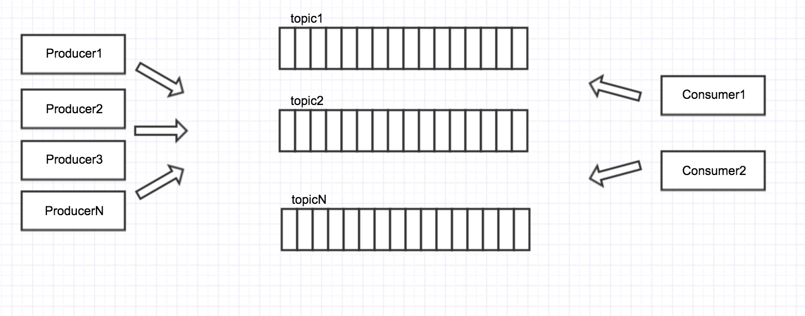
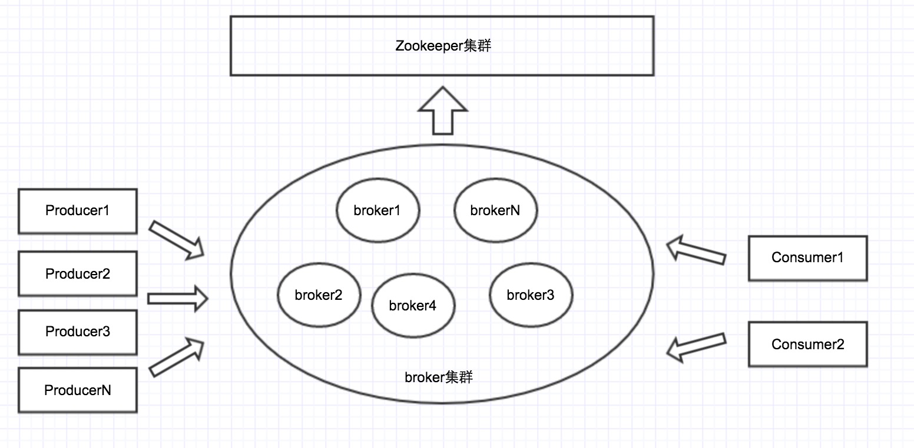

# 序列01 - 消息队列的策略与语义

作为一个消息队列，Kafka在业界已经相当有名。相对传统的RabbitMq/ActiveMq，Kafka天生就是分布式的，支持数据的分片、复制以及集群的方便扩展。

与此同时，Kafka是高可靠的、持久化的消息队列，并且这种可靠性没有以牺牲性能为前提。

同时，在允许丢消息的业务场景下，Kafka可以以非ACK、异步的方式来运行，从而最大程度的提高性能。

从本篇开始，本序列将会由浅入深、从使用方式到原理再到源码，全面的剖析Kafka这个消息中间件的方方面面。(所用Kafka源码为0.9.0)

## 关键概念介绍

### topic

以下是kafka的逻辑结构图: 每个topic也就是自定义的一个队列，producer往队列中放消息，consumer从队列中取消息，topic之间相互独立。



### broker
与上图对应的是kafka的物理结构图：每个broker通常就是一台物理机器，在上面运行kafka server的一个实例，所有这些broker实例组成kafka的服务器集群。

每个broker会给自己分配一个唯一的broker id。broker集群是通过zookeeper集群来管理的。每个broker都会注册到zookeeper上，有某个机器挂了，有新的机器加入，zookeeper都会收到通知。

在0.9.0中，producer/consumer已经不会依赖Zookeeper来获取集群的配置信息，而是通过任意一个broker来获取整个集群的配置信息。如下图所示：只有服务端依赖zk，客户端不依赖zk。



### partition

kafka的topic，在每个机器上，是用文件存储的。而这些文件呢，会分目录。partition就是文件的目录。比如一个topic叫abc，分了10个partition，则在机器的目录上，就是：
```
abc_0
abc_1
abc_2
abc_3
…
abc_9
```
然后每个目录里面，存放了一堆消息文件，消息是顺序append log方式存储的。关于这个，后面会详细阐述。

### replica/leader/follower

每个topic的partition的所有消息，都不是只存1份，而是在多个broker上冗余存储，从而提高系统的可靠性。这多台机器就叫一个replica集合。

在这个replica集合中，需要选出1个leader，剩下的是follower。也就是master/slave。

发送消息的时候，只会发送给leader，然后leader再把消息同步给followers（以pull的方式，followers去leader上pull，而不是leader push给followers)。

那这里面就有一个问题：leader收到消息之后，是直接返回给producer呢，还是等所有followers都写完消息之后，再返回？ 关于这个，后面会相信阐述。

关键点：这里replica/leader/follower都是逻辑概念，并且是相对"partition"来讲的，而不是"topic"。也就说，同一个topic的不同partition，对于的replica集合可以是不一样的。

比如
“abc-0” <1,3,5> //abc_0的replica集合是borker 1, 3, 5， leader是1， follower是3, 5
“abc-1” <1,3,7> //abc_1的replica集合是broker 1, 3, 7，leader是1, follower是3, 7

## 消息队列的各种策略和语义

对于消息队列的使用，表面上看起来很简单，一端往里面放，一端从里面取。但就在这一放一取中，存在着诸多策略。

### Producer的策略

#### 是否ACK

所谓ACK，是指服务器收到消息之后，是存下来之后，再给客户端返回，还是直接返回。很显然，是否ACK，是影响性能的一个重要指标。在kafka中，request.required.acks有3个取值，分别对应3种策略：

* request.required.acks
    * 0: 不等服务器ack就返回了，性能最高，可能丢数据
    * 1: leader确认消息存下来了，再返回
    * all: leader和当前ISR中所有replica都确认消息存下来了，再返回（这种方式最可靠）

备注：在0.9.0以前的版本，是用-1表示all

#### 同步发送 vs 异步发送

所谓异步发送，就是指客户端有个本地缓冲区，消息先存放到本地缓冲区，然后有后台线程来发送。

在0.8.2和0.8.2之前的版本中，同步发送和异步发送是分开实现的，用的Scala语言。从0.8.2开始，引入了1套新的Java版的client api。在这套api中，同步实际上是用异步间接实现的：

在异步发送下，有以下4个参数需要配置：

（1）队列的最大长度
buffer.memory	//缺省为33554432, 即32M

（2）队列满了，客户端是阻塞，还是抛异常出来（缺省是true)
block.on.buffer.full	
//true: 阻塞消息
//false：抛异常

（3）发送的时候，可以批量发送的数据量
batch.size	//缺省16384字节，即16K

（4）最长等多长时间，批量发送
linger.ms	//缺省是0
//类似TCP/IP协议中的linger algorithm，> 0 表示发送的请求，会在队列中积攥，然后批量发送。

很显然，异步发送可以提高发送的性能，但一旦客户端挂了，就可能丢数据。

对于RabbitMQ, ActiveMQ，他们都强调可靠性，因此不允许非ACK的发送，也没有异步发送模式。Kafka提供了这个灵活性，允许使用者在性能与可靠性之间做权衡。

（5）消息的最大长度
max.request.size //缺省是1048576，即1M

这个参数会影响batch的大小，如果单个消息的大小 > batch的最大值(16k)，那么batch会相应的增大

### Consumer的策略

#### Push vs Pull

所有的消息队列都要面对一个问题，是broker把消息Push给消费者呢，还是消费者主动去broker Pull消息？

kafka选择了pull的方式，为什么呢？ 因为pull的方式更灵活：消息发送频率应该如何，消息是否可以延迟然后batch发送，这些信息只有消费者自己最清楚！

因此把控制权交给消费者，消费者自己控制消费的速率，当消费者处理消息很慢时，它可以选择减缓消费速率；当处理消息很快时，它可以选择加快消费速率。而在push的方式下，要实现这种灵活的控制策略，就需要额外的协议，让消费者告诉broker，要减缓还是加快消费速率，这增加了实现的复杂性。

另外pull的方式下，消费者可以很容易的自适应控制消息是batch的发送，还是最低限度的减少延迟，每来1个就发送1个。

#### 消费的confirm

在消费端，所有消息队列都要解决的一个问题就是“消费确认问题”：消费者拿到一个消息，然后处理这个消息的时候挂了，如果这个时候broker认为这个消息已经消费了，那这条消息就丢失了。

一个解决办法就是，消费者在消费完之后，再往broker发个confirm消息。broker收到confirm消息之后，再把消息删除。

要实现这个，broker就要维护每个消息的状态，已发送/已消费，很显然，这会增大broker的实现难度。同时，这还有另外一个问题，就是消费者消费完消息，发送confirm的时候，挂了。这个时候会出现重复消费的问题。

kafka没有直接解决这个问题，而是引入offset回退机制，变相解决了这个问题。在kafka里面，消息会存放一个星期，才会被删除。并且在一个partion里面，消息是按序号递增的顺序存放的，因此消费者可以回退到某一个历史的offset，进行重新消费。

当然，对于重复消费的问题，需要消费者去解决。

### broker的策略

#### 消息的顺序问题

在某些业务场景下，需要消息的顺序不能乱：发送顺序和消费顺序要严格一致。而在kafka中，同一个topic，被分成了多个partition，这多个partition之间是互相独立的。

之所以要分成多个partition，是为了提高并发度，多个partition并行的进行发送/消费，但这却没有办法保证消息的顺序问题。

一个解决办法是，一个topic只用一个partition，但这样很显然限制了灵活性。

还有一个办法就是，所有发送的消息，用同一个key，这样同样的key会落在一个partition里面。

消息的刷盘机制
我们都知道，操作系统本身是有page cache的。即使我们用无缓冲的io，消息也不会立即落到磁盘上，而是在操作系统的page cache里面。操作系统会控制page cache里面的内容，什么时候写回到磁盘。在应用层，对应的就是fsync函数。

我们可以指定每条消息都调用一次fsync存盘，但这会较低性能，也增大了磁盘IO。也可以让操作系统去控制存盘。

#### 消息的不重不漏 – Exactly Once

一个完美的消息队列，应该做到消息的“不重不漏”，这里面包含了4重语义：
* 消息不会重复存储；
* 消息不会重复消费；
* 消息不会丢失存储；
* 消息不会丢失消费。

先说第1个：重复存储。发送者发送一个消息之后，服务器返回超时了。那请问，这条消息是存储成功了，还是没有呢？
要解决这个问题：发送者需要给每条消息增加一个primary key，同时服务器要记录所有发送过的消息，用于判重。很显然，要实现这个，代价很大

重复消费：上面说过了，要避免这个，消费者需要消息confirm。但同样，会引入其他一些问题，比如消费完了，发送confirm的时候，挂了怎么办？ 一个消息一直处于已发送，但没有confirm状态怎么办？

丢失存储：这个已经解决

丢失消费：同丢失存储一样，需要confirm。

总结一下：真正做到不重不漏，exactly once，是很难的。这个需要broker、producer、consumer和业务方的协调配合。

在kafka里面，是保证消息不漏，也就是at least once。至于重复消费问题，需要业务自己去保证，比如业务加判重表。