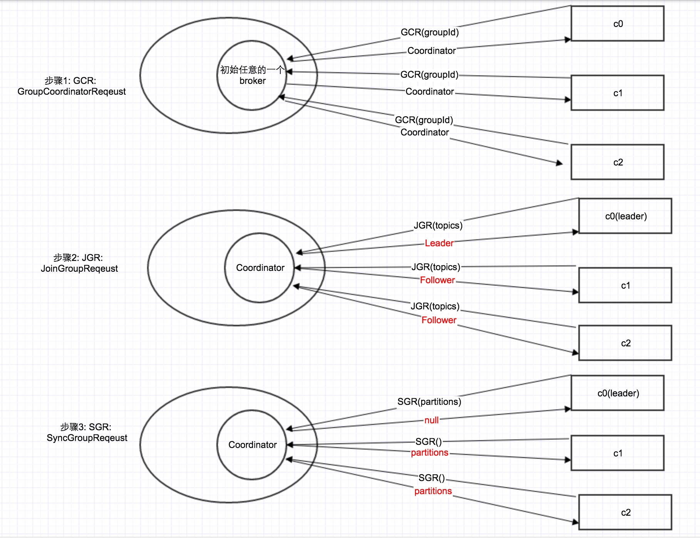

# 序列07-Consumer-coordinator协议与heartbeat实现原理

## 单线程的consumer

在前面我们讲过，KafkaProducer是线程安全的，同时其内部还有一个Sender，开了一个后台线程，不断从队列中取消息进行发送。
而consumer，是一个纯粹的单线程程序，后面所讲的所有机制，包括coordinator，rebalance, heartbeat等，都是在这个单线程的poll函数里面完成的。也因此，在consumer的代码内部，没有锁的出现。

## 何为coordinator?
### 去Zookeeper依赖
在0.9以前的client api中，consumer是要依赖Zookeeper的。因为同一个consumer group中的所有consumer需要进行协同，进行下面所讲的rebalance。

但是因为zookeeper的“herd”与“split brain”，导致一个group里面，不同的consumer拥有了同一个partition，进而会引起消息的消费错乱。为此，在0.9中，不再用zookeeper，而是Kafka集群本身来进行consumer之间的同步。下面引自kafka设计的原文：

https://cwiki.apache.org/confluence/display/KAFKA/Kafka+0.9+Consumer+Rewrite+Design#Kafka0.9ConsumerRewriteDesign-Failuredetectionprotocol

https://cwiki.apache.org/confluence/display/KAFKA/Consumer+Client+Re-Design

```
The current version of the high level consumer suffers from herd and split brain problems, where multiple consumers in a group run a distributed algorithm to agree on the same partition ownership decision. Due to different view of the zookeeper data, they run into conflicts that makes the rebalancing attempt fail. But there is no way for a consumer to verify if a rebalancing operation completed successfully on the entire group. This also leads to some potential bugs in the rebalancing logic, for example, https://issues.apache.org/jira/browse/KAFKA-242
```

### 为什么在一个group内部，1个parition只能被1个consumer拥有？
我们知道，对于属于不同consumer group的consumers，可以消费同1个partition，从而实现Pub/Sub模式。

但是在一个group内部，是不允许多个consumer消费同一个partition的，这也就意味着，对于1个topic，1个group来说， 其partition数目 >= consumer个数。

比如对于1个topic，有4个partition，那么在一个group内部，最多只能有4个consumer。你加入更多的consumer，它们也不会分配到partition。

那为什么要做这个限制呢？原因在下面这篇文章中，有详细阐述： 
http://stackoverflow.com/questions/25896109/in-apache-kafka-why-cant-there-be-more-consumer-instances-than-partitions

简单来说，一个是因为这样做就没办法保证同1个partition消息的时序；另1方面，Kafka的服务器，是每个topic的每个partition的每个consumer group对应1个offset，即(topic, partition, consumer_group_id) – offset。如果多个consumer并行消费同1个partition，那offset的confirm就会出问题。

知道了这个前提，下面我们就来分析partition的分配问题。

### coordinator协议 / partition分配问题
问题的提出： 
给定一个topic，有4个partition: p0, p1, p2, p3， 一个group有3个consumer: c0, c1, c2。那么，如果按范围分配策略，分配结果是： 
c0: p0, c1: p1, c2: p2, p3 
如果按轮询分配策略： 
c0: p0, p3, c1: p1, c2: p2

那这整个分配过程是如何进行的呢？见下图所示： 



### 3步分配过程

步骤1：对于每1个consumer group，Kafka集群为其从broker集群中选择一个broker作为其coordinator。因此，第1步就是找到这个coordinator。
```
private Map<TopicPartition, List<ConsumerRecord<K, V>>> pollOnce(long timeout) {
        coordinator.ensureCoordinatorKnown();  //poll函数的第1行，就是寻找coordinator。如果没找到，就会一直阻塞在这里
        ...
 }

    public void ensureCoordinatorKnown() {
        while (coordinatorUnknown()) {
            RequestFuture<Void> future = sendGroupMetadataRequest();
            client.poll(future);

            if (future.failed()) {
                if (future.isRetriable())
                    client.awaitMetadataUpdate();
                else
                    throw future.exception();
            }
        }
    }

    private RequestFuture<Void> sendGroupMetadataRequest() {
        Node node = this.client.leastLoadedNode();
        if (node == null) {
            return RequestFuture.noBrokersAvailable();
        } else {
            GroupCoordinatorRequest metadataRequest = new GroupCoordinatorRequest(this.groupId);  //向集群中负载最小的node，发送请求，询问这个group id对应的coordinator是谁
            return client.send(node, ApiKeys.GROUP_COORDINATOR, metadataRequest)
                    .compose(new RequestFutureAdapter<ClientResponse, Void>() {
                        @Override
                        public void onSuccess(ClientResponse response, RequestFuture<Void> future) {
                            handleGroupMetadataResponse(response, future);
                        }
                    });
        }
    }
```
步骤2：找到coordinator之后，发送JoinGroup请求
```
private Map<TopicPartition, List<ConsumerRecord<K, V>>> pollOnce(long timeout) {
        coordinator.ensureCoordinatorKnown();  //步骤1：寻找coordinator

        if (subscriptions.partitionsAutoAssigned())
            coordinator.ensurePartitionAssignment(); //步骤2+3： JoinGroup + SyncGroup

    public void ensureActiveGroup() {
        if (!needRejoin())
            return;

        if (needsJoinPrepare) {
            onJoinPrepare(generation, memberId);
            needsJoinPrepare = false;
        }

        while (needRejoin()) {
            ensureCoordinatorKnown();

           if (client.pendingRequestCount(this.coordinator) > 0) {
                client.awaitPendingRequests(this.coordinator);
                continue;
            }

            RequestFuture<ByteBuffer> future = performGroupJoin();
            client.poll(future);

            if (future.succeeded()) {
                onJoinComplete(generation, memberId, protocol, future.value());
                needsJoinPrepare = true;
                heartbeatTask.reset();
            } else {
                RuntimeException exception = future.exception();
                if (exception instanceof UnknownMemberIdException ||
                        exception instanceof RebalanceInProgressException ||
                        exception instanceof IllegalGenerationException)
                    continue;
                else if (!future.isRetriable())
                    throw exception;
                time.sleep(retryBackoffMs);
            }
        }
    }
```
步骤3：JoinGroup返回之后，发送SyncGroup，得到自己所分配到的partition
```
private RequestFuture<ByteBuffer> performGroupJoin() {
        if (coordinatorUnknown())
            return RequestFuture.coordinatorNotAvailable();

        // send a join group request to the coordinator
        log.debug("(Re-)joining group {}", groupId);
        JoinGroupRequest request = new JoinGroupRequest(
                groupId,
                this.sessionTimeoutMs,
                this.memberId,
                protocolType(),
                metadata());

        // create the request for the coordinator
        log.debug("Issuing request ({}: {}) to coordinator {}", ApiKeys.JOIN_GROUP, request, this.coordinator.id());
        return client.send(coordinator, ApiKeys.JOIN_GROUP, request)
                .compose(new JoinGroupResponseHandler());
    }


    private class JoinGroupResponseHandler extends CoordinatorResponseHandler<JoinGroupResponse, ByteBuffer> {

        @Override
        public JoinGroupResponse parse(ClientResponse response) {
            return new JoinGroupResponse(response.responseBody());
        }

        @Override
        public void handle(JoinGroupResponse joinResponse, RequestFuture<ByteBuffer> future) {
            // process the response
            short errorCode = joinResponse.errorCode();
            if (errorCode == Errors.NONE.code()) {
                log.debug("Joined group: {}", joinResponse.toStruct());
                AbstractCoordinator.this.memberId = joinResponse.memberId();
                AbstractCoordinator.this.generation = joinResponse.generationId();
                AbstractCoordinator.this.rejoinNeeded = false;
                AbstractCoordinator.this.protocol = joinResponse.groupProtocol();
                sensors.joinLatency.record(response.requestLatencyMs());
                if (joinResponse.isLeader()) {
                    onJoinLeader(joinResponse).chain(future); //关键点：在JoinGroup返回之后，竟跟着发送SyncGroup消息
                } else {
                    onJoinFollower().chain(future);
                }
            } else if (errorCode == Errors.GROUP_LOAD_IN_PROGRESS.code()) {
               。。。
            }
        }
    }
```
注意，在上面3步中，有一个关键点： partition的分配策略和分配结果其实是由client决定的，而不是由coordinator决定的。什么意思呢？在第2步，所有consumer都往coordinator发送JoinGroup消息之后，coordinator会指定其中一个consumer作为leader，其他consumer作为follower。

然后由这个leader进行partition分配。然后在第3步，leader通过SyncGroup消息，把分配结果发给coordinator，其他consumer也发送SyncGroup消息，获得这个分配结果。

为什么要在consumer中选一个leader出来，进行分配，而不是由coordinator直接分配呢？关于这个, Kafka的官方文档有详细的分析。其中一个重要原因是为了灵活性：如果让server分配，一旦需要新的分配策略，server集群要重新部署，这对于已经在线上运行的集群来说，代价是很大的；而让client分配，server集群就不需要重新部署了。

## rebalance机制
所谓rebalance，就是在某些条件下，partition要在consumer中重新分配。那哪些条件下，会触发rebalance呢？ 
条件1：有新的consumer加入 
条件2：旧的consumer挂了 
条件3：coordinator挂了，集群选举出新的coordinator 
条件4：topic的partition新加 
条件5：consumer调用unsubscrible()，取消topic的订阅

当consumers检测到要rebalance时，所有consumer都会重走上面的流程，进行步骤2 + 步骤3： JoinGroup + SyncGroup。

可问题是： 当一个consumer挂了，或者有新的consumer加入，其他consumers怎么知道要进行rebalance呢？ 答案就是下面的heartbeat。

## heartbeat的实现原理
每一个consumer都会定期的往coordinator发送heartbeat消息，一旦coordinator返回了某个特定的error code：ILLEGAL_GENERATION, 就说明之前的group无效了（解散了），要重新进行JoinGroup + SyncGroup操作。

那这个定期发送如何实现呢？一个直观的想法就是开一个后台线程，定时发送heartbeat消息，但维护一个后台线程，很显然会增大实现的复杂性。上面也说了， consumer是单线程程序。在这里是通过DelayedQueue来实现的。

### DelayedQueue与HeartBeatTask
其基本思路是把HeartBeatRequest放入一个DelayedQueue中，然后在while循环的poll中，每次从DelayedQueue中把请求拿出来发送出去（只有时间到了，Task才能从Queue中拿出来）。
```
private class HeartbeatTask implements DelayedTask {

        private boolean requestInFlight = false;  //关键变量：判断当前是否有发送出去的HeartBeatRequest，其Response还没回来

        //reset本质就是发送函数
        public void reset() {      
            long now = time.milliseconds();
            heartbeat.resetSessionTimeout(now);
            client.unschedule(this);

            if (!requestInFlight)
                client.schedule(this, now);  //如果没有requestInFlight，则把HeartBeatTask放入DelayedQueue中
        }

        @Override
        public void run(final long now) {
            if (generation < 0 || needRejoin() || coordinatorUnknown()) {
                return;
            }

            if (heartbeat.sessionTimeoutExpired(now)) {
                coordinatorDead();
                return;
            }

            if (!heartbeat.shouldHeartbeat(now)) {
                client.schedule(this, now + heartbeat.timeToNextHeartbeat(now));
            } else {
                heartbeat.sentHeartbeat(now);
                requestInFlight = true;

                RequestFuture<Void> future = sendHeartbeatRequest();
                future.addListener(new RequestFutureListener<Void>() {
                    @Override
                    public void onSuccess(Void value) {
                        requestInFlight = false;
                        long now = time.milliseconds();
                        heartbeat.receiveHeartbeat(now);
                        long nextHeartbeatTime = now + heartbeat.timeToNextHeartbeat(now);
                        //放入delayedQueue
                        client.schedule(HeartbeatTask.this, nextHeartbeatTime);
                    }

         //hearbeat返回之后，无论response成功，还是失败，把下1个heartbeat放入delayedQueue，从而形成循环间隔发送
                    @Override
                    public void onFailure(RuntimeException e) {
                        requestInFlight = false;
                        client.schedule(HeartbeatTask.this, time.milliseconds() + retryBackoffMs);
                    }
                });
            }
        }
```

### rebalance检测
首先一点说明：个人认为这里的网络框架，封装的有点冗余：sendHeartbeatRequest既有callback机制（CompleteHandler），又为其Future加了Listener机制（上面的代码）。

也就是在heartbeat的completeHandler中，完成了rebalance的检测：从下面代码可以看出，对于以下的response error code，都会触发rebalance:

```
* GROUP_COORDINATOR_NOT_AVAILABLE (15)
* NOT_COORDINATOR_FOR_GROUP (16)
* ILLEGAL_GENERATION (22)
* UNKNOWN_MEMBER_ID (25)
* REBALANCE_IN_PROGRESS (27)
* GROUP_AUTHORIZATION_FAILED (30)
```
```
 public RequestFuture<Void> sendHeartbeatRequest() {
        HeartbeatRequest req = new HeartbeatRequest(this.groupId, this.generation, this.memberId);
        return client.send(coordinator, ApiKeys.HEARTBEAT, req)
                .compose(new HeartbeatCompletionHandler());
    }

    private class HeartbeatCompletionHandler extends CoordinatorResponseHandler<HeartbeatResponse, Void> {
        @Override
        public HeartbeatResponse parse(ClientResponse response) {
            return new HeartbeatResponse(response.responseBody());
        }

        @Override
        public void handle(HeartbeatResponse heartbeatResponse, RequestFuture<Void> future) {
            sensors.heartbeatLatency.record(response.requestLatencyMs());
            short errorCode = heartbeatResponse.errorCode();
            if (errorCode == Errors.NONE.code()) {
                log.debug("Received successful heartbeat response.");
                future.complete(null);
            } else if (errorCode == Errors.GROUP_COORDINATOR_NOT_AVAILABLE.code()
                    || errorCode == Errors.NOT_COORDINATOR_FOR_GROUP.code()) {
                log.info("Attempt to heart beat failed since coordinator is either not started or not valid, marking it as dead.");
                coordinatorDead();
                future.raise(Errors.forCode(errorCode));
            } else if (errorCode == Errors.REBALANCE_IN_PROGRESS.code()) {
                log.info("Attempt to heart beat failed since the group is rebalancing, try to re-join group.");
                AbstractCoordinator.this.rejoinNeeded = true;
                future.raise(Errors.REBALANCE_IN_PROGRESS);
            } else if (errorCode == Errors.ILLEGAL_GENERATION.code()) {
                log.info("Attempt to heart beat failed since generation id is not legal, try to re-join group.");
                AbstractCoordinator.this.rejoinNeeded = true;
                future.raise(Errors.ILLEGAL_GENERATION);
            } else if (errorCode == Errors.UNKNOWN_MEMBER_ID.code()) {
                log.info("Attempt to heart beat failed since member id is not valid, reset it and try to re-join group.");
                memberId = JoinGroupRequest.UNKNOWN_MEMBER_ID;
                AbstractCoordinator.this.rejoinNeeded = true;
                future.raise(Errors.UNKNOWN_MEMBER_ID);
            } else if (errorCode == Errors.GROUP_AUTHORIZATION_FAILED.code()) {
                future.raise(new GroupAuthorizationException(groupId));
            } else {
                future.raise(new KafkaException("Unexpected errorCode in heartbeat response: "
                        + Errors.forCode(errorCode).exception().getMessage()));
            }
        }
    }
```

关键点：这里所谓的触发，其实就是把rejoinNeeded置为了true。然后在下一次poll循环的时候，检测到rejoinNeeded为true，就会重走上面的步骤2 + 步骤3

## failover
对于这整个体系来说，consumer可能挂掉，coordinator也可能挂掉。因此双方需要互相检测，对方是否挂了。

检测方法同样是上面的heartbeat：当consumer发现heartbeat返回超时，或者coordinator很久没有收到heartbeat，就会认为对方挂了。

当然，这会有“误操作”，比如consumer处理消息很慢（因为是单线程），导致下1次heartbeat迟迟没有发出去。这个时候coordinator就会认为该consumer挂了，会主动断开连接。从而触发1次rebalance。

### consumer认为coordinator挂了
就会从上面的步骤1开始，重新discovery coordinator，然后JoinGroup + SyncGroup

### coordinator认为consumer挂了
从上面的步骤2开始，通知其他所有剩下的consumers，进行JoinGroup + SyncGroup