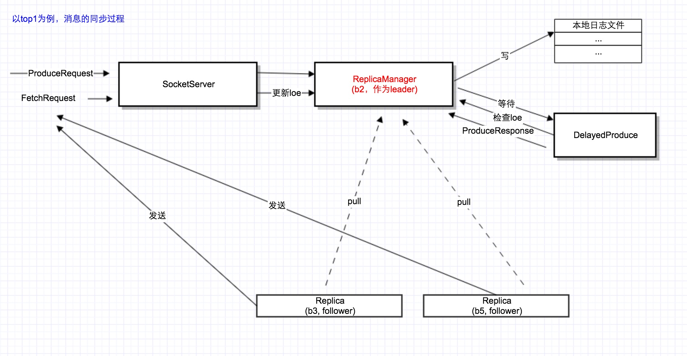

# 序列12-Server核心组件之2-ReplicaManager核心数据结构与Replica同步原理

在上1篇，我们介绍了kafka server的1个核心组件Controller，今天我们介绍第2个核心组件ReplicaManager。ReplicaManager主要功能是完成消息从leader到其它followers的同步。

## ReplicaManager核心数据结构
假如有1堆的broker: b0, b1, b2, b3, … 当前结点为b2； 
b2有3个partition: t0p0, t0p1, t1p1； 
每个partition对应的replica如下： 
t0p0: b0, b2,b4（对于该partition，b2作为follower)； 
t0p1: b2, b3, b5（对于该partition，b2作为leader); 
t1p1: b2, b6, b8（对于该partition，b2作为leader)。

则对于b2这个结点来说，其ReplicaManager核心结构如下：


其中，ReplicaManager内部有一个成员变量，存储了该台机器上所有的partition:
```
class ReplicaManager(val config: KafkaConfig,
                     metrics: Metrics,
                     time: Time,
                     jTime: JTime,
                     val zkUtils: ZkUtils,
                     scheduler: Scheduler,
                     val logManager: LogManager,
                     val isShuttingDown: AtomicBoolean,
                     threadNamePrefix: Option[String] = None) extends Logging with KafkaMetricsGroup {
  //核心变量：存储该节点上所有的Partition
  private val allPartitions = new Pool[(String, Int), Partition]
```
然后对于每1个Partition，其内部又存储了其所有的replica，也就是ISR:
```
class Partition(val topic: String,
                val partitionId: Int,
                time: Time,
                replicaManager: ReplicaManager) extends Logging with KafkaMetricsGroup {
  private val localBrokerId = replicaManager.config.brokerId
  private val logManager = replicaManager.logManager
  private val zkUtils = replicaManager.zkUtils
  private val assignedReplicaMap = new Pool[Int, Replica]
  //核心变量：这个Partition的leader
  @volatile var leaderReplicaIdOpt: Option[Int] = None

  //核心变量：isr，也即除了leader以外，其它所有的活着的follower集合
  @volatile var inSyncReplicas: Set[Replica] = Set.empty[Replica]
```
对于每1个Replica，其核心结构如下：
```
class Replica(val brokerId: Int,
              val partition: Partition,
              time: Time = SystemTime,
              initialHighWatermarkValue: Long = 0L,
              val log: Option[Log] = None) extends Logging {

  。。。
  //核心变量：该Replica当前从leader那fetch消息的最近offset，简称为loe
  @volatile private[this] var logEndOffsetMetadata: LogOffsetMetadata = LogOffsetMetadata.UnknownOffsetMetadata
```
知道了上述ReplicaManager的核心结构，下面看一下日志的同步过程：每1条发送给leader的消息，是如何同步给follower的。

## Replica同步原理



以partition t0p1为例，b2作为leader，b3, b5作为follower，整个过程如下： 
(1)b2的SocketServer收到producer的ProduceRequest请求，把请求交给ReplicaManager处理, ReplicaManager调用自己的appendMessages函数，把消息存到本地日志。 
(2)ReplicaManager生成一个DelayedProduce对象，放入DelayedProducerPurgatory中，等待followers来把该请求pull到自己机器上 
(3)2个followers会跟consumer一样，发送FetchRequest请求到SocketServer，ReplicaManager调用自己的fetchMessage函数返回日志，同时更新2个follower的LOE，并且判断DelayedProducer是否可以complete。如果可以，则发送ProduceResponse.

下面看一下FetchRequest的处理代码：
```
//ReplicaManager
  def fetchMessages(timeout: Long,
                    replicaId: Int,
                    fetchMinBytes: Int,
                    fetchInfo: immutable.Map[TopicAndPartition, PartitionFetchInfo],
                    responseCallback: Map[TopicAndPartition, FetchResponsePartitionData] => Unit) {
    ...
    if(Request.isValidBrokerId(replicaId))  //关键性的判断：如果这个FetchRequest来自一个Replica，而不是普通的Consumer
      updateFollowerLogReadResults(replicaId, logReadResults) //check DelayedProducer是否可以complete了

//check相对应的DelayedProduce
  def tryCompleteDelayedProduce(key: DelayedOperationKey) {
    val completed = delayedProducePurgatory.checkAndComplete(key)
    debug("Request key %s unblocked %d producer requests.".format(key.keyLabel, completed))
  }
```

这里有3个关键点： 
0. 每个DelayedProduce，内部包含一个ProduceResponseCallback函数。当complete之后，该callback被回调，也就处理了ProduceRequest请求. 
1。 leader处理ProduceRequest请求和followers同步日志，这2个事情是并行的。leader并不会等待2个followers同步完该消息，再处理下1个。 
2。每一个ProduceRequest对于一个该请求写入日志时的requestOffset。判断该条消息同步是否完成，只要每个replica的Loe >= requestOffset就可以了，并不需要完全相等。

## 总结
本篇分析了ReplicaManager处理ProduceRequest时，消息的同步思路。还有1块没提到，就是“超时”的处理：也就是leader不可能无限期的等所有followers来同步该条消息，当超过一定时间，leader就会直接返回“超时”错误。

也就是说，对于每1个ProduceRequest，都得有一个“定时器”。关于这个，下1篇讲详细处理。