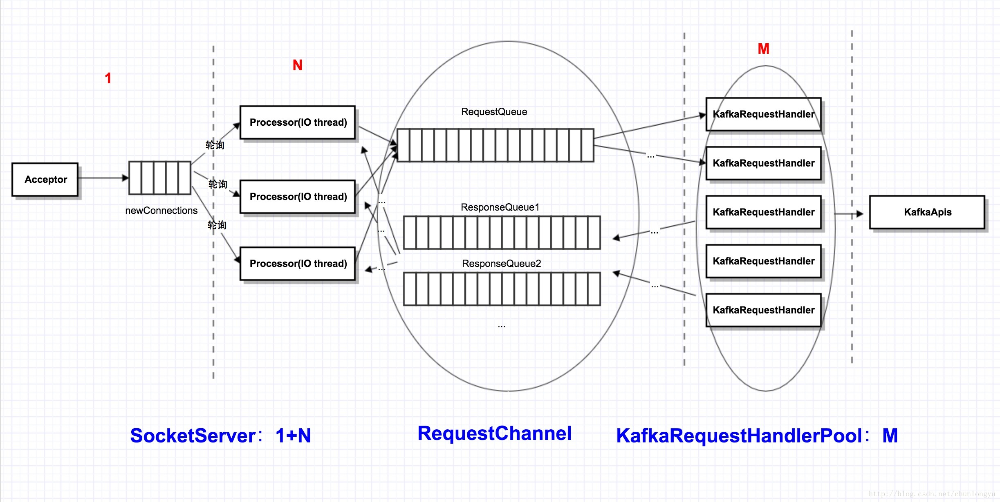

# 序列14-Server核心组件之3-SocketServer与NIO-1+N+M 模型

对于任何服务器程序来讲，网络框架都是其最基础的部分。在前面我们分析了Producer端的NIO和Network框架，本篇将详细分析服务器端的Network框架。

同时对比一下Kafka的1+N+M模型和Tomcat 6的1+N+M模型有什么重要区别。

## 入口 KafkaServer
让我们从main函数出发，看一下网络框架在入口中有那些组件：
```
 def startup() {
    try {

        ...
        //关键组件：SocketServer
        socketServer = new SocketServer(config, metrics, kafkaMetricsTime)
        socketServer.startup()

        ...
        //关键组件：KafkaApis
        apis = new KafkaApis(socketServer.requestChannel, replicaManager, consumerCoordinator,
          kafkaController, zkUtils, config.brokerId, config, metadataCache, metrics, authorizer)

        ...
        //关键组件：KafkaRequestHandlerPool
        requestHandlerPool = new KafkaRequestHandlerPool(config.brokerId, socketServer.requestChannel, apis, config.numIoThreads)

        ...
        }

        ...
      }
    }
    catch {
      case e: Throwable =>
        fatal("Fatal error during KafkaServer startup. Prepare to shutdown", e)
        isStartingUp.set(false)
        shutdown()
        throw e
    }
  }
```
从上面可以的入口程序可以看出，网络部分，有3个核心组件： 
SocketServer 
KafkaApis 
KafkaRequestHandlerPool

下面就来分析这几个核心组件是如何联系在一起的.

## 1+N+M模型
在很多的网络框架中，我们都能看到类似的1+N+M模型，具体说来，就是：

1个监听线程，负责监听新的socket连接； 
N个IO线程，负责对socket进行读写，N一般等于cpu的核数； 
M个worker线程，负责处理数据。

其中线程之间通过队列进行连接。

下面就通过源码来分析Kafka的1+N+M模型的具体实现过程。 



## Acceptor的run函数
```
private[kafka] class Acceptor(val endPoint: EndPoint,
                              val sendBufferSize: Int,
                              val recvBufferSize: Int,
                              brokerId: Int,
                              processors: Array[Processor],
                              connectionQuotas: ConnectionQuotas) extends AbstractServerThread(connectionQuotas) with KafkaMetricsGroup {

  private val nioSelector = NSelector.open()
  val serverChannel = openServerSocket(endPoint.host, endPoint.port)

  //Acceptor线程的run函数
  def run() {
    serverChannel.register(nioSelector, SelectionKey.OP_ACCEPT)  //注册OP_ACCEPT事件
    startupComplete()
    try {
      var currentProcessor = 0
      while (isRunning) {
        try {
          val ready = nioSelector.select(500)
          if (ready > 0) {
            val keys = nioSelector.selectedKeys()
            val iter = keys.iterator()
            while (iter.hasNext && isRunning) {
              try {
                val key = iter.next
                iter.remove()
                if (key.isAcceptable)
                  accept(key,   processors(currentProcessor))  //拿到一个socket连接，轮训选择一个processor进行处理
                else
                  throw new IllegalStateException("Unrecognized key state for acceptor thread.")

                //轮训算法
                currentProcessor = (currentProcessor + 1) % processors.length
              } catch {
                case e: Throwable => error("Error while accepting connection", e)
              }
            }
          }
        }
        catch {
          // We catch all the throwables to prevent the acceptor thread from exiting on exceptions due
          // to a select operation on a specific channel or a bad request. We don't want the
          // the broker to stop responding to requests from other clients in these scenarios.
          case e: ControlThrowable => throw e
          case e: Throwable => error("Error occurred", e)
        }
      }
    } finally {
      debug("Closing server socket and selector.")
      swallowError(serverChannel.close())
      swallowError(nioSelector.close())
      shutdownComplete()
    }
  }
```
```
def accept(key: SelectionKey, processor: Processor) {
    val serverSocketChannel = key.channel().asInstanceOf[ServerSocketChannel]
    val socketChannel = serverSocketChannel.accept()
    try {
      connectionQuotas.inc(socketChannel.socket().getInetAddress)
      socketChannel.configureBlocking(false)
      socketChannel.socket().setTcpNoDelay(true)
      socketChannel.socket().setKeepAlive(true)
      socketChannel.socket().setSendBufferSize(sendBufferSize)

      debug("Accepted connection from %s on %s. sendBufferSize [actual|requested]: [%d|%d] recvBufferSize [actual|requested]: [%d|%d]"
            .format(socketChannel.socket.getInetAddress, socketChannel.socket.getLocalSocketAddress,
                  socketChannel.socket.getSendBufferSize, sendBufferSize,
                  socketChannel.socket.getReceiveBufferSize, recvBufferSize))

      processor.accept(socketChannel)
    } catch {
      case e: TooManyConnectionsException =>
        info("Rejected connection from %s, address already has the configured maximum of %d connections.".format(e.ip, e.count))
        close(socketChannel)
    }
  }
```
```
//处理过程
  def accept(socketChannel: SocketChannel) {
    newConnections.add(socketChannel) //把新进来的connection放入newConnections队列
    wakeup()  //唤醒processor的Selector
  }
```
## Processor的run函数
```
override def run() {
    startupComplete()
    while(isRunning) {
      try {
        configureNewConnections()  //处理newConnections中的socket，注册OP_READ事件

        processNewResponses() //处理response

        try {
          selector.poll(300)
        } catch {
          case e @ (_: IllegalStateException | _: IOException) =>
            error("Closing processor %s due to illegal state or IO exception".format(id))
            swallow(closeAll())
            shutdownComplete()
            throw e
        }
        selector.completedReceives.asScala.foreach { receive =>
          try {
            val channel = selector.channel(receive.source)
            val session = RequestChannel.Session(new KafkaPrincipal(KafkaPrincipal.USER_TYPE, channel.principal.getName),
              channel.socketAddress)
            val req = RequestChannel.Request(processor = id, connectionId = receive.source, session = session, buffer = receive.payload, startTimeMs = time.milliseconds, securityProtocol = protocol)
            requestChannel.sendRequest(req)  //收到请求，放入request队列
          } catch {
            case e @ (_: InvalidRequestException | _: SchemaException) =>
              // note that even though we got an exception, we can assume that receive.source is valid. Issues with constructing a valid receive object were handled earlier
              error("Closing socket for " + receive.source + " because of error", e)
              close(selector, receive.source)
          }
          selector.mute(receive.source)
        }

        selector.completedSends.asScala.foreach { send =>
          val resp = inflightResponses.remove(send.destination).getOrElse {
            throw new IllegalStateException(s"Send for ${send.destination} completed, but not in `inflightResponses`")
          }
          resp.request.updateRequestMetrics()
          selector.unmute(send.destination)
        }

        selector.disconnected.asScala.foreach { connectionId =>
          val remoteHost = ConnectionId.fromString(connectionId).getOrElse {
            throw new IllegalStateException(s"connectionId has unexpected format: $connectionId")
          }.remoteHost
          // the channel has been closed by the selector but the quotas still need to be updated
          connectionQuotas.dec(InetAddress.getByName(remoteHost))
        }

      } catch {
        // We catch all the throwables here to prevent the processor thread from exiting. We do this because
        // letting a processor exit might cause bigger impact on the broker. Usually the exceptions thrown would
        // be either associated with a specific socket channel or a bad request. We just ignore the bad socket channel
        // or request. This behavior might need to be reviewed if we see an exception that need the entire broker to stop.
        case e : ControlThrowable => throw e
        case e : Throwable =>
          error("Processor got uncaught exception.", e)
      }
    }

    debug("Closing selector - processor " + id)
    swallowError(closeAll())
    shutdownComplete()
  }
```
## RequestChannel
在Kafka的1+N+M模型中，并不是1个request队列 + 1个response队列，而是为每个Processsor都准备了一个response队列，如上图所示，即1个request队列 + N个response队列。

这2种队列，封装在一个叫做RequestChannel的类中。这个类的一个全局对象，被Processor和KafkaRequestHandlerPool共用。

代码如下所示：
```
class RequestChannel(val numProcessors: Int, val queueSize: Int) extends KafkaMetricsGroup {

  ...
  //1个request Queue
  private val requestQueue = new ArrayBlockingQueue[RequestChannel.Request](queueSize)

  //N个response Queue
  private val responseQueues = new Array[BlockingQueue[RequestChannel.Response]](numProcessors)
  for(i <- 0 until numProcessors)
    responseQueues(i) = new LinkedBlockingQueue[RequestChannel.Response]()
  ...
```
## KafkaRequestHandlerPool的run函数
该类就是封装worker线程池的地方，新建了M个worker线程。每个线程，从requestQueue中取出request，然后调用KafkaApis处理，处理的response，再放回response Queue。
```
class KafkaRequestHandlerPool(val brokerId: Int,
                              val requestChannel: RequestChannel,
                              val apis: KafkaApis,
                              numThreads: Int) extends Logging with KafkaMetricsGroup {
  ...
  val threads = new Array[Thread](numThreads)
  val runnables = new Array[KafkaRequestHandler](numThreads)
  for(i <- 0 until numThreads) {
    runnables(i) = new KafkaRequestHandler(i, brokerId, aggregateIdleMeter, numThreads, requestChannel, apis)
    threads(i) = Utils.daemonThread("kafka-request-handler-" + i, runnables(i))
    threads(i).start()
  }

class KafkaRequestHandler(id: Int,
                          brokerId: Int,
                          val aggregateIdleMeter: Meter,
                          val totalHandlerThreads: Int,
                          val requestChannel: RequestChannel,
                          apis: KafkaApis) extends Runnable with Logging {
  this.logIdent = "[Kafka Request Handler " + id + " on Broker " + brokerId + "], "

  def run() {
    while(true) {
      try {
        var req : RequestChannel.Request = null
        while (req == null) {
          // We use a single meter for aggregate idle percentage for the thread pool.
          // Since meter is calculated as total_recorded_value / time_window and
          // time_window is independent of the number of threads, each recorded idle
          // time should be discounted by # threads.
          val startSelectTime = SystemTime.nanoseconds
          req = requestChannel.receiveRequest(300) //从队列中取出request

          val idleTime = SystemTime.nanoseconds - startSelectTime
          aggregateIdleMeter.mark(idleTime / totalHandlerThreads)
        }

        if(req eq RequestChannel.AllDone) {
          debug("Kafka request handler %d on broker %d received shut down command".format(
            id, brokerId))
          return
        }
        req.requestDequeueTimeMs = SystemTime.milliseconds
        trace("Kafka request handler %d on broker %d handling request %s".format(id, brokerId, req))
        apis.handle(req)  //处理结果，同时放入response队列
      } catch {
        case e: Throwable => error("Exception when handling request", e)
      }
    }
  }
}
```

## mute/unmute机制 – 消息有序性的保证
在上面Processor的run()函数中，有1个核心机制：mute/unmute。

也就是，每接受到一个request，就会mute该channel，不再接收新请求；等到该请求处理完毕，response返回之后，再unmute该通道，接收下1个请求。

通过该机制，确保了消息会按顺序处理，而不会乱序。

## 与Tomcat 6的1+N+M模型的区别
在Tomcat中，我们知道有2中IO模型：BIO和NIO。BIO就不讲了，比较简单。

此处比较一下Tomcat 6的NIO模型，也是1+N+M，和Kafka的有什么关键区别：

(1)在Tomcat 6中，Acceptor线程其实用的是BIO，而不是NIO。也就是，它是直接accept，而不是注册OP_SELECT,再poll的方式。

(2)Tomcat 6中，没有response队列。对于response的返回，是直接在worker线程中操作的。

说的更具体一点：在Tomcat 6中，IO线程只是负责读/写事件的监听，真正的读/写 + 处理数据，都是在worker线程中执行的；Kafka则不一样，读/写事件的监听 + 读/写，都是在IO线程中执行的，worker线程只负责数据处理。

关于Tomcat 6的源码，有兴趣的可以去查看一下。后续有时间，我也可以写一个Tomcat的源码分析序列。

## KSelector 与 KafkaChannel
在前面讲Producer的NIO时，我们讲过了Kafka对Java NIO的selector 和 channel分别进行了封装，也就是KSelector和KakfaChannel。

此处在服务器的网络框架中，也是用的这2个类。关于其实现原理，参见当时的文章。