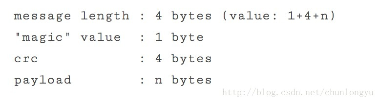

# 序列15-Log文件结构与flush刷盘机制

## Log文件结构
在前面我们反复讲topic, partition的概念，本文来分析这些不同topic、不同partition的message，在文件中，是以何种结构存储的。

## 每个topic_partition对应一个目录
假设有一个topic叫my_topic，3个partition，分别为my_topic_0, my_topic_1, my_topic_2。其中前2个parition存在1台机器A，另外一个paritition存在另1台机器B上（这里A, B都是指对应partition的leader机器）。

则机器A上，就有2个对应的目录my_topic_0, my_topic_1，也就是每个目录对应一个topic_partition，目录名字就是topic_partition名字。

而目录中，日志文件按照大小或者时间回滚，文件名字为00000000.kafka, 1200000.kakfa。。。

文件名字是上1个log文件中，最后1条消息的offset。这里的1200000.kafka，就是说，在这个文件之前，有1200000条消息。

同时，Kafka中有一个配置参数
```
log.dir   //缺省为/tmp/kafka-logs
```
所有的topic_partition目录也就存放在这个里面。

## 文件offset作为Message ID
正如上面所说，kafka没有额外用类似uuid的方式，为每条消息生成一个唯一的message id，而是直接用该message在文件中的offset，作为该message的id。

这里有一个关键点：这里的offset并不是消息在文件中的物理位置，而是一个顺序递增的逻辑编号。从0开始，每append一条消息，offset加1。

## index文件
上面说了，每个消息通过一个顺序递增的逻辑编号offset作为其message Id。但消息都是变长的，那怎么通过其offset找到消息所在的文件位置呢？

比如要找offset = 95的消息，最朴素的办法就是：按顺序扫描所有文件，从第0条记录开始读起，然后读到offset = 95 所在的消息位置。但这个办法效率太低。

Kafka引入了index文件。每1个.kakfa文件，都有一个相对应的.index文件，2者文件名字完全一样。如下图所示：


具体根据offset查找文件位置，分为3步：
第1步：把所有.kakfa的文件名字排序，通过2分查找，得到所在的.kakfa文件
第2步：到对应的.index文件里面，再2分查找，找到对应的条目，也就是offset到position的映射。
第3步：拿到这个position，就直接定位到.kakfa文件中相应的位置。然后从拿个位置开始，顺序扫描，就能得到实际所在position。

这里.index文件的目的，就是为了加快查找速度。即使没有这个文件，第1步拿到了.kakfa文件，你从头扫描，也能找到位置。

所以这个的.index存的是一个稀疏索引，每隔一个范围，存储1条消息的(offset, position)的对应关系。

## 变长消息存储
我们知道，kafka的消息是变长的。对于变长记录的存储，一般都是在记录的最前面，用固定的几个字节（比如4个字节），来存储记录的长度。

读的时候，先读取这固定的4个字节，获得记录长度，再根据长度读取后面内容。

如下图所示，kafka的记录格式也是如此：



最前面4个字节，记录长度；
紧跟着1个字节，版本号；
接下来4个字节，crc校验值；
最后n个字节，消息的实际内容。

备注：不同版本的，格式会略有差别。

## flush刷盘机制
熟悉Linux操作系统原理的都知道，当我们把数据写入到文件系统之后，数据其实在操作系统的page cache里面，并没有刷到磁盘上去。如果此时操作系统挂了，其实数据就丢了。

一方面，应用程序可以调用fsync这个系统调用来强制刷盘；另一方面，操作系统有后台线程，定期刷盘。

如果应用程序每写入1次数据，都调用一次fsync，那性能损耗就很大，所以一般都会在性能和可靠性之间进行权衡。因为对应一个应用来说，虽然应用挂了，只要操作系统不挂，数据就不会丢。

另外, kafka是多副本的，当你配置了同步复制之后。多个副本的数据都在page cache里面，出现多个副本同时挂掉的概率比1个副本挂掉，概率就小很多了。

对于kafka来说，也提供了相关的配置参数，来让你在性能与可靠性之间权衡：
```
log.flush.interval.messages  //多少条消息，刷盘1次
log.flush.interval.ms  //割多长时间，刷盘1次
log.flush.scheduler.interval.ms //周期性的刷盘，缺省3000，即3s。
```
默认前2个参数都没有设置，也就是只第3个参数起作用，即3s钟刷盘1次。

## 多线程写同一个Log文件
前面说到，网络模型是1+N+M，也就意味着M个worker线程可能写同1个log文件，此处显然需要加锁。具体源码比较简单，此处就不列了。