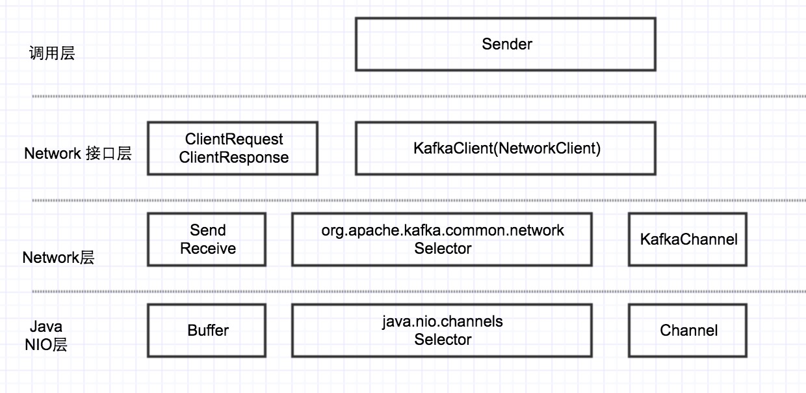
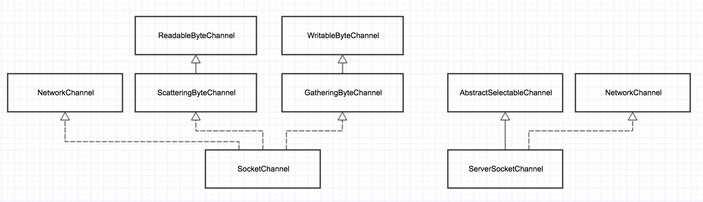
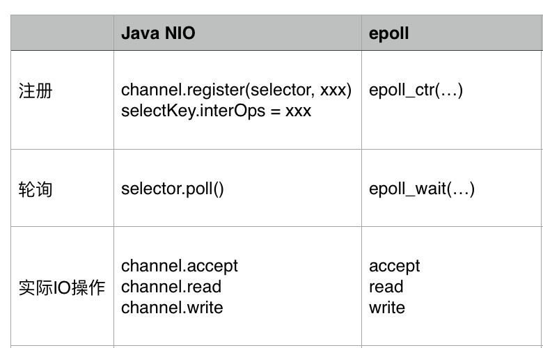
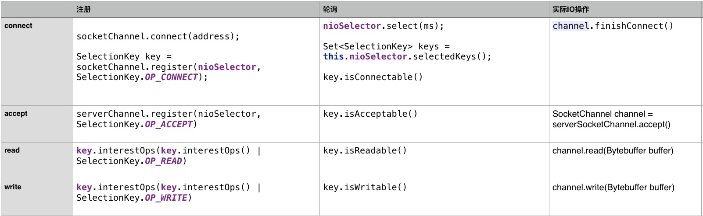

# 序列3-Producer-Java NIO

在上一篇我们分析了Metadata的更新机制，其中涉及到一个问题，就是Sender如何跟服务器通信，也就是网络层。同很多Java项目一样，Kafka client的网络层也是用的Java NIO，然后在上面做了一层封装。

下面首先看一下，在Sender和服务器之间的部分：


可以看到，Kafka client基于Java NIO封装了一个网络层，这个网络层最上层的接口是KakfaClient。其层次关系如下： 



在本篇中，先详细对最底层的Java NIO进行讲述。

## NIO的4大组件

### Buffer与Channel

Channel: 在通常的Java网络编程中，我们知道有一对Socket/ServerSocket对象，每1个socket对象表示一个connection，ServerSocket用于服务器监听新的连接。 
在NIO中，与之相对应的一对是SocketChannel/ServerSocketChannel。

下图展示了SocketChannel/ServerSocketChannel的类继承层次



```
public interface Channel extends Closeable {
    public boolean isOpen();
    public void close() throws IOException;
}

public interface ReadableByteChannel extends Channel {
    public int read(ByteBuffer dst) throws IOException;
}

public interface WritableByteChannel extends Channel {
    public int write(ByteBuffer src) throws IOException;
}
```

从代码可以看出，一个Channel最基本的操作就是read/write，并且其传进去的必须是ByteBuffer类型，而不是普通的内存buffer。

Buffer：在NIO中，也有1套围绕Buffer的类继承层次，在此就不详述了。只需知道Buffer就是用来封装channel发送／接收的数据。

### Selector

Selector的主要目的是网络事件的 loop 循环，通过调用selector.poll，不断轮询每个Channel上读写事件

### SelectionKey

SelectionKey用来记录一个Channel上的事件集合，每个Channel对应一个SelectionKey。 

SelectionKey也是Selector和Channel之间的关联，通过SelectionKey可以取到对应的Selector和Channel。

## 4种网络IO模型

### epoll与IOCP

在《Unix环境高级编程》中介绍了以下4种IO模型（实际不止4种，但常用的就这4种）：

阻塞IO： read/write的时候，阻塞调用

非阻塞IO： read/write，没有数据，立马返回，轮询

IO复用：read/write一次都只能监听一个socket，但对于服务器来讲，有成千上完个socket连接，如何用一个函数，可以监听所有的socket上面的读写事件呢？这就是IO复用模型，对应linux上面，就是select/poll/epoll3种技术。

异步IO：linux上没有，windows上对应的是IOCP。

### Reactor模式 vs. Preactor模式

相信很多人都听说过网络IO的2种设计模式，关于这2种模式的具体阐述，可以自行google之。

在此处，只想对这2种模式做一个“最通俗的解释“：

Reactor模式：主动模式，所谓主动，是指应用程序不断去轮询，问操作系统，IO是否就绪。Linux下的select/poll/epooll就属于主动模式，需要应用程序中有个循环，一直去poll。 在这种模式下，实际的IO操作还是应用程序做的。

Proactor模式：被动模式，你把read/write全部交给操作系统，实际的IO操作由操作系统完成，完成之后，再callback你的应用程序。Windows下的IOCP就属于这种模式，再比如C++ Boost中的Asio库，就是典型的Proactor模式。

### epoll的编程模型－－3个阶段

在Linux平台上，Java NIO就是基于epoll来实现的。所有基于epoll的框架，都有3个阶段： 

注册事件(connect,accept,read,write)， 轮询IO是否就绪，执行实际IO操作。

下面的代码展示了在linux下，用c语言epoll编程的基本框架:

```
//阶段1： 调用epoll_ctl(xx) 注册事件

for( ; ; )
    {
        nfds = epoll_wait(epfd,events,20,500);     //阶段2：轮询所有的socket

        for(i=0;i<nfds;++i)  //处理轮询结果
        {
            if(events[i].data.fd==listenfd) //accept事件就绪
            {
                connfd = accept(listenfd,(sockaddr *)&clientaddr, &clilen); //阶段3：执行实际的IO操作，accept
                ev.data.fd=connfd;
                ev.events=EPOLLIN|EPOLLET;
                epoll_ctl(epfd,EPOLL_CTL_ADD,connfd,&ev); //回到阶段1：重新注册
            }
            else if( events[i].events&EPOLLIN )  //读就绪
            {
                n = read(sockfd, line, MAXLINE)) < 0    //阶段3：执行实际的io操作
                ev.data.ptr = md;     
                ev.events=EPOLLOUT|EPOLLET;
                epoll_ctl(epfd,EPOLL_CTL_MOD,sockfd,&ev); //回到阶段1：重新注册事件
            }
            else if(events[i].events&EPOLLOUT) //写就绪
            {
                struct myepoll_data* md = (myepoll_data*)events[i].data.ptr;    
                sockfd = md->fd;
                send( sockfd, md->ptr, strlen((char*)md->ptr), 0 );        //阶段3： 执行实际的io操作
                ev.data.fd=sockfd;
                ev.events=EPOLLIN|EPOLLET;
                epoll_ctl(epfd,EPOLL_CTL_MOD,sockfd,&ev); //回到阶段1，重新注册事件
            }
            else
            {
                //其他的处理
            }
        }
    }
```

同样， NIO中的Selector同样有以下3个阶段，下面把Selector和epoll的使用做个对比：



可以看到，2者只是写法不同，同样的， 都有这3个阶段。

下面的表格展示了connect, accept, read, write 这4种事件，分别在这3个阶段对应的函数：



下面看一下Kafka client中Selector的核心实现：

```
 @Override
    public void poll(long timeout) throws IOException {
        。。。
        clear(); //清空各种状态
        if (hasStagedReceives())
            timeout = 0;
        long startSelect = time.nanoseconds();
        int readyKeys = select(timeout);  //轮询
        long endSelect = time.nanoseconds();
        currentTimeNanos = endSelect;
        this.sensors.selectTime.record(endSelect - startSelect, time.milliseconds());

        if (readyKeys > 0) {
            Set<SelectionKey> keys = this.nioSelector.selectedKeys();
            Iterator<SelectionKey> iter = keys.iterator();
            while (iter.hasNext()) {
                SelectionKey key = iter.next();
                iter.remove();
                KafkaChannel channel = channel(key);

                // register all per-connection metrics at once
                sensors.maybeRegisterConnectionMetrics(channel.id());
                lruConnections.put(channel.id(), currentTimeNanos);

                try {
                    if (key.isConnectable()) {  //有连接事件
                        channel.finishConnect();
                        this.connected.add(channel.id());
                        this.sensors.connectionCreated.record();
                    }

                    if (channel.isConnected() && !channel.ready()) 
                        channel.prepare(); //这个只有需要安全检查的SSL需求，普通的不加密的channel，prepare()为空实现

                    if (channel.ready() && key.isReadable() && !hasStagedReceive(channel)) { //读就绪
                        NetworkReceive networkReceive;
                        while ((networkReceive = channel.read()) != null) 
                            addToStagedReceives(channel, networkReceive); //实际的读动作
                    }

                    if (channel.ready() && key.isWritable()) {  //写就绪
                        Send send = channel.write(); //实际的写动作
                        if (send != null) {
                            this.completedSends.add(send);
                            this.sensors.recordBytesSent(channel.id(), send.size());
                        }
                    }

                    /* cancel any defunct sockets */
                    if (!key.isValid()) {
                        close(channel);
                        this.disconnected.add(channel.id());
                    }
                } catch (Exception e) {
                    String desc = channel.socketDescription();
                    if (e instanceof IOException)
                        log.debug("Connection with {} disconnected", desc, e);
                    else
                        log.warn("Unexpected error from {}; closing connection", desc, e);
                    close(channel);
                    this.disconnected.add(channel.id());
                }
            }
        }

        addToCompletedReceives();

        long endIo = time.nanoseconds();
        this.sensors.ioTime.record(endIo - endSelect, time.milliseconds());
        maybeCloseOldestConnection();
    }
```

## epoll和selector在注册上的差别-LT&ET模式
### LT & ET

我们知道，epoll里面有2种模式：LT(水平触发）和 ET(边缘触发）。水平触发，又叫条件触发；边缘触发，又叫状态触发。这2种到底有什么区别呢？

在这里就要引入socket的“读/写缓冲区”的概念了：

水平触发(条件触发）：读缓冲区只要不为空，就一直会触发读事件；写缓冲区只要不满，就一直会触发写事件。这个比较符合编程习惯，也是epoll的缺省模式。

边缘触发(状态触发）：读缓冲区的状态，从空转为非空的时候，触发1次；写缓冲区的状态，从满转为非满的时候，触发1次。比如你发送一个大文件，把写缓存区塞满了，之后缓存区可以写了，就会发生一次从满到不满的切换。

通过分析，我们可以看出： 
对于LT模式，要避免“写的死循环”问题：写缓冲区为满的概率很小，也就是“写的条件“会一直满足，所以如果你注册了写事件，没有数据要写，但它会一直触发，所以在LT模式下，写完数据，一定要取消写事件；

对应ET模式，要避免“short read”问题：比如你收到100个字节，它触发1次，但你只读到了50个字节，剩下的50个字节不读，它也不会再次触发，此时这个socket就废了。因此在ET模式，一定要把“读缓冲区”的数据读完。

另外一个关于LT和ET的区别是：LT适用于阻塞和非阻塞IO, ET只适用于非阻塞IO。

还有一个说法是ET的性能更高，但编程难度更大，容易出错。到底ET的性能，是不是一定比LT高，这个有待商榷，需要实际的测试数据来说话。

上面说了，epoll缺省使用的LT模式，而Java NIO用的就是epoll的LT模式。下面就来分析一下Java NIO中connect/read/write事件的处理。

### connect事件的注册

```
//Selector
    public void connect(String id, InetSocketAddress address, int sendBufferSize, int receiveBufferSize) throws IOException {
        if (this.channels.containsKey(id))
            throw new IllegalStateException("There is already a connection for id " + id);

        SocketChannel socketChannel = SocketChannel.open();
        。。。
        try {
            socketChannel.connect(address);
        } catch (UnresolvedAddressException e) {
            socketChannel.close();
            throw new IOException("Can't resolve address: " + address, e);
        } catch (IOException e) {
            socketChannel.close();
            throw e;
        }
        SelectionKey key = socketChannel.register(nioSelector, SelectionKey.OP_CONNECT);  //构造channel的时候，注册connect事件
        KafkaChannel channel = channelBuilder.buildChannel(id, key, maxReceiveSize);
        key.attach(channel);
        this.channels.put(id, channel);
    }
```

### connect事件的取消

```
//在上面的poll函数中，connect事件就绪，也就是指connect连接完成，连接简历
 if (key.isConnectable()) {  //有连接事件
       channel.finishConnect(); 
                        ...
     }

 //PlainTransportLayer
 public void finishConnect() throws IOException {
        socketChannel.finishConnect();  //调用channel的finishConnect()
        key.interestOps(key.interestOps() & ~SelectionKey.OP_CONNECT | SelectionKey.OP_READ); //取消connect事件，新加read事件组册
    }
```

### read事件的注册

从上面也可以看出，read事件的注册和connect事件的取消，是同时进行的

### read事件的取消

因为read是要一直监听远程，是否有新数据到来，所以不会取消，一直监听。并且因为是LT模式，只要“读缓冲区”有数据，就会一直触发。

### write事件的注册

```
//Selector
    public void send(Send send) {
        KafkaChannel channel = channelOrFail(send.destination());
        try {
            channel.setSend(send);
        } catch (CancelledKeyException e) {
            this.failedSends.add(send.destination());
            close(channel);
        }
    }

//KafkaChannel
    public void setSend(Send send) {
        if (this.send != null)
            throw new IllegalStateException("Attempt to begin a send operation with prior send operation still in progress.");
        this.send = send;
        this.transportLayer.addInterestOps(SelectionKey.OP_WRITE);  //每调用一次Send，注册一次Write事件
    }
```

### Write事件的取消

```
//上面的poll函数里面
                    if (channel.ready() && key.isWritable()) { //write事件就绪
                        Send send = channel.write(); //在这个write里面，取消了write事件
                        if (send != null) {
                            this.completedSends.add(send);
                            this.sensors.recordBytesSent(channel.id(), send.size());
                        }
                    }


    private boolean send(Send send) throws IOException {
        send.writeTo(transportLayer);
        if (send.completed())
            transportLayer.removeInterestOps(SelectionKey.OP_WRITE);  //取消write事件

        return send.completed();
    }        
```

总结一下： 
（1）“事件就绪“这个概念，对于不同事件类型，还是有点歧义的

read事件就绪：这个最好理解，就是远程有新数据到来，需要去read。这里因为是LT模式，只要读缓冲区有数据，会一直触发。

write事件就绪：这个指什么呢？ 其实指本地的socket缓冲区有没有满。没有满的话，就会一直触发写事件。所以要避免”写的死循环“问题，写完，要取消写事件。

connect事件就绪： 指connect连接完成

accept事件就绪：有新的连接进来，调用accept处理

（2）不同类型事件，处理方式是不一样的：

connect事件：注册1次，成功之后，就取消了。有且仅有1次

read事件：注册之后不取消，一直监听

write事件： 每调用一次send，注册1次。send成功，取消注册