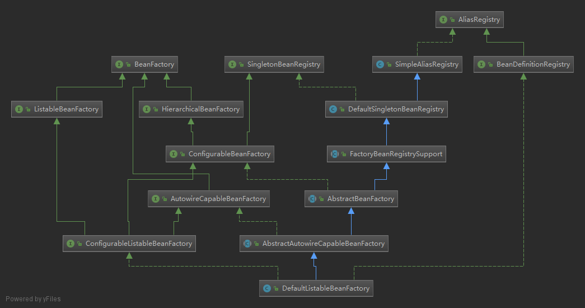

# 03.spring-beans核心类介绍

## 1. DefaultListableBeanFactory 
XmlBeanFactory 继承自 DefaultListableBeanFactory ，而 DefaultListableBeanFactory 是整个 bean 加载的核心部分，是 Spring 注册及加载 bean 的默认实现，而对于 XmlBeanFactory 与 DefaultListableBeanFactory 不同的地方其实是在 XmlBeanFactory 中使用了自定义的 XML 读取器 XmlBeanDefinitionReader ，实现了个性化的 BeanDefinitionReader 读取， DefaultListableBeanFactory 继承了 AbstractAutowireCapableBeanFactory 并实现了 ConfigurableListableBeanFactory 以及 BeanDefinitionRegistry 接口。

下面是相关类图

* AliasRegistry：定义对 alias 的简单增删改等操作。
* SimpleAliasRegistry：主要使用 map 作为 alias 的缓存，并对接口 AliasRegistry 进行实现。
* SingletonBeanRegistry：定义对单例的注册及获取。
* BeanFactory：定义获取 bean 及 bean 的各种属性。
* DefaultSingletonBeanRegistry：对接口SimpleAliasRegistry各函数的实现。
* HierarchicalBeanFactory：继承 BeanFactory ，也就是在 BeanFactory 定义的功能的基础上增加了对 parentFactory 支持。
* BeanDefinitionRegistry：定义对 BeanDefinition 的各种增删改操作。
* FactoryBeanRegistrySupport：在 DefaultSingletonBeanRegistry 基础上增加了对 FactoryBean的特殊处理功能
* ConfigurableBeanFactory：提供配置 Factory 的各种方法。
* ListableBeanFactory：根据各种条件获取 bean 的配置清单。
* AbstractBeanFactory：综合 FactoryBeanRegistrySupport和ConfigurableBeanFactory功能。
* AutowireCapableBeanFactory：提供创 bean 、自动注入、初始化以及应用 bean 的后处理器。
* AbstractAutowireCapableBeanFactory：综合 AbstractBeanFactory 并对接口 AutowireCapableBeanFactory 进行实现。
* ConfigurableListableBeanFactory：BeanFactory 配置清单，指定忽略类型及接口等。
* DefaultListableBeanFactory：综合上面所有功能，主要是对 bean 注册后的处理。

XmlBeanFactory 对 DefaultListableBeanFactory 类进行了扩展，主要用于从 XML 文档中读取 BeanDefinition ，对于注册及获取 bean 都是使用从父类 DefaultListableBeanFactory 继承的方法去实现，而唯独与父类不同的个性化实现就是增加了 XmlBeanDefinitionReader 类型的 reader 属性。在 XmlBeanFactory 中主要使用 reader 属性对资源文件进行读取和注册。

## 2.XmlBeanDefinitionReader
XML 配置文件的读取是 Spring 重要的功能 ，因为 Spring 的大部分功能都是以配置作为切入点的，那么我们可以从 XmlBeanDefinitionReader 中梳理一下资源文件读取、解析及注册的大致脉络，首先我们看看各个类的功能

* ResourceLoader：定义资源加载器，主要应用于根据给定的资源文件地址返回对应的Resource。
* BeanDefinitionReader：主要定义资源文件读取并转换为 BeanDefinition 的各个功能。
* EnvironmentCapable：定义获取 Environment 方法。
* DocumentLoader ：定义从资源文件加载到转换为 Document 的功能。
* AbstractBeanDefinitionReader：对 EnvironmentCapable、BeanDefinitionReader 类定义的功能进行实现。
* BeanDefinitionDocumentReader：定义读取 Document 并注册 BeanDefinition 功能。
* BeanDefinitionParserDelegate：定义解析 Element 的各种方法。

1.通过 AbstractBeanDefinitionReader 中的 ResourceLoader 将资源文件转换为 Resource。
2.通过 XmlBeanDefinitionReader 中的 DocumentLoader 将 Resource 转换为 Document。
3.通过实现接口 BeanDefinitionDocumentReader 的 DefaultBeanDefinitionDocumentReader 类对 Document 进行解析，并使用 BeanDefinitionParserDelegate 对 Element 进行解析。

