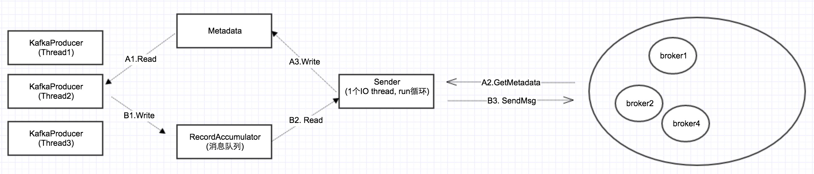

# 序列02 - Producer-Metadata的数据结构与读取、更新策略

在上一篇，我们从使用方式和策略上，对消息队列做了一个宏观描述。从本篇开始，我们将深入到源码内部，仔细分析Kafka到底是如何实现一个分布式消息队列。我们的分析将从Producer端开始。

从Kafka 0.8.2开始，发布了一套新的Java版的client api, KafkaProducer/KafkaConsumer，替代之前的scala版的api。本系列的分析将只针对这套Java版的api。

## 多线程异步发送模型

下图是经过源码分析之后，整理出来的Producer端的架构图：



在上一篇我们讲过，Producer有同步发送和异步发送2种策略。在以前的Kafka client api实现中，同步和异步是分开实现的。而在0.9中，同步发送其实是通过异步发送间接实现，其接口如下：

```
public class KafkaProducer<K, V> implements Producer<K, V> {
...
    public Future<RecordMetadata> send(ProducerRecord<K, V> record, Callback callback)  //异步发送接口
     {
     ...
     }
}
```

要实现同步发送，只要在拿到返回的Future对象之后，直接调用get()就可以了。

### 基本思路
从上图我们可以看出，异步发送的基本思路就是：send的时候，KafkaProducer把消息放到本地的消息队列RecordAccumulator，然后一个后台线程Sender不断循环，把消息发给Kafka集群。

要实现这个，还得有一个前提条件：就是KafkaProducer/Sender都需要获取集群的配置信息Metadata。所谓Metadata，也就是在上一篇所讲的，Topic/Partition与broker的映射关系：每一个Topic的每一个Partition，得知道其对应的broker列表是什么，其中leader是谁，follower是谁。

### 2个数据流
所以在上图中，有2个数据流：
Metadata流(A1,A2,A3)：Sender从集群获取信息，然后更新Metadata； KafkaProducer先读取Metadata，然后把消息放入队列。

消息流(B1, B2, B3)：这个很好理解，不再详述。

本篇着重讲述Metadata流，消息流，将在后续详细讲述。

## Metadata的线程安全性

从上图可以看出，Metadata是多个producer线程读，一个sender线程更新，因此它必须是线程安全的。

Kafka的官方文档上也有说明，KafkaProducer是线程安全的，可以在多线程中调用：

从下面代码也可以看出，它的所有public方法都是synchronized:
```
public final class Metadata {
  。。。
    public synchronized Cluster fetch() {
        return this.cluster;
    }
    public synchronized long timeToNextUpdate(long nowMs) {
       。。。
    }
    public synchronized int requestUpdate() {
      。。。
    }
    。。。    
｝
```
### Metadata的数据结构
下面代码列举了Metadata的主要数据结构：一个Cluster对象 + 1堆状态变量。前者记录了集群的配置信息，后者用于控制Metadata的更新策略。
```
public final class Metadata {
...
    private final long refreshBackoffMs;  //更新失败的情况下，下1次更新的补偿时间（这个变量在代码中意义不是太大）
    private final long metadataExpireMs; //关键值：每隔多久，更新一次。缺省是600*1000，也就是10分种
    private int version;         //每更新成功1次，version递增1。这个变量主要用于在while循环，wait的时候，作为循环判断条件
    private long lastRefreshMs;  //上一次更新时间（也包含更新失败的情况）
    private long lastSuccessfulRefreshMs; //上一次成功更新的时间（如果每次都成功的话，则2者相等。否则，lastSuccessulRefreshMs < lastRefreshMs)
    private Cluster cluster;   //集群配置信息
    private boolean needUpdate;  //是否强制刷新
、
  ...
}

public final class Cluster {
...
    private final List<Node> nodes;   //Node也就是Broker
    private final Map<TopicPartition, PartitionInfo> partitionsByTopicPartition;  //Topic/Partition和broker list的映射关系
    private final Map<String, List<PartitionInfo>> partitionsByTopic;
    private final Map<String, List<PartitionInfo>> availablePartitionsByTopic;
    private final Map<Integer, List<PartitionInfo>> partitionsByNode;
    private final Map<Integer, Node> nodesById;
}

public class PartitionInfo {
    private final String topic;
    private final int partition;
    private final Node leader;
    private final Node[] replicas;
    private final Node[] inSyncReplicas;
}
```

## producer读取Metadata

下面是send函数的源码，可以看到，在send之前，会先读取metadata。如果metadata读不到，会一直阻塞在那，直到超时，抛出TimeoutException
```
//KafkaProducer
    public Future<RecordMetadata> send(ProducerRecord<K, V> record, Callback callback) {
        try {
     long waitedOnMetadataMs = waitOnMetadata(record.topic(), this.maxBlockTimeMs);  //拿不到topic的配置信息，会一直阻塞在这，直到抛异常

     ... //拿到了，执行下面的send逻辑
     } catch()
     {}
 }

//KafkaProducer
    private long waitOnMetadata(String topic, long maxWaitMs) throws InterruptedException {
        if (!this.metadata.containsTopic(topic))
            this.metadata.add(topic);

        if (metadata.fetch().partitionsForTopic(topic) != null)
            return 0;   //取到topic的配置信息，直接返回

        long begin = time.milliseconds();
        long remainingWaitMs = maxWaitMs;
        while (metadata.fetch().partitionsForTopic(topic) == null) { //取不到topic的配置信息，一直死循环wait，直到超时，抛TimeoutException
            log.trace("Requesting metadata update for topic {}.", topic);
            int version = metadata.requestUpdate(); //把needUpdate置为true
            sender.wakeup(); //唤起sender
            
            metadata.awaitUpdate(version, remainingWaitMs); //metadata的关键函数
            long elapsed = time.milliseconds() - begin;
            if (elapsed >= maxWaitMs)
                throw new TimeoutException("Failed to update metadata after " + maxWaitMs + " ms.");
            if (metadata.fetch().unauthorizedTopics().contains(topic))
                throw new TopicAuthorizationException(topic);
            remainingWaitMs = maxWaitMs - elapsed;
        }
        return time.milliseconds() - begin;
    }

//Metadata
    public synchronized void awaitUpdate(final int lastVersion, final long maxWaitMs) throws InterruptedException {
        if (maxWaitMs < 0) {
            throw new IllegalArgumentException("Max time to wait for metadata updates should not be < 0 milli seconds");
        }
        long begin = System.currentTimeMillis();
        long remainingWaitMs = maxWaitMs;
        while (this.version <= lastVersion) {  //当Sender成功更新meatadata之后，version加1。否则会循环，一直wait
            if (remainingWaitMs != 0
                wait(remainingWaitMs);  //线程的wait机制，wait和synchronized的配合使用
            long elapsed = System.currentTimeMillis() - begin;
            if (elapsed >= maxWaitMs)  //wait时间超出了最长等待时间
                throw new TimeoutException("Failed to update metadata after " + maxWaitMs + " ms.");
            remainingWaitMs = maxWaitMs - elapsed;
        }
    }
```

总结：从上面代码可以看出，producer wait metadata的时候，有2个条件：
（1）while (metadata.fetch().partitionsForTopic(topic) == null)
（2）while (this.version <= lastVersion)

有wait就会有notify，notify在Sender更新Metadata的时候发出。

## Sender的创建

下面是KafkaProducer的构造函数，从代码可以看出，Sender就是KafkaProducer中创建的一个Thread.
```
private KafkaProducer(ProducerConfig config, Serializer<K> keySerializer, Serializer<V> valueSerializer) {
    try {
    ...
           this.metadata = new Metadata(retryBackoffMs, config.getLong(ProducerConfig.METADATA_MAX_AGE_CONFIG)); //构造metadata

this.metadata.update(Cluster.bootstrap(addresses), time.milliseconds()); //往metadata中，填入初始的，配置的node列表

        ChannelBuilder channelBuilder = ClientUtils.createChannelBuilder(config.values());
        
        NetworkClient client = new NetworkClient(
                new Selector(config.getLong(ProducerConfig.CONNECTIONS_MAX_IDLE_MS_CONFIG), this.metrics, time, "producer", metricTags, channelBuilder),
                this.metadata,
                clientId,
                config.getInt(ProducerConfig.MAX_IN_FLIGHT_REQUESTS_PER_CONNECTION),
                config.getLong(ProducerConfig.RECONNECT_BACKOFF_MS_CONFIG),
                config.getInt(ProducerConfig.SEND_BUFFER_CONFIG),
                config.getInt(ProducerConfig.RECEIVE_BUFFER_CONFIG),


        this.sender = new Sender(client,  //构造一个sender。sender本身实现的是Runnable接口
                this.metadata,
                this.accumulator,
                config.getInt(ProducerConfig.MAX_REQUEST_SIZE_CONFIG),
                (short) parseAcks(config.getString(ProducerConfig.ACKS_CONFIG)),
                config.getInt(ProducerConfig.RETRIES_CONFIG),
                this.metrics,
                new SystemTime(),
                clientId,
                this.requestTimeoutMs);

        String ioThreadName = "kafka-producer-network-thread" + (clientId.length() > 0 ? " | " + clientId : "");
        this.ioThread = new KafkaThread(ioThreadName, this.sender, true);
        this.ioThread.start();  //一个线程，开启sender
```

### Sender poll() 更新Metadata

```
public void run() {
    // main loop, runs until close is called
    while (running) {
        try {
            run(time.milliseconds());
        } catch (Exception e) {
            log.error("Uncaught error in kafka producer I/O thread: ", e);
        }
    }
   。。。
}

public void run(long now) {
    Cluster cluster = metadata.fetch();
    。。。
    RecordAccumulator.ReadyCheckResult result = this.accumulator.ready(cluster, now);   //遍历消息队列中所有的消息，找出对应的，已经ready的Node

    if (result.unknownLeadersExist)  //如果一个ready的node都没有，请求更新metadata
        this.metadata.requestUpdate();

    。。。

    //client的2个关键函数，一个发送ClientRequest，一个接收ClientResponse。底层调用的是NIO的poll。关于nio, 后面会详细介绍
    for (ClientRequest request : requests)
        client.send(request, now);
    
    this.client.poll(pollTimeout, now);
}

//NetworkClient
public List<ClientResponse> poll(long timeout, long now) {
    long metadataTimeout = metadataUpdater.maybeUpdate(now); //关键点：每次poll的时候判断是否要更新metadata
    
    try {
        this.selector.poll(Utils.min(timeout, metadataTimeout, requestTimeoutMs));
    } catch (IOException e) {
        log.error("Unexpected error during I/O", e);
    }

    // process completed actions
    long updatedNow = this.time.milliseconds();
    List<ClientResponse> responses = new ArrayList<>();
    handleCompletedSends(responses, updatedNow);
    handleCompletedReceives(responses, updatedNow);   //在返回的handler中，会处理metadata的更新
    handleDisconnections(responses, updatedNow);
    handleConnections();
    handleTimedOutRequests(responses, updatedNow);

    // invoke callbacks
    for (ClientResponse response : responses) {
        if (response.request().hasCallback()) {
            try {
                response.request().callback().onComplete(response);
            } catch (Exception e) {
                log.error("Uncaught error in request completion:", e);
            }
        }
    }

    return responses;
}
 
//DefaultMetadataUpdater
@Override
public long maybeUpdate(long now) {
    // should we update our metadata?
    long timeToNextMetadataUpdate = metadata.timeToNextUpdate(now);
    long timeToNextReconnectAttempt = Math.max(this.lastNoNodeAvailableMs + metadata.refreshBackoff() - now, 0);
    long waitForMetadataFetch = this.metadataFetchInProgress ? Integer.MAX_VALUE : 0;
    // if there is no node available to connect, back off refreshing metadata
    long metadataTimeout = Math.max(Math.max(timeToNextMetadataUpdate, timeToNextReconnectAttempt),
            waitForMetadataFetch);

    if (metadataTimeout == 0) {
        // highly dependent on the behavior of leastLoadedNode.
        Node node = leastLoadedNode(now);  //找到负载最小的Node
        maybeUpdate(now, node); //把更新Metadata的请求，发给这个Node
    }

    return metadataTimeout;
}

private void maybeUpdate(long now, Node node) {
    if (node == null) {
        log.debug("Give up sending metadata request since no node is available");
        // mark the timestamp for no node available to connect
        this.lastNoNodeAvailableMs = now;
        return;
    }
    String nodeConnectionId = node.idString();

    if (canSendRequest(nodeConnectionId)) {
        Set<String> topics = metadata.needMetadataForAllTopics() ? new HashSet<String>() : metadata.topics();
        this.metadataFetchInProgress = true;
        ClientRequest metadataRequest = request(now, nodeConnectionId, topics);  //关键点：发送更新Metadata的Request
        log.debug("Sending metadata request {} to node {}", metadataRequest, node.id());
        doSend(metadataRequest, now); //这里只是异步发送，返回的response在上面的handleCompletedReceives里面处理
    } else if (connectionStates.canConnect(nodeConnectionId, now)) {
        log.debug("Initialize connection to node {} for sending metadata request", node.id());
        initiateConnect(node, now);

    } else { // connected, but can't send more OR connecting
        this.lastNoNodeAvailableMs = now;
    }
}
 
private void handleCompletedReceives(List<ClientResponse> responses, long now) {
    for (NetworkReceive receive : this.selector.completedReceives()) {
        String source = receive.source();
        ClientRequest req = inFlightRequests.completeNext(source);
        ResponseHeader header = ResponseHeader.parse(receive.payload());
        // Always expect the response version id to be the same as the request version id
        short apiKey = req.request().header().apiKey();
        short apiVer = req.request().header().apiVersion();
        Struct body = (Struct) ProtoUtils.responseSchema(apiKey, apiVer).read(receive.payload());
        correlate(req.request().header(), header);
        if (!metadataUpdater.maybeHandleCompletedReceive(req, now, body))
            responses.add(new ClientResponse(req, now, false, body));
    }
}
 
 
@Override
public boolean maybeHandleCompletedReceive(ClientRequest req, long now, Struct body) {
    short apiKey = req.request().header().apiKey();
    if (apiKey == ApiKeys.METADATA.id && req.isInitiatedByNetworkClient()) {
        handleResponse(req.request().header(), body, now);
        return true;
    }
    return false;
}

//关键函数
private void handleResponse(RequestHeader header, Struct body, long now) {
    this.metadataFetchInProgress = false;
    MetadataResponse response = new MetadataResponse(body);
    Cluster cluster = response.cluster();   //从response中，拿到一个新的cluster对象
    if (response.errors().size() > 0) {
        log.warn("Error while fetching metadata with correlation id {} : {}", header.correlationId(), response.errors());
    }
    
    if (cluster.nodes().size() > 0) {
        this.metadata.update(cluster, now);   //更新metadata，用新的cluster覆盖旧的cluster
    } else {
        log.trace("Ignoring empty metadata response with correlation id {}.", header.correlationId());
        this.metadata.failedUpdate(now);  //更新metadata失败，做失败处理逻辑
    }
}


//更新成功，version+1, 同时更新其它字段
public synchronized void update(Cluster cluster, long now) {
    this.needUpdate = false;
    this.lastRefreshMs = now;
    this.lastSuccessfulRefreshMs = now;
    this.version += 1;

    for (Listener listener: listeners)
        listener.onMetadataUpdate(cluster);  //如果有人监听了metadata的更新，通知他们

    this.cluster = this.needMetadataForAllTopics ? getClusterForCurrentTopics(cluster) : cluster;    //新的cluster覆盖旧的cluster

    notifyAll();  //通知所有的阻塞的producer线程
    
    log.debug("Updated cluster metadata version {} to {}", this.version, this.cluster);
}

//更新失败，只更新lastRefreshMs
public synchronized void failedUpdate(long now) {
    this.lastRefreshMs = now;
}

```

从上面可以看出，Metadata的更新，是在while循环，每次调用client.poll()的时候更新的。
更新机制又有以下2种：

### Metadata的2种更新机制

(1)周期性的更新: 每隔一段时间更新一次，这个通过 Metadata的lastRefreshMs, lastSuccessfulRefreshMs 这2个字段来实现

对应的ProducerConfig配置项为：
metadata.max.age.ms //缺省5 * 60 * 1000，即5分钟1次

(2) 失效检测，强制更新：检查到metadata失效以后，调用metadata.requestUpdate()强制更新。 requestUpdate()函数里面其实什么都没做，就是把needUpdate置成了true

每次poll的时候，都检查这2种更新机制，达到了，就触发更新。

那如何判定Metadata失效了呢？这个在代码中很分散，有很多地方，会判定Metadata失效。

## Metadata失效检测

### 条件1：initConnect的时候
```
private void initiateConnect(Node node, long now) {
    String nodeConnectionId = node.idString();
    try {
        log.debug("Initiating connection to node {} at {}:{}.", node.id(), node.host(), node.port());
        this.connectionStates.connecting(nodeConnectionId, now);
        selector.connect(nodeConnectionId,
                         new InetSocketAddress(node.host(), node.port()),
                         this.socketSendBuffer,
                         this.socketReceiveBuffer);
    } catch (IOException e) {
        connectionStates.disconnected(nodeConnectionId, now);
        metadataUpdater.requestUpdate(); //判定metadata失效
        log.debug("Error connecting to node {} at {}:{}:", node.id(), node.host(), node.port(), e);
    }
}
```
### 条件2：poll里面IO的时候，连接断掉了
```
private void handleDisconnections(List<ClientResponse> responses, long now) {
    for (String node : this.selector.disconnected()) {
        log.debug("Node {} disconnected.", node);
        processDisconnection(responses, node, now);
    }
    if (this.selector.disconnected().size() > 0)
        metadataUpdater.requestUpdate();  //判定metadata失效
}
```
### 条件3：有请求超时
```
private void handleTimedOutRequests(List<ClientResponse> responses, long now) {
    List<String> nodeIds = this.inFlightRequests.getNodesWithTimedOutRequests(now, this.requestTimeoutMs);
    for (String nodeId : nodeIds) {
        this.selector.close(nodeId);
        log.debug("Disconnecting from node {} due to request timeout.", nodeId);
        processDisconnection(responses, nodeId, now);
    }

    if (nodeIds.size() > 0)
        metadataUpdater.requestUpdate();  //判定metadata失效
}
```
### 条件4：发消息的时候，有partition的leader没找到
```
public void run(long now) {
    Cluster cluster = metadata.fetch();
    RecordAccumulator.ReadyCheckResult result = this.accumulator.ready(cluster, now);

    if (result.unknownLeadersExist)
        this.metadata.requestUpdate();
```
### 条件5：返回的response和请求对不上的时候
```
private void handleProduceResponse(ClientResponse response, Map<TopicPartition, RecordBatch> batches, long now) {
    int correlationId = response.request().request().header().correlationId();
    if (response.wasDisconnected()) {
        log.trace("Cancelled request {} due to node {} being disconnected", response, response.request()
        for (RecordBatch batch : batches.values())
            completeBatch(batch, Errors.NETWORK_EXCEPTION, -1L, correlationId, now);
```
总之1句话：发生各式各样的异常，数据不同步，都认为metadata可能出问题了，要求更新。

### Metadata其他的更新策略
除了上面所述，Metadata的更新，还有以下几个特点：

1.更新请求MetadataRequest是nio异步发送的，在poll的返回中，处理MetadataResponse的时候，才真正更新Metadata。

这里有个关键点：Metadata的cluster对象，每次是整个覆盖的，而不是局部更新。所以cluster内部不用加锁。

2.更新的时候，是从metadata保存的所有Node，或者说Broker中，选负载最小的那个，也就是当前接收请求最少的那个。向其发送MetadataRequest请求，获取新的Cluster对象。
