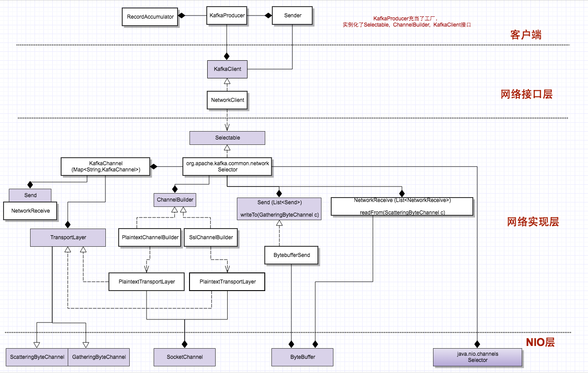
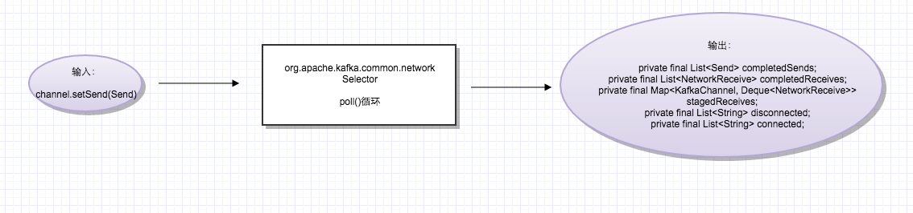

# 序列04-Producer-network层核心原理

## network层的分层架构

下图展示了从最上层的KafkaProducer到最底层的Java NIO的构建层次关系： 
图中淡紫色的方框表示接口或者抽象类，白色方框是具体实现。

整个架构图也体现了“面向接口编程”的思想：最底层Java NIO往上层全部以接口形式暴露，上面的3层，也都定义了相应的接口，逐层往上暴露。

接口的实例化（包括KafkaClient, Selectable, ChannelBuilder），也都在最外层的容器类KafkaProducer的构造函数中完成，KafkaProducer也就充当了一个“工厂”的角色，装配所有这些底层组件。 



## network层组件与NIO组件的映射关系

从上图也可以看出: 
KakfaChannel基本是对SocketChannel的封装，只是这个中间多个一个间接层：TransportLayer，为了封装普通和加密的Channel；

Send/NetworkReceive是对ByteBuffer的封装，表示一次请求的数据包；

Kafka的Selector封装了NIO的Selector，内含一个NIO Selector对象。

## Kafka Selector实现思路

1.从上图可以看出， Selector内部包含一个Map, 也就是它维护了所有连接的连接池。这些KafkaChannel都由ChannelBuilder接口创建。

```
private final Map<String, KafkaChannel> channels;
```

2.所有的io操作：connect, read, write其实都是在poll这1个函数里面完成的。具体什么意思呢？

NetworkClient的send()函数，调用了selector.send(Send send)， 但这个时候数据并没有真的发送出去，只是暂存在了selector内部相对应的channel里面。下面看代码：

```
//Selector
    public void send(Send send) {
        KafkaChannel channel = channelOrFail(send.destination());  //找到数据包相对应的connection
        try {
            channel.setSend(send);  //暂存在这个connection(channel)里面
        } catch (CancelledKeyException e) {
            this.failedSends.add(send.destination());
            close(channel);
        }
    }

//KafkaChannel
    public void setSend(Send send) {
        if (this.send != null)  //关键点：当前的没有发出去之前，不能暂存下1个！！！关于这个，后面还要详细分析
            throw new IllegalStateException("Attempt to begin a send operation with prior send operation still in progress.");
        this.send = send;   //暂存这个数据包
        this.transportLayer.addInterestOps(SelectionKey.OP_WRITE);
    }

public class KafkaChannel {
    private final String id;
    private final TransportLayer transportLayer;
    private final Authenticator authenticator;
    private final int maxReceiveSize;
    private NetworkReceive receive;
    private Send send;   //关键点：1个channel一次只能存放1个数据包，在当前的send数据包没有完整发出去之前，不能存放下一个
    ...
}
```

暂存在channel中之后，poll函数进行处理，我们抽象出一个输入-输出模型如下： 
输入：暂存的send数据包 
输出：完成的sends, 完成的receive(针对上1次的send), 建立的连接， 断掉的连接。



```
@Override
    public void poll(long timeout) throws IOException {
        if (timeout < 0)
            throw new IllegalArgumentException("timeout should be >= 0");
        clear();  //关键点：每次poll之前，会清空“输出”
        if (hasStagedReceives())
            timeout = 0;
        /* check ready keys */
        long startSelect = time.nanoseconds();
        int readyKeys = select(timeout);
        long endSelect = time.nanoseconds();
        currentTimeNanos = endSelect;
        this.sensors.selectTime.record(endSelect - startSelect, time.milliseconds());

        if (readyKeys > 0) {
            Set<SelectionKey> keys = this.nioSelector.selectedKeys();
            Iterator<SelectionKey> iter = keys.iterator();
            while (iter.hasNext()) {
                SelectionKey key = iter.next();
                iter.remove();
                KafkaChannel channel = channel(key);

                // register all per-connection metrics at once
                sensors.maybeRegisterConnectionMetrics(channel.id());
                lruConnections.put(channel.id(), currentTimeNanos);

                try {
                    /* complete any connections that have finished their handshake */
                    if (key.isConnectable()) {
                        channel.finishConnect();    //把建立的连接，加入输出结果集合
                        this.connected.add(channel.id());
                        this.sensors.connectionCreated.record();
                    }

                    ...

                    if (channel.ready() && key.isReadable() && !hasStagedReceive(channel)) {
                        NetworkReceive networkReceive;
                        while ((networkReceive = channel.read()) != null)
                            addToStagedReceives(channel, networkReceive);
                    }

                    if (channel.ready() && key.isWritable()) {
                        Send send = channel.write();
                        if (send != null) {
                            this.completedSends.add(send);  //把完成的发送，加入输出结果集合
                            this.sensors.recordBytesSent(channel.id(), send.size());
                        }
                    }

                    if (!key.isValid()) {
                        close(channel);
                        this.disconnected.add(channel.id());  //把断掉的连接，加入输出结果集合
                    }
                } catch (Exception e) {
                    String desc = channel.socketDescription();
                    if (e instanceof IOException)
                        log.debug("Connection with {} disconnected", desc, e);
                    else
                        log.warn("Unexpected error from {}; closing connection", desc, e);
                    close(channel);
                    this.disconnected.add(channel.id()); //把断掉的连接，加入输出结果集合
                }
            }
        }

        addToCompletedReceives(); //把完成的接收，加入输出结果集合

        long endIo = time.nanoseconds();
        this.sensors.ioTime.record(endIo - endSelect, time.milliseconds());
        maybeCloseOldestConnection();
    }
```

## 核心原理之1 – 消息的分包

在上面的代码中，为什么会有addToStagedReceives？ 什么叫做staged receives呢？ 这叫要从数据的分包说起：

在NetworkClient中，往下传的是一个完整的ClientRequest，进到Selector，暂存到channel中的，也是一个完整的Send对象（1个数据包）。但这个Send对象，交由底层的channel.write(Bytebuffer b)的时候，并不一定一次可以完全发送，可能要调用多次write，才能把一个Send对象完全发出去。这是因为write是非阻塞的，不是等到完全发出去，才会返回。所以才有上面的代码：

```
if (channel.ready() && key.isWritable()) {
    Send send = channel.write(); //send不为空，表示完全发送出去，返回发出去的这个Send对象。如果没完全发出去，返回null
    if (send != null) {  
        this.completedSends.add(send);
        this.sensors.recordBytesSent(channel.id(), send.size());
    }
}
```

同样，在接收的时候，channel.read(ByteBuffer b)，一个response也可能要read多次，才能完全接收。所以就有了上面的while循环代码：

```
if (channel.ready() && key.isReadable() && !hasStagedReceive(channel)) {
    NetworkReceive networkReceive;
    while ((networkReceive = channel.read()) != null)  //循环接收，直到1个response完全接收到，才会从while循环退出
        addToStagedReceives(channel, networkReceive);
}
```

## 核心原理之2 – 消息的分界

从上面知道，底层数据的通信，是在每一个channel上面，2个源源不断的byte流，一个send流，一个receive流。 
send的时候，还好说，发送之前知道一个完整的消息的大小； 
那接收的时候，我怎么知道一个msg response什么时候结束，然后开始接收下一个response呢？

这就需要一个小技巧：在所有request，response头部，首先是一个定长的，4字节的头，receive的时候，至少调用2次read，先读取这4个字节，获取整个response的长度，接下来再读取消息体。

```
public class NetworkReceive implements Receive {
    private final String source;
    private final ByteBuffer size;  //头部4字节的buffer
    private final int maxSize;
    private ByteBuffer buffer;  //后面整个消息response的buffer

    public NetworkReceive(String source) {
        this.source = source;
        this.size = ByteBuffer.allocate(4);   //先分配4字节的头部
        this.buffer = null;
        this.maxSize = UNLIMITED;
   }
}
```

## 核心原理之3 － 消息时序保证

在InFlightRequests中，存放了所有发出去，但是response还没有回来的request。request发出去的时候，入对；response回来，就把相对应的request出对。

```
final class InFlightRequests {

    private final int maxInFlightRequestsPerConnection;
    private final Map<String, Deque<ClientRequest>> requests = new HashMap<String, Deque<ClientRequest>>();
｝
```

这个有个关键点：我们注意到request与response的配对，在这里是用队列表达的，而不是Map。用队列的入队，出队，完成2者的匹配。要实现这个，服务器就必须要保证消息的时序：即在一个socket上面，假如发出去的reqeust是0, 1, 2，那返回的response的顺序也必须是0, 1, 2。

但是服务器是1 + N + M模型，所有的请求进入一个requestQueue，然后是多线程并行处理的。那它如何保证消息的时序呢？

答案是mute/unmute机制：每当一个channel上面接收到一个request，这个channel就会被mute，然后等response返回之后，才会再unmute。这样就保证了同1个连接上面，同时只会有1个请求被处理。

下面是服务端的代码：

```
selector.completedReceives.asScala.foreach { receive =>
  try {
    val channel = selector.channel(receive.source)
    val session = RequestChannel.Session(new KafkaPrincipal(KafkaPrincipal.USER_TYPE, channel.principal.getName),
      channel.socketAddress)
    val req = RequestChannel.Request(processor = id, connectionId = receive.source, session = session, buffer = receive.payload, startTimeMs = time.milliseconds, securityProtocol = protocol)
    requestChannel.sendRequest(req)
  } catch {
    case e @ (_: InvalidRequestException | _: SchemaException) =>
      // note that even though we got an exception, we can assume that receive.source is valid. Issues with constructing a valid receive object were handled earlier
      error("Closing socket for " + receive.source + " because of error", e)
      close(selector, receive.source)
  }
  selector.mute(receive.source)    //收到请求，把这个请求对应的channel, mute
}

selector.completedSends.asScala.foreach { send =>
  val resp = inflightResponses.remove(send.destination).getOrElse {
    throw new IllegalStateException(s"Send for ${send.destination} completed, but not in `inflightResponses`")
  }
  resp.request.updateRequestMetrics()
  selector.unmute(send.destination)  //发送response之后，把这个responese对应的channel, unmute
}
```

## NetworkClient实现思路

上面已经讲到： 
（1）Selector维护了所有连接的连接池，所有连接上，消息的发送、接收都是通过poll函数进行的 
（2）一个channel一次只能暂存1个Send对象。

但如果这个Send对象，一次poll之后，没有完全发送出去怎么办呢？看上层NetworkClient怎么处理的：

### 关键的client.ready函数

先从Sender的run()函数看起：

```
public void run(long now) {
        Cluster cluster = metadata.fetch();
        // get the list of partitions with data ready to send
        RecordAccumulator.ReadyCheckResult result = this.accumulator.ready(cluster, now);

        if (result.unknownLeadersExist)
            this.metadata.requestUpdate();

        // remove any nodes we aren't ready to send to
        Iterator<Node> iter = result.readyNodes.iterator();
        long notReadyTimeout = Long.MAX_VALUE;
        while (iter.hasNext()) {
            Node node = iter.next();
            if (!this.client.ready(node, now)) {   //关键函数！！！
                iter.remove();
                notReadyTimeout = Math.min(notReadyTimeout, this.client.connectionDelay(node, now));
            }
        }

        // create produce requests
        Map<Integer, List<RecordBatch>> batches = this.accumulator.drain(cluster,
                                                                         result.readyNodes,
                                                                         this.maxRequestSize,
                                                                         now);

        List<RecordBatch> expiredBatches = this.accumulator.abortExpiredBatches(this.requestTimeout, cluster, now);
        // update sensors
        for (RecordBatch expiredBatch : expiredBatches)
            this.sensors.recordErrors(expiredBatch.topicPartition.topic(), expiredBatch.recordCount);

        sensors.updateProduceRequestMetrics(batches);
        List<ClientRequest> requests = createProduceRequests(batches, now);

        long pollTimeout = Math.min(result.nextReadyCheckDelayMs, notReadyTimeout);
        if (result.readyNodes.size() > 0) {
            log.trace("Nodes with data ready to send: {}", result.readyNodes);
            log.trace("Created {} produce requests: {}", requests.size(), requests);
            pollTimeout = 0;
        }

        for (ClientRequest request : requests)  //每个request分属于不同的Node
            client.send(request, now);   //client的send就是直接调用了selector.send，消息暂存在channel里面，没有发送

        this.client.poll(pollTimeout, now); //调用selector.poll，处理连接、发送、接收
    }
```

在上面的代码中，有一个关键函数：client.ready(Node n, ..)， 这个函数内部会判断这个node有没有ready，如果没有ready，就会从readNodes里面移除，接下来就不会往这个Node发送消息。

那什么叫ready呢？ 我们看一下代码：

```
public boolean ready(Node node, long now) {
        if (isReady(node, now))
            return true;

        if (connectionStates.canConnect(node.idString(), now))
            initiateConnect(node, now);
        return false;
    }

    public boolean isReady(Node node, long now) {
        return !metadataUpdater.isUpdateDue(now) && canSendRequest(node.idString());
    }

    private boolean canSendRequest(String node) {
        return connectionStates.isConnected(node) && selector.isChannelReady(node) && inFlightRequests.canSendMore(node);
    }

    public boolean canSendMore(String node) {
        Deque<ClientRequest> queue = requests.get(node);
        return queue == null || queue.isEmpty() ||
               (queue.peekFirst().request().completed() && queue.size() < this.maxInFlightRequestsPerConnection);
    }

    public boolean completed() {
        return remaining <= 0 && !pending;
    }
```

上面的代码封了好几层，但总结下来，一个Node ready，可以向其发送请求，需要符合以下几个条件： 
1. metadata正常，不需要update： !metadataUpdater.isUpdateDue(now) 
2. 连接正常 connectionStates.isConnected(node) 
3. channel是ready状态：这个对于PlaintextChannel， 一直返回true 
4. 当前该channel中，没有in flight request，所有请求都处理完了 
5. 当前该channel中，队列尾部的request已经完全发送出去, request.completed()，并且inflight request数目，没有超过设定的最大值（缺省为5，即允许在“天上飞”的request最多有5个，所谓在“天上飞”，就是发出去了，response还没有回来)

而上面的第5个条件，正是解决了上面的问题：一个channel里面的Send对象要是只发送了部分，下1次就不会处于ready状态了。

### client.poll函数

下面看一下client.poll，是如何封装selector.poll的：

```
public List<ClientResponse> poll(long timeout, long now) {
        long metadataTimeout = metadataUpdater.maybeUpdate(now);
        try {
            this.selector.poll(Utils.min(timeout, metadataTimeout, requestTimeoutMs));
        } catch (IOException e) {
            log.error("Unexpected error during I/O", e);
        }

        //上面说到，selector.poll函数，会把处理结果，放到一堆的状态变量里面（输出结果集），现在就是处理这堆输出结果的时候了。

        long updatedNow = this.time.milliseconds();
        List<ClientResponse> responses = new ArrayList<>();
        handleCompletedSends(responses, updatedNow);
        handleCompletedReceives(responses, updatedNow);
        handleDisconnections(responses, updatedNow);
        handleConnections();
        handleTimedOutRequests(responses, updatedNow);

        // invoke callbacks
        for (ClientResponse response : responses) {
            if (response.request().hasCallback()) {
                try {
                    response.request().callback().onComplete(response);
                } catch (Exception e) {
                    log.error("Uncaught error in request completion:", e);
                }
            }
        }

        return responses;
   }

//Selector中的那堆状态变量，在每次poll之前,被clear情况掉，每次poll之后，填充。
//然后在client.poll里面，这堆输出结果被处理
public class Selector implements Selectable {
    。。。
    private final List<Send> completedSends;
    private final List<NetworkReceive> completedReceives;
    private final Map<KafkaChannel, Deque<NetworkReceive>> stagedReceives;
    private final List<String> disconnected;
    private final List<String> connected;
。。。
}
```

## 连接检测 & 自动重连机制

在所有tcp长链接的编程中，都有一个基本问题要解决：如何判断1个连接是否断开？客户端需要维护所有连接的状态（connecting, connected, disconnected)，然后根据连接状态做不同逻辑。

但在NIO中，并没有一个函数，可以直接告诉你一个连接是否断开了；在NetworkClient里面，也并没有开一个线程，不断发送心跳消息，来检测连接。那它是如何处理的呢？

### 检测连接断开的手段

在networkClient的实现中，用了3种手段，来判断一个连接是否断开： 

手段1：所有的IO函数，connect, finishConnect, read, write都会抛IOException，因此任何时候，调用这些函数的时候，只要抛异常，就认为连接已经断开。

手段2：selectionKey.isValid()

手段3：inflightRequests，所有发出去的request，都设置有一个response返回的时间。在这个时间内，response没有回来，就认为连接断了。

前2种手段，都集中在Select.poll函数里面:

```
public void poll(long timeout) throws IOException {
        if (timeout < 0)
            throw new IllegalArgumentException("timeout should be >= 0");
        clear();
        if (hasStagedReceives())
            timeout = 0;
        /* check ready keys */
        long startSelect = time.nanoseconds();
        int readyKeys = select(timeout);
        long endSelect = time.nanoseconds();
        currentTimeNanos = endSelect;
        this.sensors.selectTime.record(endSelect - startSelect, time.milliseconds());

        if (readyKeys > 0) {
            Set<SelectionKey> keys = this.nioSelector.selectedKeys();
            Iterator<SelectionKey> iter = keys.iterator();
            while (iter.hasNext()) {
                SelectionKey key = iter.next();
                iter.remove();
                KafkaChannel channel = channel(key);

                // register all per-connection metrics at once
                sensors.maybeRegisterConnectionMetrics(channel.id());
                lruConnections.put(channel.id(), currentTimeNanos);

                try {
                    /* complete any connections that have finished their handshake */
                    if (key.isConnectable()) {
                        channel.finishConnect();
                        this.connected.add(channel.id());
                        this.sensors.connectionCreated.record();
                    }

                    /* if channel is not ready finish prepare */
                    if (channel.isConnected() && !channel.ready())
                        channel.prepare();

                    /* if channel is ready read from any connections that have readable data */
                    if (channel.ready() && key.isReadable() && !hasStagedReceive(channel)) {
                        NetworkReceive networkReceive;
                        while ((networkReceive = channel.read()) != null)
                            addToStagedReceives(channel, networkReceive);
                    }

                    /* if channel is ready write to any sockets that have space in their buffer and for which we have data */
                    if (channel.ready() && key.isWritable()) {
                        Send send = channel.write();
                        if (send != null) {
                            this.completedSends.add(send);
                            this.sensors.recordBytesSent(channel.id(), send.size());
                        }
                    }

                    if (!key.isValid()) {   //手段2
                        close(channel);
                        this.disconnected.add(channel.id());
                    }
                } catch (Exception e) {  //手段1：任何一个io函数，只要抛错，就认为连接断了
                    String desc = channel.socketDescription();
                    if (e instanceof IOException)
                        log.debug("Connection with {} disconnected", desc, e);
                    else
                        log.warn("Unexpected error from {}; closing connection", desc, e);
                    close(channel);
                    this.disconnected.add(channel.id());
                }
            }
        }

        addToCompletedReceives();

        long endIo = time.nanoseconds();
        this.sensors.ioTime.record(endIo - endSelect, time.milliseconds());
        maybeCloseOldestConnection();
    }
```

第3种手段，在NetworkClient里面：

```
public List<ClientResponse> poll(long timeout, long now) {
        long metadataTimeout = metadataUpdater.maybeUpdate(now);
        try {
            this.selector.poll(Utils.min(timeout, metadataTimeout, requestTimeoutMs));
        } catch (IOException e) {
            log.error("Unexpected error during I/O", e);
        }

        long updatedNow = this.time.milliseconds();
        List<ClientResponse> responses = new ArrayList<>();
        handleCompletedSends(responses, updatedNow);
        handleCompletedReceives(responses, updatedNow);
        handleDisconnections(responses, updatedNow);
        handleConnections();
        handleTimedOutRequests(responses, updatedNow); //手段3：处理所有TimeOutRequests

        for (ClientResponse response : responses) {
            if (response.request().hasCallback()) {
                try {
                    response.request().callback().onComplete(response);
                } catch (Exception e) {
                    log.error("Uncaught error in request completion:", e);
                }
            }
        }

        return responses;
    }

    private void processDisconnection(List<ClientResponse> responses, String nodeId, long now) {
        connectionStates.disconnected(nodeId, now);
        for (ClientRequest request : this.inFlightRequests.clearAll(nodeId)) {
            log.trace("Cancelled request {} due to node {} being disconnected", request, nodeId);
            if (!metadataUpdater.maybeHandleDisconnection(request)) //把MetaDataRequest排除在外，其它所有请求，只要超时，就认为连接断开
                responses.add(new ClientResponse(request, now, true, null));
        }
    }
```

除了上述的2个地方，还要一个地方，就是初始化的时候

```
private void initiateConnect(Node node, long now) {
        String nodeConnectionId = node.idString();
        try {
            log.debug("Initiating connection to node {} at {}:{}.", node.id(), node.host(), node.port());
            this.connectionStates.connecting(nodeConnectionId, now);
            selector.connect(nodeConnectionId,
                             new InetSocketAddress(node.host(), node.port()),
                             this.socketSendBuffer,
                             this.socketReceiveBuffer);
        } catch (IOException e) { //检测到连接断开
            connectionStates.disconnected(nodeConnectionId, now);
            metadataUpdater.requestUpdate();
            log.debug("Error connecting to node {} at {}:{}:", node.id(), node.host(), node.port(), e);
        }
    }
```

### 检测时机

从上面代码我们可以看出，连接的检测时机，有2个： 
一个是初始建立连接的时候，一个就是每次poll循环，每poll一次，就收集到一个断开的连接集合。

下面分别是Selector和NetworkClient中，关于连接状态的数据结构：

```
//Selector中的连接状态
public class Selector implements Selectable {
    private final List<String> disconnected;
    private final List<String> connected;
    ..
}
```

```
//NetworkClient中的连接状态维护
public class NetworkClient implements KafkaClient {
    private final ClusterConnectionStates connectionStates;
    ...
}

final class ClusterConnectionStates {
    private final long reconnectBackoffMs; //重连的时间间隔
    private final Map<String, NodeConnectionState> nodeState;
}

    private static class NodeConnectionState {
        ConnectionState state;
        long lastConnectAttemptMs;  //上1次发起重连的时间
        ...
    }

public enum ConnectionState {
    DISCONNECTED, CONNECTING, CONNECTED
}
```

总结： 
1. Selector中的连接状态，在每次poll之前，会调用clear清空；在poll之后，收集。 
2. Selector中的连接状态，会传给上层NetworkClient，用于它更新自己的连接状态 
3. 出了来自Selctor，NetworkClient自己内部的inflightRequests，也就是上面的手段3， 也用于检测连接状态。

通过上面的机制，就保证了NetworkClient可以实时准确维护所有connection的状态。

### 自动重连 － ready函数

状态知道了，那剩下的就是自动重连了。这个发生在更上层的Send的run函数里面：

```
//Sender
    public void run(long now) {
        Cluster cluster = metadata.fetch();
        RecordAccumulator.ReadyCheckResult result = this.accumulator.ready(cluster, now);

        if (result.unknownLeadersExist)
            this.metadata.requestUpdate();

        Iterator<Node> iter = result.readyNodes.iterator();
        long notReadyTimeout = Long.MAX_VALUE;
        while (iter.hasNext()) {
            Node node = iter.next();
            if (!this.client.ready(node, now)) {  //关键的ready函数
                iter.remove();
                notReadyTimeout = Math.min(notReadyTimeout, this.client.connectionDelay(node, now));
            }
        }

    public boolean ready(Node node, long now) {
        if (isReady(node, now))
            return true;

        if (connectionStates.canConnect(node.idString(), now))
            initiateConnect(node, now);   //发起重连

        return false;
    }

    public boolean canConnect(String id, long now) {
        NodeConnectionState state = nodeState.get(id);
        if (state == null)
            return true;
        else
            return state.state == ConnectionState.DISCONNECTED && now - state.lastConnectAttemptMs >= this.reconnectBackoffMs;
    }
```

从上面函数可以看出，每次Send发数据之前，会先调用client.ready(node)判断该node的连接是否可用。

在ready内部，如果连接不是connected状态，会再判断是否可以发起自动重连，检测条件有2个：

条件1： 它不能是connecting状态，必须是disconnected

条件2： 重连不能太频繁。当前时间距离上1次重连时间，要有一定的间隔。如果broker挂了，你太频繁的重连也不起作用。

这里有个关键点：因为都是非阻塞调用，本次虽然检测到连接断了，但只是发起连接，不会等到连接建立好了，再执行下面的代码。 

会在poll之后，判断连接是否建立；在下1次或者下几次poll之前，可能连接才会建立好，ready才会返回true.