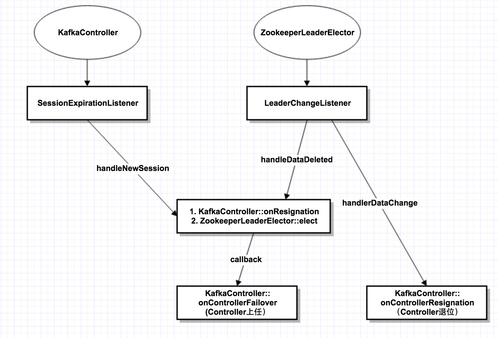

# 序列11-Server核心组件之1-KafkaController选举过程Failover与Resignation
在上1篇我们提到整个Kafka集群有一个“中央控制器“－Controller，这个Controller从所有brokers中选举出来，当Controller挂了之后，其它brokers再次竞选出新的Controller，本篇将详细介绍这个过程。

## Kafka集群的几大核心组件
在正式进入源码分析之前，我们先看一下整个Kafka集群的几大核心组件。让我们从整个服务器的main函数开始：
```
//Kafka
  def main(args: Array[String]): Unit = {
    try {
      val serverProps = getPropsFromArgs(args)
      val kafkaServerStartable = KafkaServerStartable.fromProps(serverProps)

      // attach shutdown handler to catch control-c
      Runtime.getRuntime().addShutdownHook(new Thread() {
        override def run() = {
          kafkaServerStartable.shutdown   //注册一个JVM关闭的钩子
        }
      })

      kafkaServerStartable.startup  //启动程序
      kafkaServerStartable.awaitShutdown
    }
    catch {
      case e: Throwable =>
        fatal(e)
        System.exit(1)
    }
    System.exit(0)
  }

//KafkaServerStartable
class KafkaServerStartable(val serverConfig: KafkaConfig) extends Logging {
  private val server = new KafkaServer(serverConfig)

  def startup() {
    try {
      server.startup()
    }
    catch {
      case e: Throwable =>
        fatal("Fatal error during KafkaServerStartable startup. Prepare to shutdown", e)
        // KafkaServer already calls shutdown() internally, so this is purely for logging & the exit code
        System.exit(1)
    }
  }
  ...
}

//KafkaServer
  def startup() {
    try {
      info("starting")

      if(isShuttingDown.get)
        throw new IllegalStateException("Kafka server is still shutting down, cannot re-start!")

      if(startupComplete.get)
        return

      val canStartup = isStartingUp.compareAndSet(false, true)
      if (canStartup) {
        metrics = new Metrics(metricConfig, reporters, kafkaMetricsTime, true)

        brokerState.newState(Starting)

        //核心组件0
        kafkaScheduler.startup()

        zkUtils = initZk()

        logManager = createLogManager(zkUtils.zkClient, brokerState)
        logManager.startup()

        config.brokerId =  getBrokerId
        this.logIdent = "[Kafka Server " + config.brokerId + "], "
        //核心组件1
        socketServer = new SocketServer(config, metrics, kafkaMetricsTime)
        socketServer.startup()

        //核心组件2
        replicaManager = new ReplicaManager(config, metrics, time, kafkaMetricsTime, zkUtils, kafkaScheduler, logManager,
          isShuttingDown)
        replicaManager.startup()

        //核心组件3
        kafkaController = new KafkaController(config, zkUtils, brokerState, kafkaMetricsTime, metrics, threadNamePrefix)
        kafkaController.startup()

        //核心组件4
        consumerCoordinator = GroupCoordinator.create(config, zkUtils, replicaManager)
        consumerCoordinator.startup()

        /* Get the authorizer and initialize it if one is specified.*/
        authorizer = Option(config.authorizerClassName).filter(_.nonEmpty).map { authorizerClassName =>
          val authZ = CoreUtils.createObject[Authorizer](authorizerClassName)
          authZ.configure(config.originals())
          authZ
        }

        //核心组件5
        apis = new KafkaApis(socketServer.requestChannel, replicaManager, consumerCoordinator,
          kafkaController, zkUtils, config.brokerId, config, metadataCache, metrics, authorizer)
        requestHandlerPool = new KafkaRequestHandlerPool(config.brokerId, socketServer.requestChannel, apis, config.numIoThreads)
        brokerState.newState(RunningAsBroker)

        Mx4jLoader.maybeLoad()

        /* start dynamic config manager */
        dynamicConfigHandlers = Map[String, ConfigHandler](ConfigType.Topic -> new TopicConfigHandler(logManager),
                                                           ConfigType.Client -> new ClientIdConfigHandler(apis.quotaManagers))

        // Apply all existing client configs to the ClientIdConfigHandler to bootstrap the overrides
        // TODO: Move this logic to DynamicConfigManager
        AdminUtils.fetchAllEntityConfigs(zkUtils, ConfigType.Client).foreach {
          case (clientId, properties) => dynamicConfigHandlers(ConfigType.Client).processConfigChanges(clientId, properties)
        }

        // Create the config manager. start listening to notifications
        dynamicConfigManager = new DynamicConfigManager(zkUtils, dynamicConfigHandlers)
        dynamicConfigManager.startup()

        /* tell everyone we are alive */
        val listeners = config.advertisedListeners.map {case(protocol, endpoint) =>
          if (endpoint.port == 0)
            (protocol, EndPoint(endpoint.host, socketServer.boundPort(protocol), endpoint.protocolType))
          else
            (protocol, endpoint)
        }
        kafkaHealthcheck = new KafkaHealthcheck(config.brokerId, listeners, zkUtils)
        kafkaHealthcheck.startup()

        /* register broker metrics */
        registerStats()

        shutdownLatch = new CountDownLatch(1)
        startupComplete.set(true)
        isStartingUp.set(false)
        AppInfoParser.registerAppInfo(jmxPrefix, config.brokerId.toString)
        info("started")
      }
    }
    catch {
      case e: Throwable =>
        fatal("Fatal error during KafkaServer startup. Prepare to shutdown", e)
        isStartingUp.set(false)
        shutdown()
        throw e
    }
  }
```
除了代码，我们也看一下服务器的启动／关闭的shell脚本：
```
bin/kafka-server-start.sh
通过 nohup 守护进程，具体脚本细节就不在此列出了。

//bin/kafak-server-stop.sh 可以看到，进程的关闭很简单，就是通过kill命令，发送SIGTERM信号。JVM收到信号，执行上面的钩子函数
ps ax | grep -i 'kafka\.Kafka' | grep java | grep -v grep | awk '{print $1}' | xargs kill -SIGTERM   
```

通过看Server的启动函数，我们可以看到有以下几大核心组件：
1。SocketServer ＋ KafkaApis 前者接收所有网络请求，后者处理请求
2。KafkaController 负责Controller选举
3。ConsumerCoordinator 前面在分析consumer的时候已经讲过，用于consumer group的负载均衡
4。ReplicaManager 机器的管理
5。KafkaSchedule

本篇着重分析KafkaController，其它核心组件，后面会一一讲述。

## 选举的基本原理
整个选举过程是通过zk上的一个临时节点来实现的：/controller节点，其data结构为：核心信息就是记录当前的controller的brokerId。
```
"version" -> 1, "brokerid" -> brokerId, "timestamp" -> timestamp
```
当controller挂了，其它所有broker监听到此临时节点消失，然后争相创建此临时节点，谁创建成功，谁就成为新的Controller。

除了/controller节点，还有一个辅助的/controller_epoch，记录当前Controller的轮值数。

## KafkaController与ZookeeperLeaderElector
整个选举过程是通过这2个核心类实现的，其中ZookeeperLeaderElector是KafkaController的一个成员变量：
```
//KafkaController的一个成员变量
  private val controllerElector = new ZookeeperLeaderElector(controllerContext, ZkUtils.ControllerPath, onControllerFailover,
    onControllerResignation, config.brokerId)
```
下图展示了选举的整个交互过程：
（1）KafkaController和ZookeeperLeaderElector内部各有1个Listener，一个监听session重连，1个监听/controller节点变化。
（2）当session重连，或者/controller节点被删除，则调用elect()函数，发起重新选举。在重新选举之前，先判断自己是否旧的Controller，如果是，则先调用onResignation退位。



下面从KakfaController的startup函数看起：
```
def startup() = {
    inLock(controllerContext.controllerLock) {
      info("Controller starting up")
      registerSessionExpirationListener()   //第1种监听：SessionExpirationListener
      isRunning = true
      controllerElector.startup   //第2种监听：LeaderChangeListener
      info("Controller startup complete")
    }
  }

  class SessionExpirationListener() extends IZkStateListener with Logging {
    ...
    @throws(classOf[Exception])
    def handleNewSession() {
      info("ZK expired; shut down all controller components and try to re-elect")
      inLock(controllerContext.controllerLock) {
        onControllerResignation()   //先退位
        controllerElector.elect   //发起重新选举
      }
    }
    ...
  }
  
  class LeaderChangeListener extends IZkDataListener with Logging {

    @throws(classOf[Exception])
    def handleDataChange(dataPath: String, data: Object) {
      inLock(controllerContext.controllerLock) {
        val amILeaderBeforeDataChange = amILeader
        leaderId = KafkaController.parseControllerId(data.toString)

        if (amILeaderBeforeDataChange && !amILeader)
          onResigningAsLeader()  //自己以前是controller，现在不是，退位
      }
    }


    @throws(classOf[Exception])
    def handleDataDeleted(dataPath: String) {
      inLock(controllerContext.controllerLock) {
        debug("%s leader change listener fired for path %s to handle data deleted: trying to elect as a leader"
          .format(brokerId, dataPath))
        if(amILeader)
          onResigningAsLeader()  //关键点：controller死了，有可能不是因为自己死了。而是和zookeeper的session断了。但是自己还在。此时，自己先退休，再重新发起选举。
        elect   //发起重现选举
      }
    }
  }
```

## 2个关键回调：Failover(上任)与Resignation(退位)
在上面的选举过程中，存在2个关键的callback：也就是新Controller上任要做的事情和旧Controller退位要做的事情。

“上任“这个比较容易理解，也就是新的broker选举为controller；那为什么会有“退位“呢？

这是因为zk是用心跳来判断controller是否存活，可能controller存活，但zk认为它挂了，这个时候选举出了新的controller。那旧的controller发现自己是旧的，就得主动退位。

下面看一下“新官上任“和“旧官退位“时，分别做了什么：
```
def onControllerFailover() {
    if(isRunning) {
      readControllerEpochFromZookeeper()
      //递增controller epoch
      incrementControllerEpoch(zkUtils.zkClient) 
      
      //关键点：接管所有对broker/partition节点的监听
      registerReassignedPartitionsListener()
      registerIsrChangeNotificationListener()
      registerPreferredReplicaElectionListener()
      partitionStateMachine.registerListeners()
      replicaStateMachine.registerListeners()
      initializeControllerContext()
      replicaStateMachine.startup()
      partitionStateMachine.startup()
     
      // register the partition change listeners for all existing topics on failover
      controllerContext.allTopics.foreach(topic => partitionStateMachine.registerPartitionChangeListener(topic))
      info("Broker %d is ready to serve as the new controller with epoch %d".format(config.brokerId, epoch))
      brokerState.newState(RunningAsController)
      maybeTriggerPartitionReassignment()
      maybeTriggerPreferredReplicaElection()
      /* send partition leadership info to all live brokers */
      sendUpdateMetadataRequest(controllerContext.liveOrShuttingDownBrokerIds.toSeq)
      if (config.autoLeaderRebalanceEnable) {
        info("starting the partition rebalance scheduler")
        autoRebalanceScheduler.startup()
        autoRebalanceScheduler.schedule("partition-rebalance-thread", checkAndTriggerPartitionRebalance,
          5, config.leaderImbalanceCheckIntervalSeconds.toLong, TimeUnit.SECONDS)
      }
      deleteTopicManager.start()
    }
    else
      info("Controller has been shut down, aborting startup/failover")
  }

  def onControllerResignation() {
    //关键点：放弃对所有broker/partition的监听
    deregisterIsrChangeNotificationListener()
    deregisterReassignedPartitionsListener()
    deregisterPreferredReplicaElectionListener()

    // shutdown delete topic manager
    if (deleteTopicManager != null)
      deleteTopicManager.shutdown()

    // shutdown leader rebalance scheduler
    if (config.autoLeaderRebalanceEnable)
      autoRebalanceScheduler.shutdown()

    inLock(controllerContext.controllerLock) {
      // de-register partition ISR listener for on-going partition reassignment task
      deregisterReassignedPartitionsIsrChangeListeners()
      // shutdown partition state machine
      partitionStateMachine.shutdown()
      // shutdown replica state machine
      replicaStateMachine.shutdown()
      // shutdown controller channel manager
      if(controllerContext.controllerChannelManager != null) {
        controllerContext.controllerChannelManager.shutdown()
        controllerContext.controllerChannelManager = null
      }
      // reset controller context
      controllerContext.epoch=0
      controllerContext.epochZkVersion=0
      brokerState.newState(RunningAsBroker)

    }
  }
```