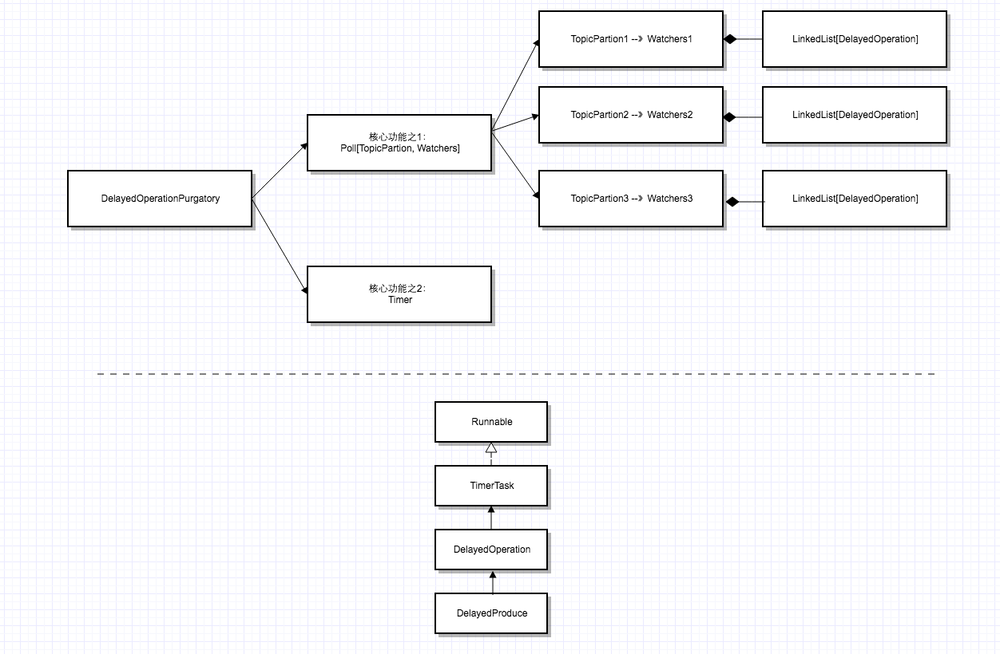
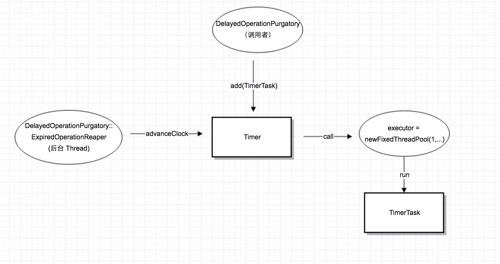
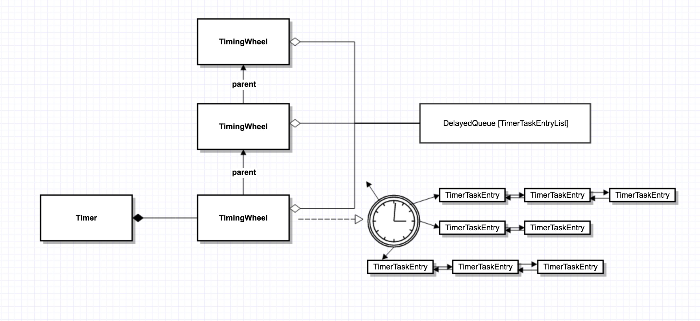
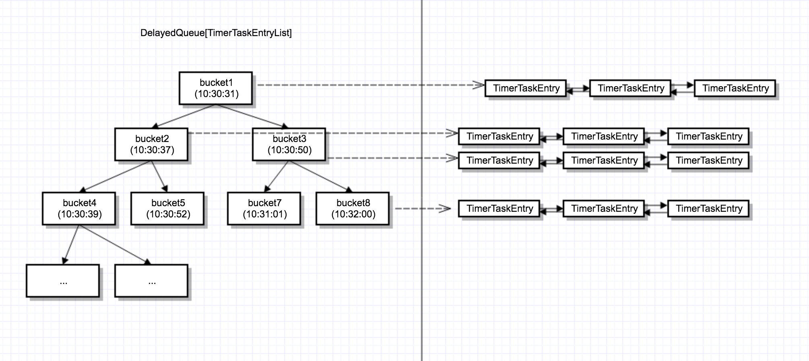
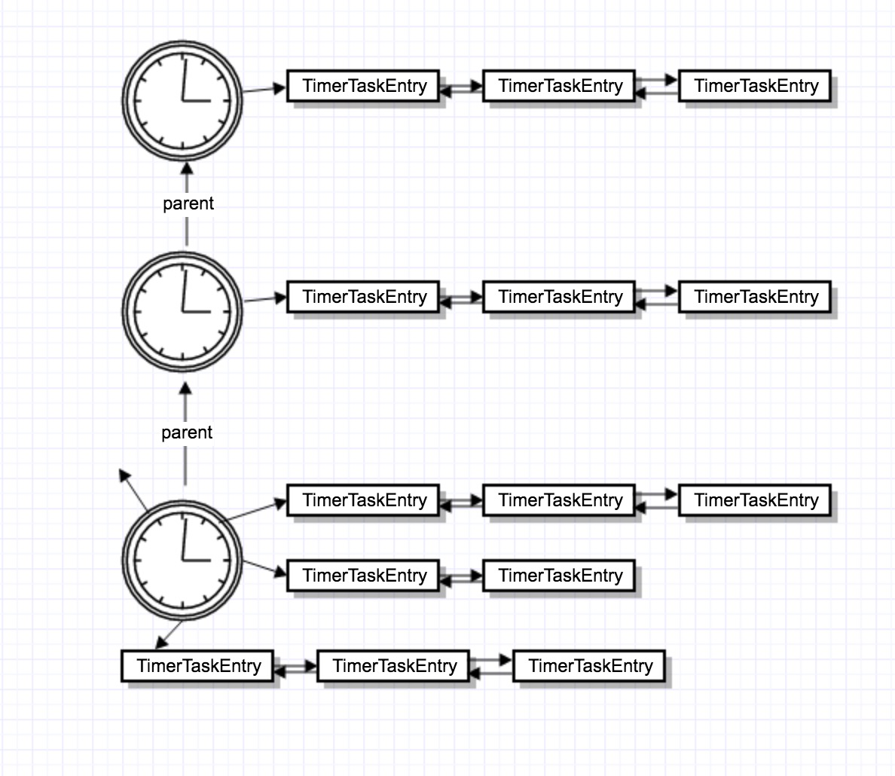

# 序列13-Server核心组件之2(续)-TimingWheel本质与DelayedOperationPurgatory核心结构

在上一篇，分析ReplicaManager的同步原理时，提到了DelayedOperationPurgatory，这个部件完成了2个核心功能： 
1个是check DelayedProduce的complete条件，如果条件满足（也就是所有replica同步消息完成），则调用DelayedOperation的onComplete函数； 
另1个就是实现“超时”机制。本篇将详细分析其内部结构。

## DelayedOperationPurgatory核心结构
### ReplicaManager内部的2个成员变量
首先，我们知道ReplicaManager有2个DelayedOperationPurgatory成员变量：
```
class ReplicaManager(val config: KafkaConfig,
                     metrics: Metrics,
                     time: Time,
                     jTime: JTime,
                     val zkUtils: ZkUtils,
                     scheduler: Scheduler,
                     val logManager: LogManager,
                     val isShuttingDown: AtomicBoolean,
                     threadNamePrefix: Option[String] = None) extends Logging with KafkaMetricsGroup {

  //关键组件：每来1个ProduceReuqest，写入本地日志之后。就会生成一个DelayedProduce对象，放入delayedProducePurgatory中。
  // 之后这个delayedProduce对象，要么在处理FetchRequest的时候，被complete()；要么在purgatory内部被超时.
  val delayedProducePurgatory = new DelayedOperationPurgatory[DelayedProduce](
    purgatoryName = "Produce", config.brokerId, config.producerPurgatoryPurgeIntervalRequests)

  val delayedFetchPurgatory = new DelayedOperationPurgatory[DelayedFetch](
    purgatoryName = "Fetch", config.brokerId, config.fetchPurgatoryPurgeIntervalRequests)
```
### DelayedProducePurgatory核心结构
下图可以看出，DelayedProducePurgatory有2个核心部件，1个是一个Watchers的map，1个是Timer。对应的，DelayedProduce有2个角色：一个是DelayedOperation，同时它也是一个TimerTask。

每当处理一个ProduceRequest，就会生成一个DelayedProduce对象，被加入到一个Watchers中，同时它也会作为一个TimerTask，加入到Timer中。

最后这个DelayedProduce可能被接下来的Fetch满足，也可能在Timer中超时，给客户端返回超时错误。如果是前者，那就需要调用TimerTask.cancel，把该任务从Timer中删除。



```
trait TimerTask extends Runnable {

  val expirationMs: Long // TimerTask的核心变量：过期时间（绝对时间）

  private[this] var timerTaskEntry: TimerTaskEntry = null

  def cancel(): Unit = {  //取消该TimerTask
    synchronized {
      if (timerTaskEntry != null) timerTaskEntry.remove()
      timerTaskEntry = null
    }
  }
```

## Timer实现 – TimingWheel
### 为什么需要TimingWheel
上面讲到，对于每1个请求，都要加入到Timer中，开始计时。如果时间到了，请求还未被满足，则就会返回给客户端超时错误。

关于Timer的实现，Java中常用的有2个办法：Java自带的Timer或者DelayedQueue。

关于DelayedQueue，在另一个序列JUC并发编程里面，已经讲过。其内部本质就是一个二根堆，所有Task按照过期时间排序，堆顶放置的就是最近要过期的元素。队列的入对／出对其复杂度都是Log(n)。

在Kafka的场景中，基于2根堆实现的定时器，有2个缺点： 
（1）在应对服务器大规模请求中，Log(n)的复杂度，还是不够高效 
（2）另1个更大的问题是，DelayedQueue不支持随机删除。而在Kafka的这个场景中，当一个DelayedProduce在过期之前被complete之后，就需要把其从Timer中删除。

Kakfa的作者也曾提到过，在旧的版本中，因为被complete的请求，不能及时从DelayedQueue删除，导致Queue吃完jvm的内存的情况。

所以Kafka的设计者，提供了基于TimingWheel的“定时器“实现，这个定时器有2个优点： 
（1）Task的加入，取出，时间复杂度是O(1) 
（2）支持Task的随机删除

### Timer的使用方式
我们知道，Java自带的Timer，其内部有一个线程来驱动，我们只需要把Task加进去就可以了。

但Kafka实现的Timer，在用法上有一些不同： 



一方面，调用者（也就是DelayedOperationPurgatory)不断调用timer.add函数加入新的Task；另1方面，不是Timer内部有线程驱动，而是有一个外部线程ExpiredOperationReaper，不断调用timer.advanceClock函数，来驱动整个Timer。

同时，当某一个TimerTask到期之后，不是由Timer直接执行此TimerTask。而是交由一个executor，来执行所有过期的TimerTask。之所以这么做，是因为不能让TimerTask的执行阻塞Timer本身的进度。

总结一下：这里有2个外部线程，一个驱动Timer，一个executor，专门用来执行过期的Task。这2个线程，都是DelayedOperationPurgatory的内部变量。

### Timer内部结构
下面先看一下Timer的内部结构：



Timer是最外层类，表示一个定时器。其内部有一个TimingWheel对象，TimingWheel是有层次结构的，每个TimingWheel可能有parent TimingWheel（这个原理就类似我们生活中的水表，不同表盘有不同刻度）。

TimingWheel是一个时间刻度盘，每个刻度上有一个TimerTask的双向链表，称之为一个bucket。同1个bucket里面的所有Task，其过期时间相等。因此，每1个bucket有一个过期时间的字段。

除此之外，所有TimingWheel共用了一个DelayedQueue，这个DelayedQueue存储了所有的bucket，而不是所有的TimerTask。
```
//Timer
class Timer(taskExecutor: ExecutorService, tickMs: Long = 1, wheelSize: Int = 20, startMs: Long = System.currentTimeMillis) {
  ....
  //核心变量 TimingWheel
  private[this] val timingWheel = new TimingWheel(
    tickMs = tickMs,
    wheelSize = wheelSize,
    startMs = startMs,
    taskCounter = taskCounter,
    delayQueue
  )

  //Timer的核心函数之1：加入一个TimerTask
  def add(timerTask: TimerTask): Unit = {
    readLock.lock()
    try {
      addTimerTaskEntry(new TimerTaskEntry(timerTask))
    } finally {
      readLock.unlock()
    }
  }

  //Timer的核心函数之2：Tick，每走1次，内部判断过期的TimerTask，执行其run函数
  def advanceClock(timeoutMs: Long): Boolean = {
    var bucket = delayQueue.poll(timeoutMs, TimeUnit.MILLISECONDS)
    if (bucket != null) {
      writeLock.lock()
      try {
        while (bucket != null) {
          timingWheel.advanceClock(bucket.getExpiration())
          bucket.flush(reinsert)
          bucket = delayQueue.poll()
        }
      } finally {
        writeLock.unlock()
      }
      true
    } else {
      false
    }
  }
```
```
//TimingWheel内部结构
private[timer] class TimingWheel(tickMs: Long, wheelSize: Int, startMs: Long, taskCounter: AtomicInteger, queue: DelayQueue[TimerTaskList]) {

  private[this] val interval = tickMs * wheelSize   //每1格的单位 ＊ 总格数（比如1格是1秒，60格，那总共也就能表达60s)

  //核心变量之1：每个刻度对应一个TimerTask的链表
  private[this] val buckets = Array.tabulate[TimerTaskList](wheelSize) { _ => new TimerTaskList(taskCounter) }

  ...
  //核心变量之2：parent TimingWheel
  @volatile private[this] var overflowWheel: TimingWheel = null
```
```
private[timer] class TimerTaskList(taskCounter: AtomicInteger) extends Delayed {

  private[this] val root = new TimerTaskEntry(null) //链表的头节点
  root.next = root
  root.prev = root
```
```
//每个TimerTaskEntry封装一个TimerTask对象，同时内部3个变量
private[timer] class TimerTaskEntry(val timerTask: TimerTask) {

  @volatile
  var list: TimerTaskList = null   //指向该链表自身
  var next: TimerTaskEntry = null  //后一个节点
  var prev: TimerTaskEntry = null  //前1个节点

 //因为同1个bucket(TimerTaskEntryList)里面的过期时间都相等，所以整个bucket记录了一个过期时间的字段expiration
    private[this] val expiration = new AtomicLong(-1L)

//除非该bucekt被重用，否则一个bucket只会有1个过期时间
  def setExpiration(expirationMs: Long): Boolean = {
    expiration.getAndSet(expirationMs) != expirationMs
  }
｝
```

## Timer的3大核心功能
我们知道，对于一个Timer来说，有3大功能： 
（1）添加：把一个TimerTask加入Timer 
（2）过期：时间到了，执行所有那些过期的TimerTask 
（3）取消：时间未到，取消TimerTask。把TimerTask删除

下面就逐个分析这3大核心功能，来看一下如何用TimingWheel实现一个Timer。

### 添加
```
//Timer的对外接口add
class Timer(taskExecutor: ExecutorService, tickMs: Long = 1, wheelSize: Int = 20, startMs: Long = System.currentTimeMillis) {
  ...
  def add(timerTask: TimerTask): Unit = {
    readLock.lock()
    try {
      addTimerTaskEntry(new TimerTaskEntry(timerTask))  //把TimerTask包装成一个TimerTaskEntry节点，添加进去
    } finally {
      readLock.unlock()
    }
  }

  private def addTimerTaskEntry(timerTaskEntry: TimerTaskEntry): Unit = {
    if (!timingWheel.add(timerTaskEntry)) {
      // Already expired or cancelled
      if (!timerTaskEntry.cancelled) //关键点：如果该TimerTask不能被加入timingWheel，说明其已经过期了。同时该任务又没有被取消，则直接执行此任务
        taskExecutor.submit(timerTaskEntry.timerTask)
    }
  }

//关键的TimingWheel的add函数
  def add(timerTaskEntry: TimerTaskEntry): Boolean = {
    val expiration = timerTaskEntry.timerTask.expirationMs

    if (timerTaskEntry.cancelled) {
      // 如果该任务已经被取消，则不加入timingWheel
      false
    } else if (expiration < currentTime + tickMs) {
      //如果该Task的过期时间已经小于当前时间 ＋ 基本的tick单位（1ms)，说明此任务已经过期了，不用再加入timingWheel
      false
    } else if (expiration < currentTime + interval) {
      // 如果过期时间 < 当前时间 ＋ interval，则说明当前的刻度盘可以表达此过期时间。这里的interval就是当前刻度盘所能表达的最大时间范围：tickMs * wheelSize

      //这里tickMs设置的是1ms，所以virtualId = expiration
      val virtualId = expiration / tickMs

      //关键的hash函数：根据过期时间，计算出bucket的位置
      val bucket = buckets((virtualId % wheelSize.toLong).toInt) 

      //把该Task加入bucket
      bucket.add(timerTaskEntry)

      //同一个bucket，所有task的expiration是相等的。因此，expiration相等的task，会hash到同1个bucket，然后此函数只第1次调用会成功
      if (bucket.setExpiration(virtualId * tickMs)) {
        queue.offer(bucket) //该桶只会被加入delayedQueue1次
      }
      true
    } else {
      //过期时间超出了currentTime + interval，说明该过期时间超出了当前刻度盘所能表达的最大范围，则调用其parent刻度盘，来试图加入此Task
      if (overflowWheel == null) addOverflowWheel()
      overflowWheel.add(timerTaskEntry)
    }
  }
```
### 过期
正如上面的图所示，外部线程每隔200ms调用1次advanceClock，从而驱动时钟不断运转。在驱动过程中，发现过期的Task，放入executors执行。
```
private class ExpiredOperationReaper extends ShutdownableThread(
    "ExpirationReaper-%d".format(brokerId),
    false) {

    override def doWork() {
      //不断循环，每200ms调用1次advanceClock
      timeoutTimer.advanceClock(200L)  
      ...
    }
}


  def advanceClock(timeoutMs: Long): Boolean = {
    //关键点：这里判断一个Task是否过期，其实还是用delayedQueue来判断的。而不是TimingWheel本事
    //过期的bucket会从队列的首部出对
    var bucket = delayQueue.poll(timeoutMs, TimeUnit.MILLISECONDS)
    if (bucket != null) {
      writeLock.lock()
      try {
        while (bucket != null) {
          //把timingWheel的进度，调整到队列首部的bucket的过期时间，也就是当前时间
          timingWheel.advanceClock(bucket.getExpiration())

          //清空bucket，执行bucket中每个Task的过期函数（执行方式就是把所有这些过期的Task，放入executors)
          bucket.flush(reinsert)

          //再次从队列首部拿下1个过期的bucket。如果没有，直接返回null。该函数不会阻塞
          bucket = delayQueue.poll()
        }
      } finally {
        writeLock.unlock()
      }
      true
    } else {
      false
    }
  }

//TimingWheel
  def advanceClock(timeMs: Long): Unit = {
    if (timeMs >= currentTime + tickMs) {
      //更新currentTime(把timeMs取整，赋给currentTime)
      currentTime = timeMs - (timeMs % tickMs)

      //更新parent timingWheel的currentTime
      if (overflowWheel != null) overflowWheel.advanceClock(currentTime)
    }
  }
```
### 取消
Task的取消，并不是在Timer里面实现的。而是TimerTask自身，定义了一个cancel函数。所谓cancel，就是自己把自己用TimerTaskEntryList这个双向链表中删除。
```
trait TimerTask extends Runnable {

  val expirationMs: Long // timestamp in millisecond

  private[this] var timerTaskEntry: TimerTaskEntry = null

  def cancel(): Unit = {
    synchronized {
      if (timerTaskEntry != null) timerTaskEntry.remove()
      timerTaskEntry = null
    }
  }

  def remove(): Unit = {
    var currentList = list
    while (currentList != null) {
      currentList.remove(this)  //从链表中，把自己删掉
      currentList = list
    }
  }

 //remove函数。因为是双向链表，所以删除不需要遍历链表。删除复杂度是O(1)
  def remove(timerTaskEntry: TimerTaskEntry): Unit = {
    synchronized {
      timerTaskEntry.synchronized {
        if (timerTaskEntry.list eq this) {
          timerTaskEntry.next.prev = timerTaskEntry.prev
          timerTaskEntry.prev.next = timerTaskEntry.next
          timerTaskEntry.next = null
          timerTaskEntry.prev = null
          timerTaskEntry.list = null
          taskCounter.decrementAndGet()
        }
      }
    }
  }
```
## TimingWheel的本质
### DelayedQueue
从上面代码中可以看到，添加/取消的时间复杂度都是O(1)。

并且在上面的代码中，大家可以看出，TimingWheel.advanceClock()函数里面其实什么都没做，就只是更新了一下所有刻度盘的currentTime。真正的判断哪个Task过期的逻辑，其实是用DelayedQueue来判断的，而不是通过TimingWheel判断的。

那TimingWheel在此处到底起了一个什么作用呢？

让我们从另外1个角度，来画一下Timer的实现机制：

前面讲过，expiration相等的TimerTask，会组成一个双向链表，称之为一个bucket。DelayedQueue的每个节点，放入的就是一个bucket，而不是单个的TimerTask。过期的判断，就是通过DelayedQueue来实现的。



### Hash函数
但这里有个问题，当我要把某个TimerTask加入这个DelayedQueue时，我怎么计算出所在的bucket呢？？

答案就是TimingWheel。这里TimingWheel本质上就是充当了一个hash函数，通过Task的expiration time，hash出所在的bucket。如下图所示：

跟水表一样，刻度盘有多级，每个刻度上对应一个bucket。根据expiration计算所属的bucket的代码，就在上面的add函数里面。



### 刻度盘的层次
每个刻度盘都有个变量，记录currentTime。所有刻度盘的currentTime基本是相等的（会根据自己的tickMs取整）。advanceClock函数，就是更新这个currentTime。

在这里，不同的刻度盘单位其实都是ms。只是不同的刻度盘上，1格所代表的时间长度是不一样的。这里有个关系：

parent 刻度盘的1格表示的时间长度 ＝ child刻度盘的整个表盘所表示的时间范围

在代码中，即：
```
private[this] def addOverflowWheel(): Unit = {
    synchronized {
      if (overflowWheel == null) {
        overflowWheel = new TimingWheel(
          tickMs = interval,  //parent刻度盘的刻度tickMs = child刻度盘的整个表盘范围 interval(tickMs * wheelSize)
          wheelSize = wheelSize,
          startMs = currentTime,
          taskCounter = taskCounter,
          queue
        )
      }
    }
  }
```
因此，从底往上: tickMs = 1ms, wheelSize = 20格 
第1层刻度盘能表达的expiration的范围就是[currentTime, currentTime + tickMs*wheelSize]; //每1格1ms，总共20ms范围 
第2层刻度盘能表达的expiration的范围就是[currentTime, currentTime + tickMs*wheelSize*wheelSize]; //每1格20ms，总共400ms范围 
第3层刻度盘能表达的expiration的范围就是[currentTime, currentTime + tickMs*wheelSize*wheelSize*WheelSize]; //每1格400ms，总共8000ms范围

这里有个细节：
```
private[this] val reinsert = (timerTaskEntry: TimerTaskEntry) => addTimerTaskEntry(timerTaskEntry)

//advanceClock函数
  bucket.flush(reinsert)
```

严格来讲，同1个bucket里面装的并不是expiration精确相等的Task，而是在当前刻度下，经过取整，落在同1个bucket里面的所有Task。

最底层的精度是1ms，往上1层精度是20ms，意味着相差在20ms以内的所有Task都会落到同1个bucket里面，以此类推。。

所以当从上层的TimingWheel的bucket中取出来的Task，要重新从最低层加入TimingWheel体系，只有最底层都加不进去，才说明真正的过期！！

## 总结
Kafka对于TimingWheel的用法是有改进的，结合了DelayedQueue。

并不同于传统的TimingWheel直接用来做Task的过期逻辑的判断，Kafka此处是用DelayedQueue判断过期，把TimingWheel当hash函数用，用来计算其在DelayedQueue中bucket的位置。