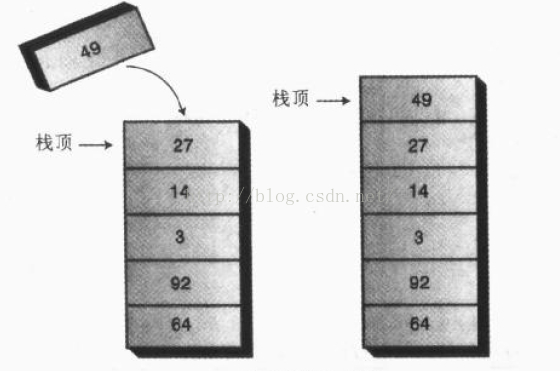

## 3.数据结构之栈

数组、链表、树等数据结构适用于存储数据库应用中的数据记录，它们常常用于记录那些现实世界的对象和活动的数据，便与数据的访问：插入、删除和查找特定数据项

而栈和队列更多的是作为程序员的工具来使用。他们主要作为构思算法的辅助工具，而不是完全的数据存储工具。这些数据结构的生命周期比那些数据库类型的结构要短很多。在程序操作执行期间它们才被创建，通常它们去执行某项特殊的任务，当任务完成后就被销毁

栈和队列的访问是受限制的，即在特定时刻只有一个数据项可以被读取或删除

栈和队列是比数组和其他数据结构更加抽象的结构，是站在更高的层面对数据进行组织和维护

栈的主要机制可用数组来实现，也可以用链表来实现。优先级队列的内部实现可以用数组或者一种特别的树——堆来实现。

先来了解栈的概念和实例，然后分别深入理解队列和优先级队列

栈只允许访问一个数据项：即最后插入的数据。移除这个数据项后才能访问倒数第二个插入的数据项。它是一种“**后进先出**”的数据结构。

栈最基本的操作是**出栈**（Pop）、**入栈**（Push），还有其他扩展操作，如查看栈顶元素，判断栈是否为空、是否已满，读取栈的大小等

下面我们就用数组来写一个栈操作的封装类

    public class Stack {
        private int size;           //栈的大小
        private int top;            //栈顶元素的下标
        private int[] stackArray;   //栈的容器
    
        //构造函数
        public Stack(int size) {
            stackArray = new int[size];
            top = -1; //初始化栈的时候，栈内无元素，栈顶下标设为-1
            this.size = size;
        }
    
        //入栈，同时，栈顶元素的下标加一
        public void push(int elem) {
            stackArray[++top] = elem; //插入栈顶
        }
    
        //出栈，删除栈顶元素，同时，栈顶元素的下标减一
        public int pop() {
            return stackArray[top--];
        }
    
        //查看栈顶元素，但不删除
        public int peek() {
            return stackArray[top];
        }
    
        //判空
        public boolean isEmpty() {
            return top == -1;
        }
    
        //判满
        public boolean isFull() {
            return top == size - 1;
        }
    }
    
上例中，没有对可能的异常进行处理，需要由编程人员保证程序的正确性，比如，才出栈前需要应该保证栈中有元素，在入栈前应保证栈没有满

栈通常用于解析某种类型的文本串。通常，文本串是用计算机语言写的代码行，而解析它们的程序就是编译器

下面我们来用栈来实现一个经典的应用：分隔符匹配。想一下在Eclipse编程时，如果我们写的代码中如果多了一个“{”，后者少了一个“}”，或者括号的顺序错乱，都会报错。接下来我们就用栈来模拟这种分隔符匹配

分隔符匹配程序从字符串中不断地读取程序，每次读取一个字符，若发现它是左分隔符（{、[、(），将它压入栈中。当读到一个右分隔符时（)、]、}），弹出栈顶元素，并且查看它是否和该右分隔符匹配。如果它们不匹配，则程序报错。如果到最后一直存在着没有被匹配的分隔符，程序也报错