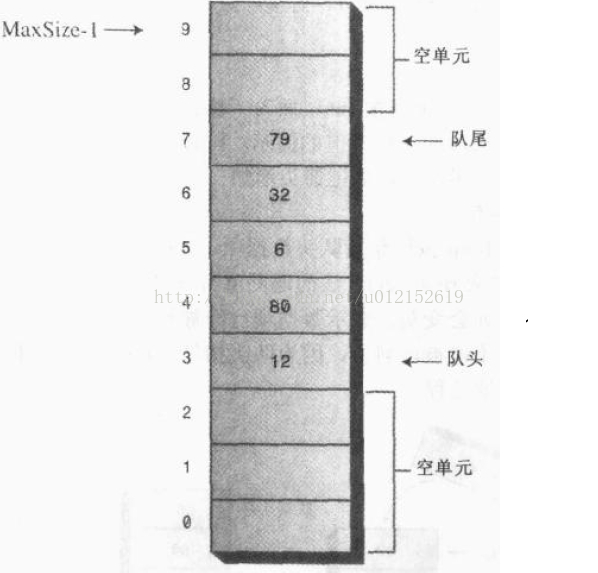
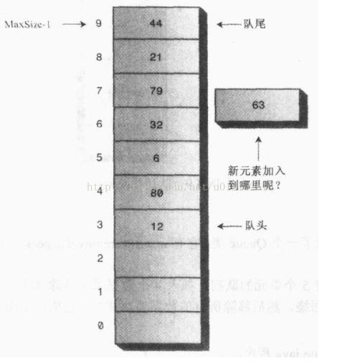
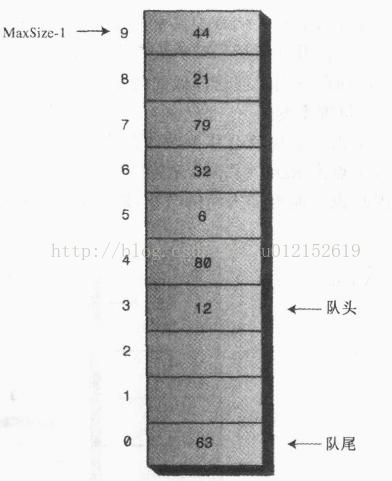
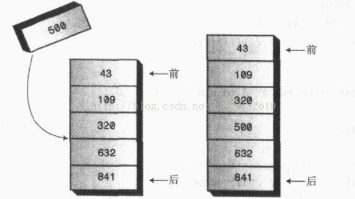
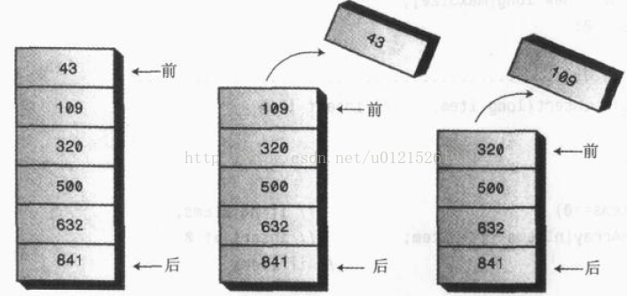

## 4.数据结构之队列

栈是“**后进先出**”（LIFO，Last InFirst Out）的数据结构，与之相反，队列是“**先进先出**”（FIFO，First InFirst Out）的数据结构

队列的作用就像售票口前的人们站成的一排一样：第一个进入队列的人将最先买到票，最后排队的人最后才能买到票

在计算机操作系统或网路中，有各种队列在安静地工作着。打印作业在打印队列中等待打印。当敲击键盘时，也有一个存储键盘键入内容的队列，如果我们敲击了一个键，而计算机又暂时在做其他事情，敲击的内容不会丢失，它会排在队列中等待，直到计算机有时间来读取它，利用队列保证了键入内容在处理时其顺序不会改变

栈的插入和删除数据项的命名方法很标准，成为push和pop，队列的方法至今也没有一个标准化的方法，插入可以称作put、add或enque等，删除可以叫作delete、get、remove或deque等

### 4.1 队列

下面我们依然使用数组作为底层容器来实现一个队列的操作封装，与栈不同的是，队列的数据项并不都是从数组的第一个下标开始，因为数据项在数组的下标越小代表其在队列中的排列越靠前，移除数据项只能从队头移除，然后队头指针后移，这样数组的前几个位置就会空出来如下图所示：

这与我们的直观感觉相反，因为我们排队买票时，队列总是向前移动，当前面的人买完票离开后，其他人都向前移动，而在我们的设计中，队列并没有向前移动，因为那样做会使效率大打折扣，我们只需要使用指针来标记队头和队尾，队列发生变化时，移动指针就可以，而数据项的位置不变

但是，这样的设计还存在着一个问题，随着队头元素不断地移除，数组前面空出的位置会越来越多，当队尾指针移到最后的位置时，即使队列没有满，我们也不能再插入新的数据项了

解决这种缺点的方法是**环绕式处理**，即让队尾指针回到数组的第一个位置：

这就是**循环队列**（也成为缓冲环）。虽然在存储上是线形的，但是在逻辑上它是一个首尾衔接的环形

    public class Queue {
        private int[] queArray;
        private int maxSize;
        public int front;   //存储队头元素的下标
        public int rear;    //存储队尾元素的下标
        private int length; //队列长度
    
        //构造方法，初始化队列
        public Queue(int maxSize) {
            this.maxSize = maxSize;
            queArray = new int[maxSize];
            front = 0;
            rear = -1;
            length = 0;
        }
    
        //插入
        public void insert(int elem) throws Exception {
            if (isFull()) {
                throw new Exception("队列已满，不能进行插入操作！");
            }
            //如果队尾指针已到达数组的末端，插入到数组的第一个位置
            if (rear == maxSize - 1) {
                rear = -1;
            }
            queArray[++rear] = elem;
            length++;
        }
    
        //移除
        public int remove() throws Exception {
            if (isEmpty()) {
                throw new Exception("队列为空，不能进行移除操作！");
            }
            int elem = queArray[front++];
            //如果队头指针已到达数组末端，则移到数组第一个位置
            if (front == maxSize) {
                front = 0;
            }
            length--;
            return elem;
        }
    
        //查看队头元素
        public int peek() throws Exception {
            if (isEmpty()) {
                throw new Exception("队列内没有元素！");
            }
            return queArray[front];
        }
    
        //获取队列长度
        public int size() {
            return length;
        }
    
        //判空
        public boolean isEmpty() {
            return length == 0;
        }
    
        //判满
        public boolean isFull() {
            return length == maxSize;
        }
    }
    
还有一种称为**双端队列**的数据结构，队列的每一端都可以进行插入和移除操作。

其实双端队列是队列和栈的综合体。如果限制双端队列的一段只能插入，而另一端只能移除，就变成了平常意义上的队列；如果限制双端队列只能在一端进行插入和移除，就变成了栈

### 4.2 优先级队列

像普通队列一样，优先级队列有一个队头和一个队尾，并且也是从队头移除数据，从队尾插入数据，不同的是，在优先级队列中，数据项按关键字的值排序，数据项插入的时候会按照顺序插入到合适的位置

除了可以快速访问优先级最高的数据项，优先级队列还应该可以实现相当快的插入，因此，优先级队列通常使用一种称为堆的数据结构来实现。在下例中，简便起见，我们仍然使用数组来实现

在数据项个数比较少，或不太关心速度的情况下，用数组实现优先级队列还可以满足要求，如果数据项很多，或对速度要求很高，采用堆是更好的选择

优先级队列的实现跟上面普通队列的实现有很大的区别。

优先级队列的插入本来就需要移动元素来找到应该插入的位置，所以循环队列那种不需要移动元素的优势就不太明显了。在下例中，没有设置队头和队尾指针，而是使数组的第一个元素永远是队尾，数组的最后一个元素永远是队头，为什么不是相反的呢？因为队头有移除操作，所以将队头放在数组的末端，便于移除，如果放在首段，每次移除队头都需要将队列向前移动

    public class PriorityQueue {
        private int[] queArray;
        private int maxSize;
        private int length; //队列长度
        private int referencePoint;  //基准点
    
        //构造方法，初始化队列
        public PriorityQueue(int maxSize, int referencePoint) {
            this.maxSize = maxSize;
            this.referencePoint = referencePoint;
            queArray = new int[maxSize];
            length = 0;
        }
    
        //插入
        public void insert(int elem) throws Exception {
            if (isFull()) {
                throw new Exception("队列已满，不能进行插入操作！");
            }
    
            //如果队列为空，插入到数组的第一个位置
            if (length == 0) {
                queArray[length++] = elem;
            } else {
                int i;
                for (i = length; i > 0; i--) {
    
                    int dis = Math.abs(elem - referencePoint);  //待插入元素的距离
                    int curDis = Math.abs(queArray[i - 1] - referencePoint); //当前元素的距离
    
                    //将比插入元素优先级高的元素后移一位
                    if (dis >= curDis) {
                        queArray[i] = queArray[i - 1];
                    } else {
                        break;
                    }
                }
                queArray[i] = elem;
                length++;
            }
        }
    
        //移除
        public int remove() throws Exception {
            if (isEmpty()) {
                throw new Exception("队列为空，不能进行移除操作！");
            }
            int elem = queArray[--length];
            return elem;
        }
    
        //查看队头元素
        public int peek() throws Exception {
            if (isEmpty()) {
                throw new Exception("队列内没有元素！");
            }
            return queArray[length - 1];
        }
    
        //返回队列长度
        public int size() {
            return length;
        }
    
        //判空
        public boolean isEmpty() {
            return length == 0;
        }
    
        //判满
        public boolean isFull() {
            return length == maxSize;
        }
    }