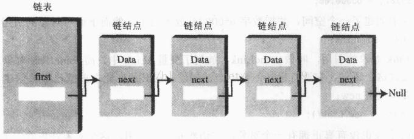
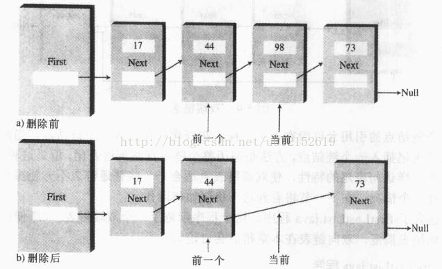
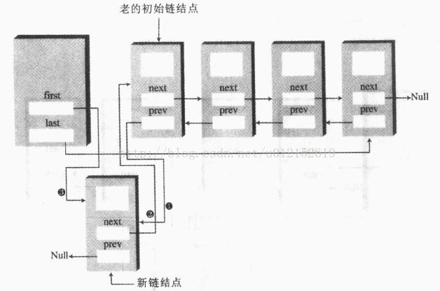
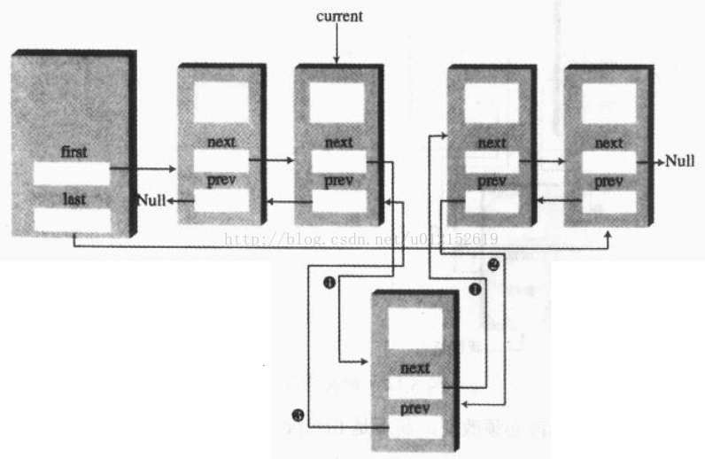
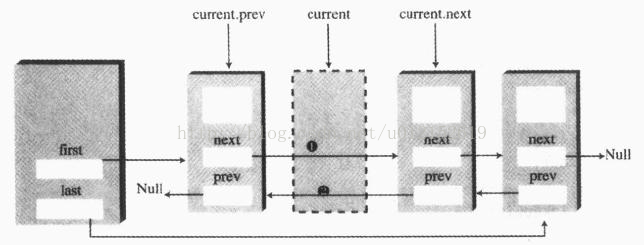

## 5.数据结构之链表

链表是一种插入和删除都比较快的数据结构，缺点是查找比较慢。除非需要频繁的通过下标来随机访问数据，否则在很多使用数组的地方都可以用链表代替

在链表中，每个数据项都包含在“**链结点**”中，一个链结点是某个类的对象。每个链结点对象中都包含一个对下一个链接点的引用，链表本身的对象中有一个字段指向第一个链结点的引用，如下图所示：

在数组中，每一项占用一个特定的位置，这个位置可以用一个下标号直接访问，就像一排房子，你可以凭房间号找到其中特定的意见。在链表中，寻找一个特定元素的唯一方法就是沿着这个元素的链一直找下去，知道发现要找的那个数据项

链表的存储单元封装类

    public class Link {
        public int age;
        public String name;
        public Link next;  //指向该链结点的下一个链结点
        public Link previous;  //指向前一个链结点
    
        //构造方法
        public Link(int age, String name) {
            this.age = age;
            this.name = name;
        }
    
        //打印该链结点的信息
        public void displayLink() {
            System.out.println("name:" + name + ",age:" + age);
        }
    }

### 5.1 单链表

链表的删除指定链结点，是通过将目标链结点的上一个链结点的next指针指向目标链结点的下一个链结点，示意图如下：

通过这种方法，在链表的指针链中将跳过与删除的元素，达到删除的目的。不过，实际上删除掉的元素的next指针还是指向原来的下一个元素的，只是它不能再被单链表检索到而已，JVM的垃圾回收机制会在一定的时间之后回收它

添加链结点比删除复杂一点，首先我们要使插入位置之前的链结点的next指针指向目标链结点，其次还要将目标链结点的next指针指向插入位置之后的链结点。本例中的插入位置仅限于链表的第一个位置，示意图如下：

    public class LinkList {
        private Link first;  //指向链表中的第一个链结点
    
        public LinkList() {
            first = null;
        }
    
        //插入到链表的前端
        public void insertFirst(Link link) {
            link.next = first;
            first = link;
        }
    
        //删除第一个链结点，返回删除的链结点引用
        public Link deleteFirst() throws Exception {
            if (isEmpty()) {
                throw new Exception("链表为空！不能进行删除操作");
            }
            Link temp = first;
            first = first.next;
            return temp;
        }
    
        //打印出所有的链表元素
        public void displayList() {
            Link cur = first;
            while (cur != null) {  //循环打印每个链结点
                cur.displayLink();
                cur = cur.next;
            }
        }
    
        //删除属性为指定值的链结点
        public Link delete(int key) {
            Link link = null;
            Link cur = first;
            Link next = first.next;
            Link previous = null;
            while (cur != null) {
                if (cur.age == key) {  //找到了要删除的链结点
                    link = cur;
                    //如果当前链结点的前驱为null，证明当其为链表的第一个链结点，删除该链结点后需要对first属性重新赋值
                    if (previous == null) {
                        this.first = next;
                    } else {
                        //删除操作，即将前驱的next指针指向当前链结点的next，链表中将去当前链结点这一环
                        previous.next = next;
                    }
                    break;
                } else if (cur.next == null) {  //当前链结点不是目标且下一个链结点为null，证明没有要删除的链结点
                    break;
                }
    
                //当前链结点不是要删除的目标，则向后继续寻找
                next = next.next;
                cur = cur.next;
                previous = cur;
            }
    
            return link;
        }
    
        //查找属性为指定值的链结点
        public Link find(int key) {
            Link link = null;
            Link cur = first;
            Link next = null;
            Link previous = null;
            while (cur != null) {
                if (cur.age == key) {
                    link = cur;
                    break;
                } else if (cur.next == null) {//当前链结点不是要找的目标且下一个链结点为null，则证明没有找到目标
                    break;
                }
    
                //当前链结点不是要找的目标且存在下一个链结点，则向后继续寻找
                next = next.next;
                cur = cur.next;
                previous = cur;
            }
    
            return link;
        }
    
        //判空
        public boolean isEmpty() {
            return (first == null);
        }
    }
    
### 5.2 双端链表

首先需要注意，**双端链表与双向链表是完全不同的两个概念**

双端链表与单链表的区别在于它不只第一个链结点有引用，还对最后一个链结点有引用，如下图所示：

对最后一个链结点的引用允许像插入表头那样在表尾插入一个链结点，使用双端链表更适合于一些单链表不方便操作的场合，队列的实现就是这样一个情况

下面是双端链表的实现类，与单链表不同的是，DoubleEndList类多了指向表尾的引用，并且多了插入表尾的操作

    public class DoubleEndList {
    
        private Link first;  //指向链表中的第一个链结点
        private Link last;   //指向链表中最后一个链结点
    
        public DoubleEndList() {
            first = null;
            last = null;
        }
    
        //插入到链表的前端
        public void insertFirst(Link link) {
            if (isEmpty()) {  //如果为空链表，则插入的第一个链结点既是表头也是表尾
                last = link;
            }
            link.next = first;
            first = link;
        }
    
        //插入到链表的末端
        public void insertLast(Link link) {
            if (isEmpty()) {  //如果为空链表，则插入的第一个链结点既是表头也是表尾
                first = link;
            } else {
                last.next = link;
            }
            last = link;
        }
    
        //删除第一个链结点，返回删除的链结点引用
        public Link deleteFirst() throws Exception {
            if (isEmpty()) {
                throw new Exception("链表为空！不能进行删除操作");
            }
            Link temp = first;
            if (first.next == null) {
                last = null;  //如果只有一个链结点，则删除后会影响到last指针
            }
            first = first.next;
            return temp;
        }
    
        //打印出所有的链表元素
        public void displayList() {
            Link cur = first;
            while (cur != null) {  //循环打印每个链结点
                cur.displayLink();
                cur = cur.next;
            }
        }
    
        //判空
        public boolean isEmpty() {
            return (first == null);
        }
    
    }
    
双端链表可以插入表尾，但是仍然不能方便的删除表尾，因为我们没有方法快捷地获取倒数第二个链结点，双端链表没有逆向的指针，这一点就要靠双向链表来解决了

### 5.3 有序链表

对于某些应用来说，在链表中保持数据有序是很有用的，具有这个特性的链表叫作“有序链表”

通常，有序链表的删除只限于最大值或最小值，不过，有时候也会查找和删除某一特定点，但这种操作对于有序链表来说效率不高

有序链表优于有序数组的地方在于插入的效率更高（不需要像数组那样移动元素），另外链表可以灵活地扩展大小，而数组的大小是固定的。但是这种效率的提高和灵活的优势是以算法的复杂为代价的

下面我们给出一个有序单链表的实现类

    public class SortedList {
    
        private Link first;  //指向链表中的第一个链结点
    
        public SortedList() {
            first = null;
        }
    
        //插入
        public void insert(Link link) {
            Link previous = null;
            Link cur = first;
            while (cur != null && link.age > cur.age) {  //链表由大到小排列
                previous = cur;
                cur = cur.next;
            }
    
            if (previous == null) {  //如果previous为null，则证明当前链结点为表头
                this.first = link;
            } else {
                previous.next = link;
            }
    
            link.next = cur;
    
        }
    
        //删除第一个链结点，返回删除的链结点引用
        public Link deleteFirst() throws Exception {
            if (isEmpty()) {
                throw new Exception("链表为空！不能进行删除操作");
            }
            Link temp = first;
            first = first.next;
            return temp;
        }
    
        //打印出所有的链表元素
        public void displayList() {
            Link cur = first;
            while (cur != null) {  //循环打印每个链结点
                cur.displayLink();
                cur = cur.next;
            }
        }
    
        //判空
        public boolean isEmpty() {
            return (first == null);
        }
    
    }
    
该实现类与单链表的差别在于插入操作，因为是有序的，所以需要先找到要插入的位置，然后才能进行插入

有序链表可以用于一种高效的排序机制。假设有一个无序数组，如果从这个数组中取出数据插入有序链表，他们会自动按照顺序排列，然后把它们从有序链表中重新放入数组，该数组就变成了有序数组。这种排序方法比在数组中常用的插入排序效率更高，因为这种方式进行的复制次数少一些

### 5.4 双向链表

下面来讨论一种更复杂的链表结构：双向链表。

传统链表存在着一个潜在的问题，就是没有反向引用，由上一个链结点跳到下一个链结点很容易，而从下一个链结点跳到上一个链结点很困难

双向链表提供了这种能力，即允许向前遍历，也允许向后遍历。实现这种特性的关键在于每个链结点既有下一个链结点的引用，也有上一个链结点的引用，如下图所示：

诚然，双向链表有其自身的优势，但是任何优势都要付出一定的代价，比如双向链表的插入和删除会变得更复杂，因为同时要处理双倍的指针变化。例如，我们在进行表头插入的操作示意图如下：

在表尾插入与之类似，是表头插入的镜像操作

在表头表尾之外的其他位置插入新的链结点的示意图如下：

对于删除操作，如果要删除表头或表尾，比较简单，如果要删除指定值的链结点比较复杂，首先需要定位到要删除的链结点，然后改变了其前后链结点的指针，示意图如下：

