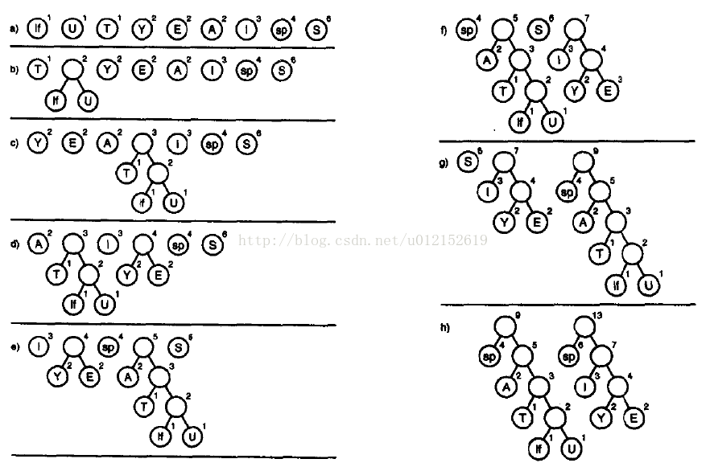

## 7.数据结构之霍夫曼树

计算机里每个字符在没有压缩的文本文件中都由一个字节（如ASCII码）或两个字节（如Unicode码）表示。这些方案中，每个字符需要相同的位数

在英文中，字母E的使用频率最高，而字母Z的使用频率最低，但是，无论使用频率高低，我们一律使用相同位数的编码来存储，是不是有些浪费空间呢？试想，如果我们对使用频率高的字母用较少的位数来存储，而对使用频率低的字母用较多的位数来存储，会大大提升存储效率

霍夫曼编码就是根据以上的设想来处理数据压缩的

霍夫曼树是最优二叉树。树的带权路径长度规定为所有叶子结点的带权路径长度之和，带权路径长度最短的树，即为最优二叉树。在最优二叉树中，权值较大的结点离根较近。

首先就需要构建一个霍夫曼树，一般利用优先级队列来构建霍夫曼树

例如消息：SUSIE SAYS IT IS EASY

统计所有符号出现的频率：

|字符|频次|
|---|---|
|换行符|1次|
|T|1次|
|U|1次|
|A|2次|
|E|2次|
|Y|2次|
|I|3次|
|空格|4次|
|S|6次|

我们先来分析一下构建霍夫曼树的过程，下图中，if代表换行符，sp代表空格

**节点封装类**
    
    public class Node {
    
        private String key;           //树节点存储的关键字，如果是非叶子节点为空
        private int frequency;        //关键字词频
        private Node left;            //左子节点
        private Node right;           //右子节点
        private Node next;            //优先级队列中指向下一个节点的引用
    
        public Node(int fre, String str) {  //构造方法1
            frequency = fre;
            key = str;
        }
    
        public Node(int fre) {  //构造方法2
            frequency = fre;
        }
    
        public String getKey() {
            return key;
        }
    
        public void setKey(String key) {
            this.key = key;
        }
    
        public Node getLeft() {
            return left;
        }
    
        public void setLeft(Node left) {
            this.left = left;
        }
    
        public Node getRight() {
            return right;
        }
    
        public void setRight(Node right) {
            this.right = right;
        }
    
        public Node getNext() {
            return next;
        }
    
        public void setNext(Node next) {
            this.next = next;
        }
    
        public int getFrequency() {
            return frequency;
        }
    
        public void setFrequency(int frequency) {
            this.frequency = frequency;
        }
    
        @Override
        public String toString() {
            return "Node{" + "key='" + key + '\'' + ", frequency=" + frequency + '}';
        }
    
    }
    
**用于辅助创建霍夫曼树的优先级队列**

    public class PriorityQueue {
    
        private Node first;
        private int length;
    
        public PriorityQueue() {
            length = 0;
            first = null;
        }
    
        //插入节点
        public void insert(Node node) {
            if (first == null) {  //队列为空
                first = node;
            } else {
                Node cur = first;
                Node previous = null;
                while (cur.getFrequency() < node.getFrequency()) {  //定位要插入位置的前一个节点和后一个节点
                    previous = cur;
                    if (cur.getNext() == null) {  //已到达队尾
                        cur = null;
                        break;
                    } else {
                        cur = cur.getNext();
                    }
    
                }
                if (previous == null) {  //要插入第一个节点之前
                    node.setNext(first);
                    first = node;
                } else if (cur == null) {  //要插入最后一个节点之后
                    previous.setNext(node);
                } else {  //插入到两个节点之间
                    previous.setNext(node);
                    node.setNext(cur);
                }
            }
            length++;
        }
    
        //删除队头元素
        public Node delete() {
            Node temp = first;
            first = first.getNext();
            length--;
            return temp;
        }
    
        //获取队列长度
        public int getLength() {
            return length;
        }
    
        //按顺序打印队列
        public void display() {
            Node cur = first;
            System.out.print("优先级队列：\t");
            while (cur != null) {
                System.out.print(cur.getKey() + ":" + cur.getFrequency() + "\t");
                cur = cur.getNext();
            }
            System.out.println();
        }
    
        //构造霍夫曼树
        public HuffmanTree buildHuffmanTree() {
            while (length > 1) {
                Node hLeft = delete();  //取出队列的第一个节点作为新节点的左子节点
                Node hRight = delete(); //取出队列的第二个节点作为新节点的右子节点
                //新节点的权值等于左右子节点的权值之和
                Node hRoot = new Node(hLeft.getFrequency() + hRight.getFrequency());
                hRoot.setLeft(hLeft);
                hRoot.setRight(hRight);
                insert(hRoot);
            }
            //最后队列中只剩一个节点，即为霍夫曼树的根节点
            return new HuffmanTree(first);
        }
    
    }
    
**霍夫曼树类**

    public class HuffmanTree {
    
        private Node root;
        private Map<String, String> codeSet = new HashMap();  //该霍夫曼树对应的字符编码集
    
        public HuffmanTree(Node root) {
            this.root = root;
            buildCodeSet(root, "");  //初始化编码集
        }
    
        //生成编码集的私有方法，运用了迭代的思想
        //参数currentNode表示当前节点，参数currentCode代表当前节点对应的代码
        private void buildCodeSet(Node currentNode, String currentCode) {
            if (currentNode.getKey() != null) {
                //霍夫曼树中，如果当前节点包含关键字，则该节点肯定是叶子节点，将该关键字和代码放入代码集
                codeSet.put(currentNode.getKey(), currentCode);
            } else {//如果不是叶子节点，必定同时包含左右子节点，这种节点没有对应关键字
                //转向左子节点需要将当前代码追加0
                buildCodeSet(currentNode.getLeft(), currentCode + "0");
                //转向右子节点需要将当前代码追加1
                buildCodeSet(currentNode.getRight(), currentCode + "1");
            }
        }
    
        //获取编码集
        public Map<String, String> getCodeSet() {
            return codeSet;
        }
    
    }
    
**测试类**

    public class TestTree {
    
        public static void main(String[] args) throws Exception {
            PriorityQueue queue = new PriorityQueue();
            // SUSIE SAYS IT IS EASY
            // if代表换行符，sp代表空格
            Node n9 = new Node(5, "S");
            Node n1 = new Node(1, "if");
            Node n2 = new Node(1, "U");
            Node n3 = new Node(1, "T");
            Node n4 = new Node(2, "Y");
            Node n5 = new Node(2, "E");
            Node n6 = new Node(2, "A");
            Node n7 = new Node(3, "I");
            Node n8 = new Node(4, "sp");
            queue.insert(n3);
            queue.insert(n2);
            queue.insert(n1);
            queue.insert(n6);
            queue.insert(n5);
            queue.insert(n4);
            queue.insert(n7);
            queue.insert(n8);
            queue.insert(n9);
            queue.display();
    
            HuffmanTree tree = queue.buildHuffmanTree();
            Map<String, String> map = tree.getCodeSet();
            Iterator<Map.Entry<String, String>> it = map.entrySet().iterator();
            System.out.println("霍夫曼编码结果：");
            while (it.hasNext()) {
                Map.Entry<String, String> entry = it.next();
                System.out.println(entry.getKey() + "——>" + entry.getValue());
            }
        }
    
    }

**霍夫曼编码器**

    public class HuffmanEncoder {
    
        private PriorityQueue queue;       //辅助建立霍夫曼树的优先级队列
        private HuffmanTree tree;         //霍夫曼树
        private String[] message;            //以数组的形式存储消息文本
        private Map<String, Integer> keyMap;                            //存储字符以及词频的对应关系
        private Map<String, String> codeSet;                     //存储字符以及代码的对应关系
    
        public HuffmanEncoder() {
            queue = new PriorityQueue();
            keyMap = new HashMap<>();
        }
    
        //获取指定字符串的霍夫曼编码
        public String encode(String msg) {
            resolveMassage(msg);
            buildCodeSet();
            String code = "";
            for (int i = 0; i < message.length; i++) {//将消息文本的逐个字符翻译成霍夫曼编码
                code = code + codeSet.get(message[i]);
            }
            return code;
        }
    
        //将一段字符串消息解析成单个字符与该字符词频的对应关系，存入Map
        private void resolveMassage(String msg) {
    
            char[] chars = msg.toCharArray();  //将消息转换成字符数组
            message = new String[chars.length];
            for (int i = 0; i < chars.length; i++) {
                String key = "";
                key = chars[i] + "";  //将当前字符转换成字符串
    
                message[i] = key;
                if (keyMap.containsKey(key)) {//如果Map中已存在该字符，则词频加一
                    keyMap.put(key, keyMap.get(key) + 1);
                } else {//如果Map中没有该字符，加入Map
                    keyMap.put(key, 1);
                }
            }
        }
    
        //建立对应某段消息的代码集
        private void buildCodeSet() {
            Iterator<Map.Entry<String, Integer>> it = keyMap.entrySet().iterator();
            while (it.hasNext()) {
                Map.Entry<String, Integer> entry = it.next();
                //用该字符和该字符的词频为参数，建立一个新的节点，插入优先级队列
                queue.insert(new Node(entry.getValue(), entry.getKey()));
            }
            queue.display();
            tree = queue.buildHuffmanTree();  //利用优先级队列生成霍夫曼树
            codeSet = tree.getCodeSet();   //获取霍夫曼树对应的代码集
        }
    
        //打印该段消息的代码集
        public void printCodeSet() {
            Iterator<Map.Entry<String, String>> it = codeSet.entrySet().iterator();
            System.out.println("代码集：");
            while (it.hasNext()) {
                Map.Entry<String, String> entry = it.next();
                System.out.println(entry.getKey() + "——>" + entry.getValue());
            }
            System.out.println();
        }
    
        //获取该段消息的代码集
        public Map getCodeSet() {
            return codeSet;
        }
    
    }
    
**霍夫曼解码器**

    public class HuffmanDecoder {
    
        private Map<String, String> codeSet;  //代码段对应的代码集
    
        public HuffmanDecoder(Map<String, String> map) {
            codeSet = map;
        }
    
        //将代码段解析成消息文本
        public String decode(String code) {
            String message = "";
            String key = "";
            char[] chars = code.toCharArray();
            for (int i = 0; i < chars.length; i++) {
                key += chars[i];
                if (codeSet.containsValue(key)) {  //代码集中存在该段代码
                    Iterator<Map.Entry<String, String>> it = codeSet.entrySet().iterator();
                    while (it.hasNext()) {
                        Map.Entry<String, String> entry = it.next();
                        if (entry.getValue().equals(key)) {
                            message += entry.getKey();  //获取该段代码对应的键值，即消息字符
                        }
                    }
                    key = "";  //代码段变量置为0
                } else {
                    continue;  //该段代码不能解析为文本消息，继续循环
                }
            }
            return message;
        }
    
    }

**测试类**

    public class TestCoder {
    
        public static void main(String[] args) {
    
            String message = "chen long fei is hero !";
            HuffmanEncoder encoder = new HuffmanEncoder();
            String code = encoder.encode(message);
    
            encoder.printCodeSet();
            System.out.print("编码结果：");
            System.out.println(code.getBytes());
    
            HuffmanDecoder decoder = new HuffmanDecoder(encoder.getCodeSet());
            String message2 = decoder.decode(code);
            System.out.print("解码结果：");
            System.out.println(message2);
        }
    
    }
