# 8.3.数据结构之红黑树-删除操作

删除一个节点同样有可能改变树的平衡性，而且，删除所造成的不平衡性比插入所造成的平衡性的修正更加复杂。

化繁为简是算法分析中一个常用的方法。下面我们将欲删除节点分为三大类：欲删除节点为叶子节点、欲删除节点只有一个子节点和欲删除有两个子节点。

而欲删除节点有两种可能的颜色，也需要分别对待。

为简化讨论，我们以欲删除节点在左侧的情况为例进行修正，如果欲删除节点在右侧，进行镜像地修正操作即可。

## 8.3.1 欲删除节点是叶子节点

### 8.3.1.1 欲删除节点为红色，父节点必为黑色，必无兄弟节点。

只有下图所示两种情况，带黄色边框的为欲删除的节点：

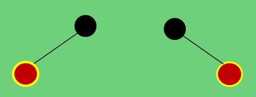

将该节点直接删除即可，所在子树的黑色高度不变，不会影响红黑树的性质。

### 8.3.1.2 欲删除节点为黑色，父节点可红可黑，必存在兄弟节点。

为什么说黑色节点必存在兄弟节点呢？如果一个黑色节点不存在兄弟节点，无论父节点是红是黑，则从该节点到父节点会比空子节点到父节点少一个黑色高度，所以这种情况是不存在的。

下面就可能存在的情况逐个分析：

#### 8.3.1.2.1 父节点是红色，则兄弟节点必为黑色

 与兄弟节点是否有左子节点相关，分为两种情况。      

（1）如果兄弟节点没有左子节点，修正策略如下：

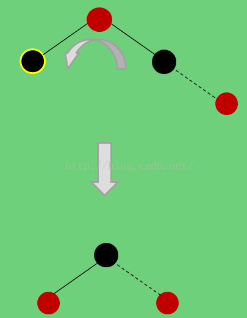

上图中，虚线代表其连接的子节点可在可不在，对修正过程无影响。

（2） 如果兄弟节点有左子节点，修正策略如下：

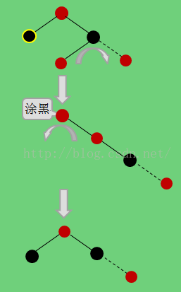

#### 8.3.1.2.2 父节点是黑色，则兄弟节点可红可黑

##### 8.3.1.2.2.1 兄弟节点为红色，则它必存在两个黑色子节点。

与左侄节点是否有子节点相关，分为三种情况。

（1）如果左侄节点有右子节点，修正策略如下：

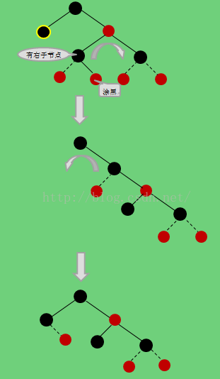

（2）如果左侄节点没有右子节点，只有左子节点，修正策略如下：

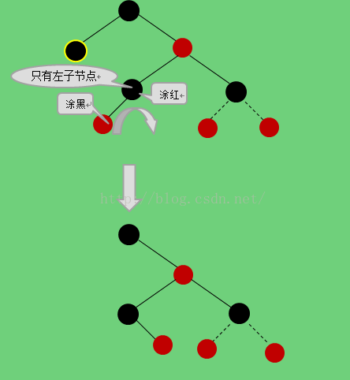

这时，左侄节点就有了右子节点，再进行与上一种情况一样的修正。

（3）如果左侄节点为叶子节点，修正策略如下：

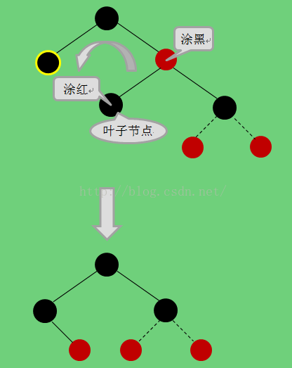

##### 8.3.1.2.2.2 兄弟节点为黑色

与兄弟节点是否有子节点相关，分为三种情况。

（1）如果兄弟节点有右子节点，修正策略如下：

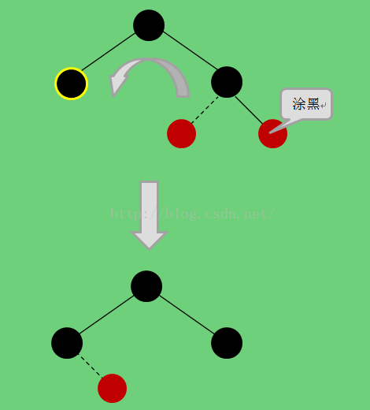

（2）如果兄弟节点无右子节点，只有左子节点，修正策略如下：

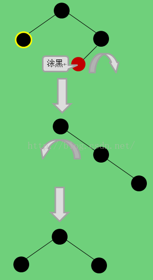

（3）如果兄弟节点既无左子节点，也无右子节点，如下图所示：

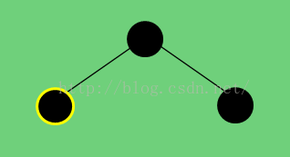

此时，依靠该子树的自身是无法解决的，因为该子树的黑色高度为2，如果将带黄色边框的节点删除，无论如何变换颜色、旋转都无法使该子树恢复黑色高度。

有两种解决思路：

（1）借助欲删除节点的祖父节点及祖父节点的子树来修正，只要祖父节点与祖父节点的另一颗子树中含有红色节点，就能通过颜色变化和旋转来使。但是，如果祖父节点与祖父节点的另一颗子树中的节点全为黑色：

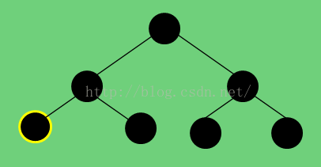

这时，依靠该子树本身也是无法解决的，还需要借助更上层的节点。层层传递，直到根节点。如果到根节点还是不能解决，就需要采用另一种思路

（2）降低黑色高度。

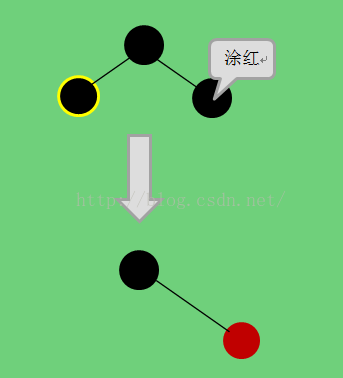

但就这颗子树来说，确实是符合红黑规则的，但是，子树的黑色高度降低，会影响到整棵红黑树的黑色高度。

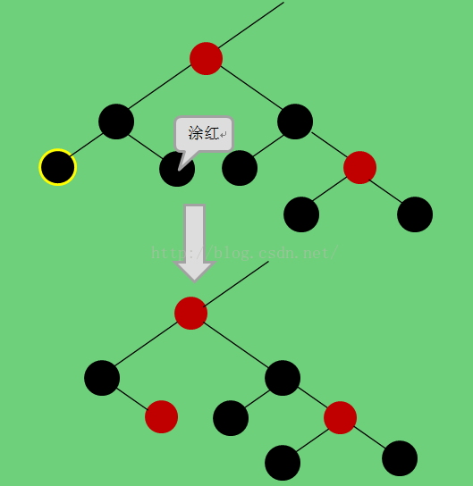

可以看到，变换之后，左子树的黑色高度为1，而右子树的黑色高度是2，违背了红黑规则。这时候就需要同时降低右子树的黑色高度，并层层向上传递，直到根节点，最终使整棵树的黑色高度降低。

但是，有的右子树是无法降低黑色高度的，比如：

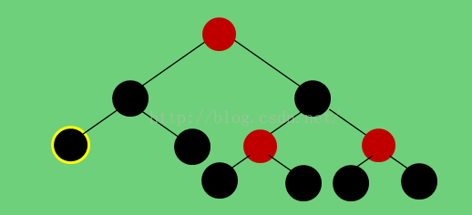

上图中的右子树就无法降低黑色高度，但是这种情况下，右子树必存在红色节点，可以通过第一种思路解决。

总之，结合两种思路，总是是可以解决“黑三角”这种顽固问题的。

## 8.3.2 欲删除节点只有一个子节点，该节点必为黑色，子节点必为红色

红色节点要么没有子节点，要么有两个黑色节点，所以该节点不可能为红色。

如果该节点只有一个黑色节点，则黑色的子节点到该节点的黑色高度与空子节点到该点的黑色高度不一致，所以子节点只能为红色。

综上，只有下图所示的两种情况会出现。

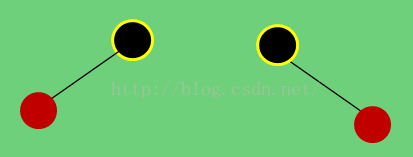

只需要将红色子节点涂黑，上移到被删除的节点位置即可。

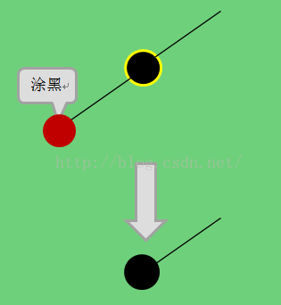

## 8.3.3 欲删除节点既有左子节点，又有右子节点。

红黑树也属于二叉搜索树，所以要先找到欲删除节点的后继节点。后继节点的寻找过程如下：从该点的右子节点开始，如果有左子节点则跳到左子节点，层层向下，直到某个子节点没有左子节点为止。实际上就是找到比欲删除节点的关键字值大的集合中的最小值。这部分内容在二叉搜索树中已经介绍过，不再赘述。

第一步，我们要将欲删除节点与后继节点中的数据对换，如此一来，节点的删除操作就转移到了后继节点上来了。

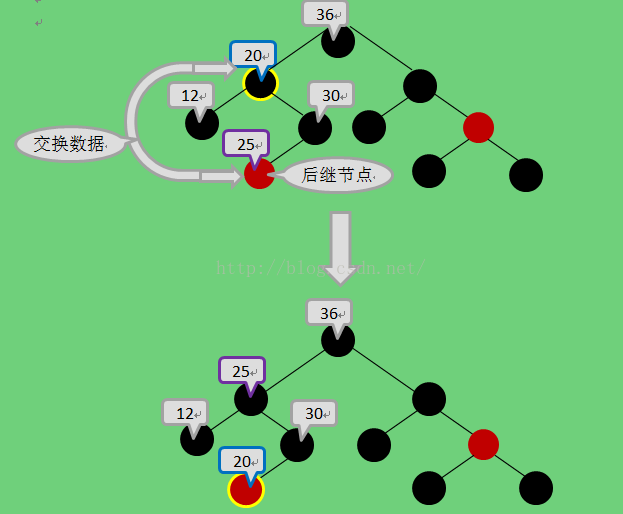

上图中，经过数据交换之后，没有改变任何节点的颜色，现在要删除的是带黄色边框的红色节点。前面已经论证，后继节点肯定是一个没有左子节点的节点，即是一个叶子节点或者只有一个右子节点的节点，而这两种情况的删除我们在之前已经分析过并给出了解决方法。

至此，红黑树所有可能出现的删除情况都已经讨论完毕。