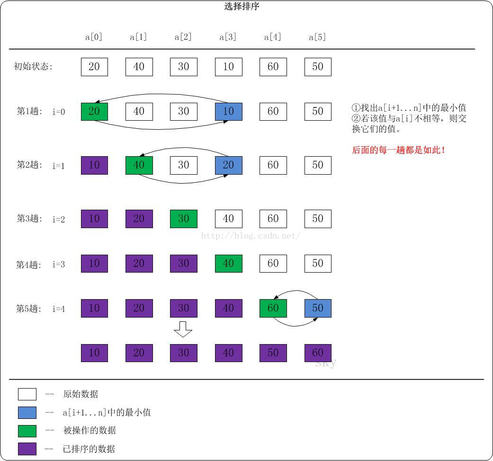

# 9.1.排序算法-选择排序

## 基本思想

冒泡排序中有一个缺点，比如，我们比较第一个数a1与第二个数a2的时候，只要a1比a2大就会交换位置，但是我们并不能确定a2是最小的元素，假如后面还有比它更小的，该元素还会与a2再次进行交换，而且这种交换有可能发生多次才能确定a2的最终位置。

选择排序可以避免这种耗费时间的交换操作，从第一个元素开始，扫描整个待排数组，找到最小的元素放之后再与第一个元素交换位置，然后再从第二个元素开始，继续寻找最小的元素与第二个元素交换位置，依次类推。



```
protected void sort() {
    for (int j = 0; j < sort.length - 1; j++) {
        int min = sort[j];
        int pos = 0;
        for (int i = j + 1; i < sort.length; i++) {
            if (min > sort[i]) {
                min = sort[i];
                pos = i;
            }
        }
        if (pos != 0) {
            sort[pos] = sort[j];
            sort[j] = min;
        }
    }
}
```

## 算法分析

选择排序与冒泡排序一样，需要进行N*(N-1)/2次比较，但是只需要N次交换，当N很大时，交换次数的时间影响力更大，所以选择排序的时间复杂度为O(N2)。

虽然选择排序与冒泡排序在时间复杂度属于同一量级，但是毫无疑问选择排序的效率更高，因为它的交换操作次数更少，而且在交换操作比比较操作的时间级大得多时，选择排序的速度是相当快的。

## 选择排序的改进

传统的选择排序每次只确定最小值，根据改进冒泡算法的经验，我们可以对排序算法进行如下改进：每趟排序确定两个最值——最大值与最小值，这样就可以将排序趟数缩减一半。

```
protected void sort() {
    for (int j = 0; j < sort.length / 2; j++) {
        int min = sort[j];
        int max = sort[sort.length - j - 1];
        int minPos = 0;
        int maxPos = 0;
        if (min > max) {
            sort[j] = max;
            max = sort[sort.length - j - 1] = min;
            min = sort[j];
        }
        for (int i = j + 1; i < sort.length - j - 1; i++) {
            if (min > sort[i]) {
                min = sort[i];
                minPos = i;
            }
            if (max < sort[i]) {
                max = sort[i];
                maxPos = i;
            }
        }
        if (minPos != 0) {
            sort[minPos] = sort[j];
            sort[j] = min;
        }
        if (maxPos != 0) {
            sort[maxPos] = sort[sort.length - j - 1];
            sort[sort.length - j - 1] = max;
        }
    }
}
```