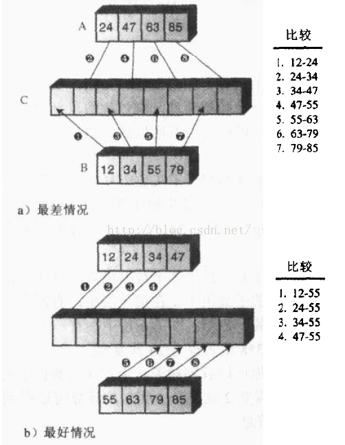

# 9.4.排序算法-归并排序

## 基本思想

分析归并排序之前，我们先来了解一下分治算法。

分治算法的基本思想是将一个规模为N的问题分解为K个规模较小的子问题，这些子问题相互独立且与原问题性质相同。求出子问题的解，就可得到原问题的解。

分治算法的一般步骤：

（1）分解，将要解决的问题划分成若干规模较小的同类问题；

（2）求解，当子问题划分得足够小时，用较简单的方法解决；

（3）合并，按原问题的要求，将子问题的解逐层合并构成原问题的解。

归并排序是分治算法的典型应用。

归并排序先将一个无序的N长数组切成N个有序子序列（只有一个数据的序列认为是有序序列），然后两两合并，再将合并后的N/2（或者N/2 + 1）个子序列继续进行两两合并，以此类推得到一个完整的有序数组。过程如下图所示：


## java实现

归并排序的核心思想是将两个有序的数组归并到另一个数组中，所以需要开辟额外的空间。

第一步要理清归并的思路。假设现在有两个有序数组A和B，要将两者有序地归并到数组C中。我们用一个实例来推演：


上图中，A数组中有四个元素，B数组中有六个元素，首先比较A、B中的第一个元素，将较小的那个放到C数组的第一位，因为该元素就是A、B所有元素中最小的。上例中，7小于23，所以将7放到了C中。

然后，用23与B中的其他元素比较，如果小于23，继续按顺序放到C中；如果大于23，则将23放入C中。

23放入C中之后，用23之后的47作为基准元素，与B中的其他元素继续比较，重复上面的步骤。

如果有一个数组的元素已经全部复制到C中了，那么将另一个数组中的剩余元素依次插入C中即可。至此结束。

按照上面的思路，用java实现：

```
protected void sort() {
    int[] workSpace = new int[sort.length]; //用于辅助排序的数组
    recursiveMergeSort(workSpace, 0, workSpace.length - 1);
}

/**
 * 递归的归并排序
 * @param workSpace  辅助排序的数组
 * @param lowerBound 欲归并数组段的最小下标
 * @param upperBound 欲归并数组段的最大下标
 */
private void recursiveMergeSort(int[] workSpace, int lowerBound, int upperBound) {
    if (lowerBound == upperBound) {  //该段只有一个元素，不用排序
        return;
    } else {
        int mid = (lowerBound + upperBound) / 2;
        recursiveMergeSort(workSpace, lowerBound, mid);    //对低位段归并排序
        recursiveMergeSort(workSpace, mid + 1, upperBound);  //对高位段归并排序
        merge(workSpace, lowerBound, mid, upperBound);
    }
}

/**
 * 对数组array中的两段进行合并，lowerBound~mid为低位段，mid+1~upperBound为高位段
 * @param workSpace  辅助归并的数组，容纳归并后的元素
 * @param lowerBound 合并段的起始下标
 * @param mid        合并段的中点下标
 * @param upperBound 合并段的结束下标
 */
private void merge(int[] workSpace, int lowerBound, int mid, int upperBound) {

    int lowBegin = lowerBound;  //低位段的起始下标
    int lowEnd = mid;           //低位段的结束下标
    int highBegin = mid + 1;  //高位段的起始下标
    int highEnd = upperBound;  //高位段的结束下标
    int j = 0; //workSpace的下标指针
    int n = upperBound - lowerBound + 1;  //归并的元素总数

    while (lowBegin <= lowEnd && highBegin <= highEnd) {
        if (sort[lowBegin] < sort[highBegin]) {//将两者较小的那个放到workSpace中
            workSpace[j++] = sort[lowBegin++];
        } else {
            workSpace[j++] = sort[highBegin++];
        }
    }

    while (lowBegin <= lowEnd) {
        workSpace[j++] = sort[lowBegin++];
    }

    while (highBegin <= highEnd) {
        workSpace[j++] = sort[highBegin++];
    }

    for (j = 0; j < n; j++) {  //将归并好的元素复制到array中
        sort[lowerBound++] = workSpace[j];
    }

}
```

归并的顺序是这样的：先将初始数组分为两部分，先归并低位段，再归并高位段。对低位段与高位段继续分解，低位段分解为更细分的一对低位段与高位段，高位段同样分解为更细分的一对低位段与高位段，依次类推。

## 算法分析

先来分析一下复制的次数。

如果待排数组有8个元素，归并排序需要分3层，第一层有四个包含两个数据项的自数组，第二层包含两个包含四个数据项的子数组，第三层包含一个8个数据项的子数组。合并子数组的时候，每一层的所有元素都要经历一次复制（从原数组复制到workSpace数组），复制总次数为3*8=24次，即层数乘以元素总数。

设元素总数为N，则层数为log2N，复制总次数为N*log2N。

其实，除了从原数组复制到workSpace数组，还需要从workSpace数组复制到原数组，所以，最终的复制复制次数为2*N*log2N。

在大O表示法中，常数可以忽略，所以归并排序的时间复杂度为O(N* log2N)。

一般来讲，复制操作的时间消耗要远大于比较操作的时间消耗，时间复杂度是由复制次数主导的。

下面我们再来分析一下比较次数。

在归并排序中，比较次数总是比复制次数少一些。现在给定两个各有四个元素的子数组，首先来看一下最坏情况和最好情况下的比较次数为多少。



第一种情况，数据项大小交错，所以必须进行7次比较，第二种情况中，一个数组比另一个数组中的所有元素都要小，因此只需要4次比较。

当归并两个子数组时，如果元素总数为N，则最好情况下的比较次数为N/2，最坏情况下的比较次数为N-1。

假设待排数组的元素总数为N，则第一层需要N/2次归并，每次归并的元素总数为2；则第一层需要N/4次归并，每次归并的元素总数为4；则第一层需要N/8次归并，每次归并的元素总数为8……最后一次归并次数为1，归并的元素总数为N。总层数为log2N。

最好情况下的比较总数为：

N/2*(2/2)+ N/4*(4/2)+N/8*(8/2)+...+1*(N/2) = (N/2)*log2N

最好情况下的比较总数为：

N/2*(2-1)+ N/4*(4-1)+N/8*(8-1)+...+1*(N-1) =

(N-N/2)+ (N-N/4)+(N-N/8)+...+(N-1)=

N*log2N-(1+N/2+N/4+..)< N*log2N

可见，比较次数介于(N/2)*log2N与N*log2N之间。如果用大O表示法，时间复杂度也为O(N* log2N)。