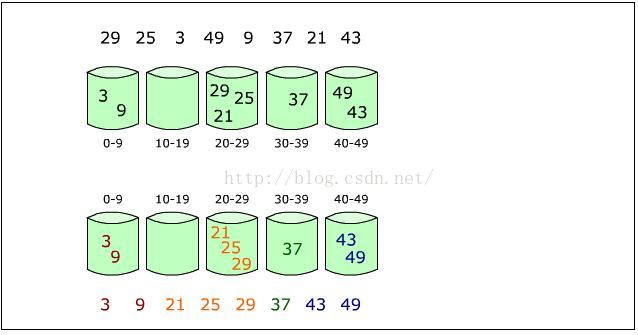
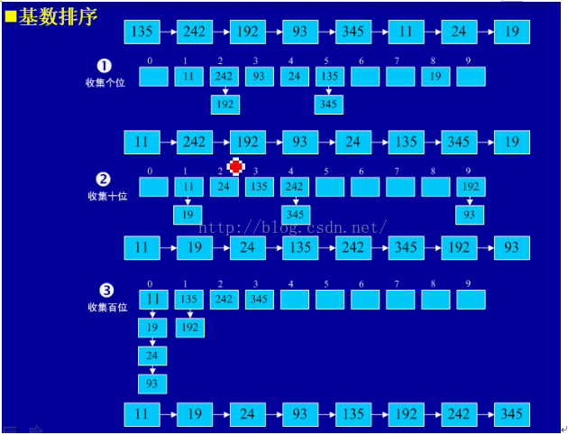

# 9.8.排序算法-基数排序

## 基本思想

基数排序(Radix Sort)是在桶排序的基础上发展而来的，两种排序都是分配排序的高级实现。分配排序(Distributive Sort)的基本思想：排序过程无须比较关键字，而是通过“分配”和“收集”过程来实现排序。它们的时间复杂度可达到线性阶：O(n)。

先来看一下桶排序(Radix Sort)。



桶排序也称为箱排序(Bin Sort)，其基本思想是：设置若干个桶，依次扫描待排序的记录R[0]，R[1]，…，R[n-1]，把关键字在某个范围内的记录全都装入到第k个桶里(分配)，然后按序号依次将各非空的桶首尾连接起来(收集)。

例如，要将一副混洗的52张扑克牌按点数A<2<…<J<Q<K排序，需设置13个“桶”，排序时依次将每张牌按点数放入相应的桶里，然后依次将这些桶首尾相接，就得到了按点数递增序排列的一副牌。

桶排序中，桶的个数取决于关键字的取值范围。因此桶排序要求关键字的类型是有限类型，否则可能要无限个桶。

一般情况下每个桶中存放多少个关键字相同的记录是无法预料的，故桶的类型应设计成链表为宜。

为保证排序是稳定的，分配过程中装箱及收集过程中的连接必须按先进先出原则进行。

对于桶排序来说，分配过程的时间是O(n)；收集过程的时间为O(m)（采用链表来存储输入的待排序记录）或O(m+n)。因此，桶排序的时间为O(m+n)。若桶个数m的数量级为O(n)，则桶排序的时间是线性的，即O(n)。

前面说的几大排序算法 ，大部分时间复杂度都是O(n2)，也有部分排序算法时间复杂度是O(nlogn)。而桶式排序却能实现O(n)的时间复杂度。但桶排序的缺点是：首先是空间复杂度比较高，需要的额外开销大。排序有两个数组的空间开销，一个存放待排序数组，一个就是所谓的桶，比如待排序值是从0到m-1，那就需要m个桶，这个桶数组就要至少m个空间。其次待排序的元素都要在一定的范围内等等。

基数排序是对桶排序的一种改进，这种改进是让“桶排序”适合于更大的元素值集合的情况，而不是提高性能。

我们还是用扑克牌的例子来说明。一张牌有两个关键字组成：花色(桃<心<梅<方)+面值(A<2<3<4<...<K)。假如一张牌的大小首先被花色决定，同花色的牌有数字决定的话。我们就有两种算法来解决这个问题。

即两张牌，若花色不同，不论面值怎样，花色低的那张牌小于花色高的，只有在同花色情况下，大小关系才由面值的大小确定。这就是多关键码排序。

为得到排序结果，我们讨论两种排序方法。

方法1：先对花色排序，将其分为4个组，即梅花组、方块组、红心组、黑心组。再对每个组分别按面值进行排序，最后，将4 个组连接起来即可。

方法2：先按13 个面值给出13 个编号组(2 号，3 号，...，A 号)，将牌按面值依次放入对应的编号组，分成13 堆。再按花色给出4 个编号组(梅花、方块、红心、黑心)，将2号组中牌取出分别放入对应花色组，再将3 号组中牌取出分别放入对应花色组，……，这样，4 个花色组中均按面值有序，然后，将4 个花色组依次连接起来即可。

多关键码排序按照从最主位关键码到最次位关键码或从最次位到最主位关键码的顺序逐次排序，分两种方法：

最高位优先(Most Significant Digit first)法，简称MSD 法：

1）先按k1排序分组，将序列分成若干子序列，同一组序列的记录中，关键码k1 相等。

2）再对各组按k2排序分成子组，之后，对后面的关键码继续这样的排序分组，直到按最次位关键码kd 对各子组排序后。

3）再将各组连接起来，便得到一个有序序列。扑克牌按花色、面值排序中介绍的方法一即是MSD 法。

最低位优先(Least Significant Digit first)法，简称LSD 法：

1) 先从kd开始排序，再对kd-1进行排序，依次重复，直到按k1排序分组分成最小的子序列后。

2) 最后将各个子序列连接起来，便可得到一个有序的序列，扑克牌按花色、面值排序中介绍的方法二即是LSD 法。

对数字型或字符型的单关键字，可以看作由多个数位或多个字符构成的多关键字，此时可以采"分配-收集”的方法进行排序，这一过程称作基数排序法，其中每个数字或字符可能的取值个数称为基数。比如，扑克牌的花色基数为4，面值基数为13。在整理扑克牌时，既可以先按花色整理，也可以先按面值整理。按花色整理时，先按红、黑、方、花的顺序分成4摞（分配），再按此顺序再叠放在一起（收集），然后按面值的顺序分成13摞（分配），再按此顺序叠放在一起（收集），如此进行二次分配和收集即可将扑克牌排列有序。

在“分配-收集”的过程中，需要保证排序的稳定性。

基数排序的思想就是将待排数据中的每组关键字依次进行桶分配。比如下面的待排序列：                

135、242、192、93、345、11、24、19

我们将每个数值的个位，十位，百位分成三个关键字，例如：

135 -> k1(个位)=5  ，k2(十位)=3 ，k3(百位)=1。



然后从最低位个位开始(从最次关键字开始)，对所有数据的k1关键字进行桶分配(因为，每个数字都是 0-9的，因此桶大小为10)，再依次输出桶中的数据得到下面的序列。

(11)、(242、192)、(93)、(24)、(135、345)、(19)（从最次关键字开始排序，忽略百位与十位，按照个位上的数字分配）

再对上面的序列接着进行针对k2的桶分配，输出序列为：

(11、19)、(24)、(135)、(242、345)、(192、93)（参考最次关键字来排序第二次关键字，忽略百位与个位，按照十位上的数字分配）

最后针对k3的桶分配，输出序列为：

(011、019、024、093)、(135、192)、(242)、(345)（参考第二次关键字来排序最高关键字，忽略十位与个位，按照百位上的数字分配）

排序完毕。

## java实现

```
protected void sort() {
    int max = sort[0];
    for (int i = 0; i < sort.length; i++) {  //找到数组中的最大值
        if (sort[i] > max) {
            max = sort[i];
        }
    }
    int keysNum = 0;  //关键字的个数，我们使用个位、十位、百位...当做关键字，所以关键字的个数就是最大值的位数
    while (max > 0) {
        max /= 10;
        keysNum++;
    }
    List<ArrayList<Integer>> buckets = new ArrayList<ArrayList<Integer>>();
    for (int i = 0; i < 10; i++) {  //每位可能的数字为0~9，所以设置10个桶
        buckets.add(new ArrayList<Integer>());  //桶由ArrayList<Integer>构成
    }
    for (int i = 0; i < keysNum; i++) {  //由最次关键字开始，依次按照关键字进行分配
        for (int j = 0; j < sort.length; j++) {  //扫描所有数组元素，将元素分配到对应的桶中
            //取出该元素对应第i+1位上的数字，比如258，现在要取出十位上的数字，258%100=58,58/10=5
            int key = sort[j] % (int)Math.pow(10, i + 1) / (int)Math.pow(10, i);
            buckets.get(key).add(sort[j]);  //将该元素放入关键字为key的桶中
        }
        //分配完之后，将桶中的元素依次复制回数组
        int counter = 0;  //元素计数器
        for (int j = 0; j < 10; j++) {
            ArrayList<Integer> bucket = buckets.get(j);  //关键字为j的桶
            while (bucket.size() > 0) {
                sort[counter++] = bucket.remove(0);  //将桶中的第一个元素复制到数组，并移除
            }
        }
    }
}
```

## 算法分析

初看起来，基数排序的执行效率似乎好的让人无法相信，所有要做的只是把原始数据项从数组复制到链表，然后再复制回去。如果有10个数据项，则有20次复制，对每一位重复一次这个过程。假设对5位的数字排序，就需要20*5=100次复制。如果有100个数据项，那么就有200*5=1000次复制。复制的次数与数据项的个数成正比，即O(n)。这是我们看到的效率最高的排序算法。

不幸的是，数据项越多，就需要更长的关键字，如果数据项增加10倍，那么关键字必须增加一位（多一轮排序）。复制的次数和数据项的个数与关键字长度成正比，可以认为关键字长度是N的对数。因此在大多数情况下，基数排序的执行效率倒退为O(N*logN)，和快速排序差不多。