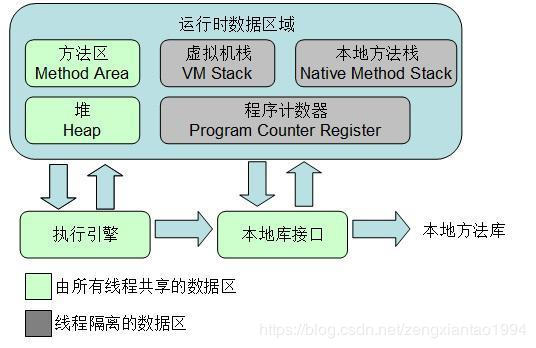
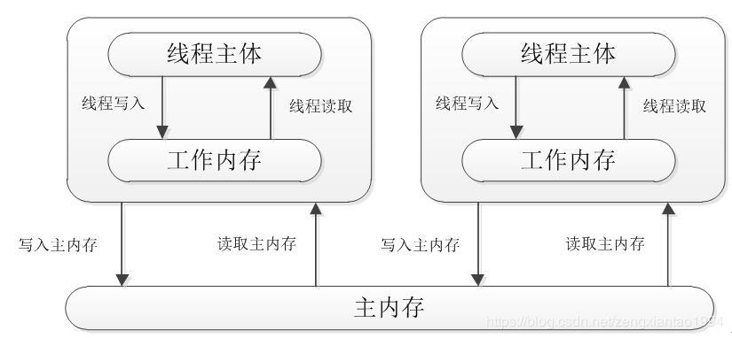

# JVM内存模型、Java内存模型

## JVM内存模型

JVM内存主要分为：程序计数器，Java虚拟机栈，本地方法栈，Java堆，方法区。
* 1、程序计数器： 为了线程切换能恢复到正确的执行位置，每条线程都需要一个独立的程序计数器，各条线程之间计数器互不影响，独立存储，我们称这类内存区域为“线程私有”的内存。计数器记录的是正在执行的虚拟机字节码指令的地址。
* 2、Java虚拟机栈： 每个方法在执行的同时都会创建一个栈帧，用于存储局部变量表、操作数栈、动态链接（例如多态就要动态链接以确定引用的状态）、方法出口等信息。局部变量表存放了编译期可知的各种基本数据类型（boolean、byte、char、short、int、float、long、double）、对象引用（reference 类型，它不等同于对象本身，可能是一个指向对象起始地址的引用指针，也可能是指向一个代表对象的句柄或其他与此对象相关的位置）和 returnAddress 类型（指向了一条字节码指令的地址）。
其中 64 位长度的 long 和 double 类型的数据会占用 2 个局部变量空间（Slot），其余的数据类型只占用 1 个。局部变量表所需的内存空间在编译期间完成分配，当进入一个方法时，这个方法需要在帧中分配多大的局部变量空间是完全确定的，在方法运行期间不会改变局部变量表的大小。
* 3、本地方法栈： Java 虚拟机栈为虚拟机执行 Java 方法（也就是字节码）服务，而本地方法栈则为虚拟机使用到的 Native 方法服务。
* 4、Java 堆： Java 堆是被所有线程共享的一块内存区域，在虚拟机启动时创建。此内存区域的唯一目的就是存放对象实例，几乎所有的对象实例都在这里分配内存。Java堆是垃圾收集器管理的主要区域，因此很多时候也被称做“GC 堆”。
* 5、方法区： 方法区（Method Area）与 Java 堆一样，是各个线程共享的内存区域，它用于存储已被虚拟机加载的类信息、常量（final ）、静态变量（static）、即时编译器编译后的代码等数据。
一个类中主要有：常量、成员变量、静态变量、局部变量。其中常量与静态变量位于方法区，成员变量位于 Java 堆，局部变量位于 Java 虚拟机栈。
* 运行时常量池： 是方法区的一部分。Class 文件中除了有类的版本、字段、方法、接口等描述信息外，还有一项信息是常量池（Constant Pool Table），用于存放编译期生成的各种字面量和符号引用，这部分内容将在类加载后进入方法区的运行时常量池中存放。

## Java内存模型

每个线程都有一个工作内存，线程只可以修改自己工作内存中的数据，然后再同步回主内存，主内存由多个线程共享。

Java Memory Model (JAVA 内存模型，JMM）描述线程之间如何通过内存(memory)来进行交互。具体说来，JVM中存在一个主存区（Main Memory或Java Heap Memory），对于所有线程进行共享，而每个线程又有自己的工作内存（Working Memory，实际上是一个虚拟的概念），工作内存中保存的是主存中某些变量的拷贝，线程对所有变量的操作并非发生在主存区，而是发生在工作内存中，而线程之间是不能直接相互访问的，变量在程序中的传递，是依赖主存来完成的。具体的如下图所示：

JMM描述了Java程序中各种变量（线程共享变量）的访问规则，以及在JVM中将变量存储到内存中读取出变量这样的底层细节。
所有的变量都存储在主内存中，每个线程都有自己独立的工作内存，里面保存该线程使用到的变量的副本（主内存中变量的一份拷贝）。

JMM的两条规定
* 1、线程对共享变量的所有操作都必须在自己的工作内存中进行，不能直接从主内存中读写；
* 2、不同的线程之间无法直接访问其他线程工作内存中的变量，线程变量值的传递需要通过主内存来完成。