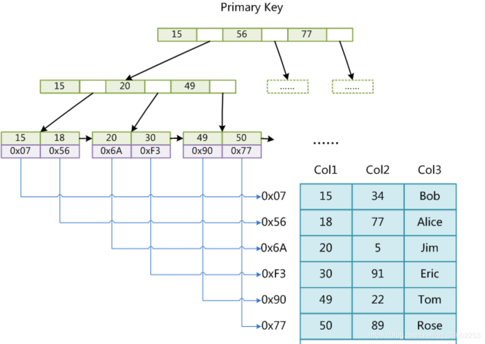
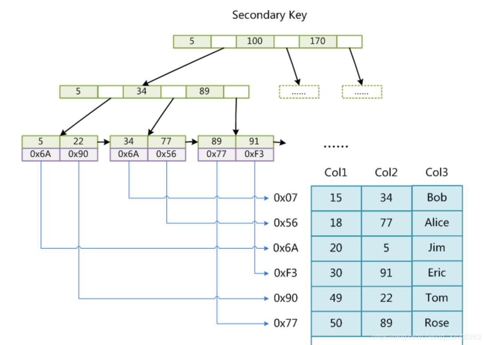
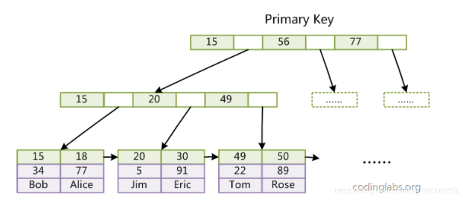
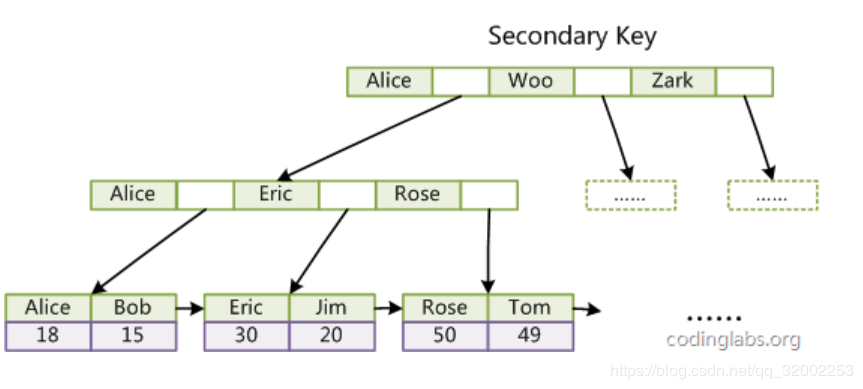
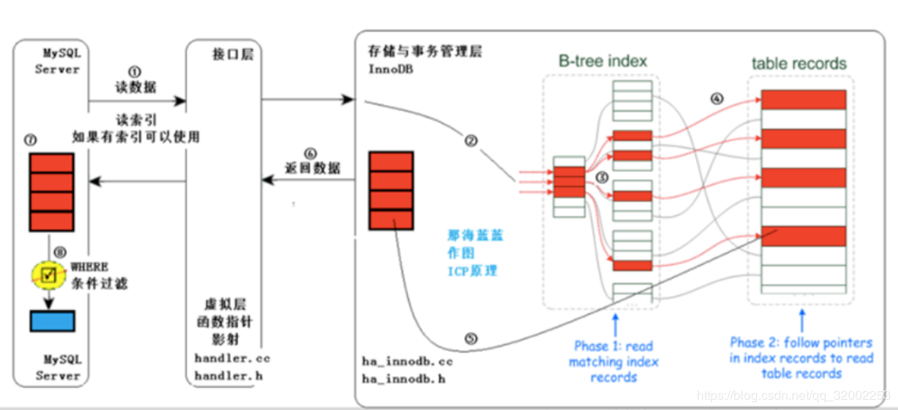

# MySQL底层原理综述

## 概念

### 数据库事务

简单的说事务就是一组原子性的SQL语句。可以将这组语句理解成一个工作单元，要么全部执行要么都不执行。默认MySQL中自动提交时开启的（start transaction）事务的ACID特性如下：

* 原子性：事务中的所有操作要么全部提交成功，要么全部失败回滚。场景：UPDATE cs_user SET age = 18 , gender = '女' WHERE id = 4。要么全部更新要么更新失败，不会出现age更新成功，gender更新失败。
* 一致性：据库总是从给一个一致性的状态转换到另一个一致性的状态。场景：比如规定某个表的字段age大于等于12小于18时，字段type为青少年，而数据库中存在age=16的时候，type='儿童'。
* 隔离性：一个事务所做的修改在提交之前对其它事务是不可见的。两个以上的事务不会出现交错执行的状态.因为这样可能会导致数据不一致。
* 持久性：一旦事务提交，其所做的修改便会永久保存在数据库中。

### 事务的并发问题

* 脏读：事务A读取了事务B更新的数据，然后B回滚操作，那么A读取到的数据是脏数据
* 不可重复读：事务 A 多次读取同一数据，事务 B 在事务A多次读取的过程中，对数据作了更新并提交，导致事务A多次读取同一数据时，结果 不一致。
* 幻读：系统管理员A将数据库中所有学生的成绩从具体分数改为ABCDE等级，但是系统管理员B就在这个时候插入了一条具体分数的记录，当系统管理员A改结束后发现还有一条记录没有改过来，就好像发生了幻觉一样，这就叫幻读。

小结：不可重复读的和幻读很容易混淆，不可重复读侧重于修改，幻读侧重于新增或删除。解决不可重复读的问题只需锁住满足条件的行，解决幻读需要锁表

### 事务的隔离级别如下

* READ UNCOMMITTED(读未提交)：事务中的修改即使未提交也是对其它事务可见
* READ COMMITTED(读提交)：事务提交后所做的修改才会被另一个事务看见，可能产生一个事务中两次查询的结果不同。
* REPEATABLE READ(可重读)：只有当前事务提交才能看见另一个事务的修改结果。解决一个事务中两次查询的结果不同的题。
* SERIALIZABLE(串行化)：只有一个事务提交之后才会执行另一个事务。

mysql默认的事务隔离级别为**REPEATABLE READ(可重读)**，oracle默认的事务隔离级别为**READ COMMITTED(读提交)**

|事务隔离级别|脏读|不可重复读|幻读|
|---|---|---|---|
|读未提交（read-uncommitted）|是|是|是|
|不可重复读（read-committed）|否|是|是|
|可重复读（repeatable-read）|否|否|是|
|串行化（serializable）|否|否|否|

### 补充：

1、事务隔离级别为读提交时，写数据只会锁住相应的行

2、事务隔离级别为可重复读时，如果检索条件有索引（包括主键索引）的时候，默认加锁方式是next-key 锁；如果检索条件没有索引，更新数据时会锁住整张表。一个间隙被事务加了锁，其他事务是不能在这个间隙插入记录的，这样可以防止幻读。

3、事务隔离级别为串行化时，读写数据都会锁住整张表

4、隔离级别越高，越能保证数据的完整性和一致性，但是对并发性能的影响也越大。

READ UNCOMMITTED (未提交读) ：隔离级别：0.  哪个问题都不能解决

原理： 事务A和事务B，事务B可以读取事务A未提交的记录。会出现脏读，因为事务A可能会回滚操作，导致数据发生变化。

READ COMMITTED (提交读) ：隔离级别：1.   可以解决脏读 。

原理： 事务中只能看到已提交的修改，提交读这种隔离级别保证了读到的任何数据都是提交的数据，避免了脏读，但是不保证事务重新读的时候能读到相同的数据，因为在每次数据读完之后其他事务可以修改刚才读到的数据。

REPEATABLE READ (可重复读) ：隔离级别：2. 可以解决脏读和不可重复读，实现不幻读，需要加锁

原理：在InnoDB中是这样的：RR隔离级别保证对读取到的记录加锁 (记录锁)，同时保证对读取的范围加锁，新的满足查询条件的记录不能够插入 (间隙锁)，因此不存在幻读现象。但是标准的RR只能保证在同一事务中多次读取同样记录的结果是一致的，而无法解决幻读问题。InnoDB的幻读解决是依靠MVCC的实现机制做到的。Mysql默认的隔离级别是RR。

InnoDB的幻读解决是依靠MVCC的实现机制：   （增加系统版本号，每次事务操作，会比较系统版本号）

InnoDB为每行记录添加了一个版本号（系统版本号），每当修改数据时，版本号加一。在读取事务开始时，系统会给事务一个当前版本号，事务会读取版本号<=当前版本号的数据，这时就算另一个事务插入一个数据，并立马提交，新插入这条数据的版本号会比读取事务的版本号高，因此读取事务读的数据还是不会变。例如：此时books表中有5条数据，版本号为1  事务A，系统版本号2：select * from books；因为1<=2所以此时会读取5条数据。 事务B，系统版本号3：insert into books ...，插入一条数据，新插入的数据版本号为3，而其他的数据的版本号仍然是2，插入完成之后commit，事务结束。  事务A，系统版本号2：再次select * from books；只能读取<=2的数据，事务B新插入的那条数据版本号为3，因此读不出来，解决了幻读的问题。

SERIALIZABLE （可串行化）：隔离级别：3.

原理：该隔离级别会在读取的每一行数据上都加上锁，退化为基于锁的并发控制，即LBCC。可以解决脏读不可重复读和幻读—相当于锁表 

需要注意的是，MVCC只在RC和RR两个隔离级别下工作，其他两个隔离级别都和MVCC不兼容。

## 数据库引擎

数据库的索引有InnoDB引擎、MyISAM引擎、Archive引擎、CSV引擎、Memory引擎、Federated引擎、Mrg_MyISAM引擎和NDB集群引擎。

#### InnoDB引擎：

* 将数据存储在表空间中，表空间由一系列的数据文件组成，由InnoDB管理；
* 支持每个表的数据和索引存放在单独文件中(innodb_file_per_table)；
* 支持事务，采用MVCC来控制并发，并实现标准的4个事务隔离级别，支持外键；
* 索引基于聚簇索引建立，对于主键查询有较高性能；
* 数据文件的平台无关性，支持数据在不同的架构平台移植；
* 能够通过一些工具支持真正的热备。如XtraBackup等；
* 内部进行自身优化如采取可预测性预读，能够自动在内存中创建hash索引等。

#### MyISAM引擎：

* MySQL5.1中默认，不支持事务和行级锁；
* 提供大量特性如全文索引、空间函数、压缩、延迟更新等；
* 数据库故障后，安全恢复性差；
* 对于只读数据可以忍受故障恢复，MyISAM依然非常适用；
* 日志服务器的场景也比较适用，只需插入和数据读取操作；
* 不支持单表一个文件，会将所有的数据和索引内容分别存在两个文件中；
* MyISAM对整张表加锁而不是对行，所以不适用写操作比较多的场景；
* 支持索引缓存不支持数据缓存。

#### Archive引擎：

* 只支持insert和select操作；
* 缓存所有的写数据并进行压缩存储，支持行级锁但不支持事务；
* 适合高速插入和数据压缩，减少IO操作，适用于日志记录和归档服务器。

#### Blackhole引擎：

没有实现任何存储机制，会将插入的数据进行丢弃，但会存储二进制日志。会在一些特殊需要的复制架构的环境中使用。

#### CSV引擎：

可以打开CSV文件存储的数据，可以将存储的数据导出，并利用excel打开。可以作为一种数据交换的机制使用。

#### Memory引擎：

将数据在内存中缓存，不消耗IO。存储数据速度较快但不会被保留，一般作为临时表的存储被使用。

#### Federated引擎：

能够访问远程服务器上的数据的存储引擎。能够建立一个连接连到远程服务器。

#### Mrg_MyISAM引擎：

将多个MYISAM表合并为一个。本身并不存储数据，数据存在MyISAM表中间。

#### NDB集群引擎：

MySQL Cluster专用。

##引擎原理

索引本质：MySQL官方对索引的定义为：索引（Index）是帮助MySQL高效获取数据的数据结构。

### MyISAM索引实现

MyISAM引擎使用B+Tree作为索引结构，叶节点的data域存放的是数据记录的地址。下图是MyISAM索引的原理图：

这里设表一共有三列，假设我们以Col1为主键，则图8是一个MyISAM表的主索引（Primary key）示意。可以看出MyISAM的索引文件仅仅保存数据记录的地址。在MyISAM中，主索引和辅助索引（Secondary key）在结构上没有任何区别，只是主索引要求key是唯一的，而辅助索引的key可以重复。如果我们在Col2上建立一个辅助索引，则此索引的结构如下图所示：

同样也是一颗B+Tree，data域保存数据记录的地址。因此，MyISAM中索引检索的算法为首先按照B+Tree搜索算法搜索索引，如果指定的Key存在，则取出其data域的值，然后以data域的值为地址，读取相应数据记录。

MyISAM的索引方式也叫做“非聚集”的，之所以这么称呼是为了与InnoDB的聚集索引区分。

### InnoDB索引实现

虽然InnoDB也使用B+Tree作为索引结构，但具体实现方式却与MyISAM截然不同。

第一个重大区别是InnoDB的数据文件本身就是索引文件。从上文知道，MyISAM索引文件和数据文件是分离的，索引文件仅保存数据记录的地址。而在InnoDB中，表数据文件本身就是按B+Tree组织的一个索引结构，这棵树的叶节点data域保存了完整的数据记录。这个索引的key是数据表的主键，因此InnoDB表数据文件本身就是主索引。

是InnoDB主索引（同时也是数据文件）的示意图，可以看到叶节点包含了完整的数据记录。这种索引叫做聚集索引。因为InnoDB的数据文件本身要按主键聚集，所以InnoDB要求表必须有主键（MyISAM可以没有），如果没有显式指定，则MySQL系统会自动选择一个可以唯一标识数据记录的列作为主键，如果不存在这种列，则MySQL自动为InnoDB表生成一个隐含字段作为主键，这个字段长度为6个字节，类型为长整形。

第二个与MyISAM索引的不同是InnoDB的辅助索引data域存储相应记录主键的值而不是地址。换句话说，InnoDB的所有辅助索引都引用主键作为data域。例如，图11为定义在Col3上的一个辅助索引：

是InnoDB主索引（同时也是数据文件）的示意图，可以看到叶节点包含了完整的数据记录。这种索引叫做聚集索引。因为InnoDB的数据文件本身要按主键聚集，所以InnoDB要求表必须有主键（MyISAM可以没有），如果没有显式指定，则MySQL系统会自动选择一个可以唯一标识数据记录的列作为主键，如果不存在这种列，则MySQL自动为InnoDB表生成一个隐含字段作为主键，这个字段长度为6个字节，类型为长整形。

第二个与MyISAM索引的不同是InnoDB的辅助索引data域存储相应记录主键的值而不是地址。换句话说，InnoDB的所有辅助索引都引用主键作为data域。例如，图11为定义在Col3上的一个辅助索引。

* 1.聚集索引
聚集索引是按每张表的主键构造的一颗B+树，并且叶节点中存放着整张表的行记录数据，因此也让聚集索引的节点成为数据页，这个特性决定了索引组织表中数据也是索引的一部分。由于实际的数据页只能按照一颗B+树进行排序，所以每张表只能拥有一个聚集索引。查询优化器非常倾向于采用聚集索引，因为其直接存储行数据，所以主键的排序查询和范围查找速度非常快。
不是物理上的连续，而是逻辑上的，不过在刚开始时数据是顺序插入的所以是物理上的连续，随着数据增删，物理上不再连续。

* 2.辅助索引
辅助索引页级别不包含行的全部数据。叶节点除了包含键值以外，每个叶级别中的索引行中还包含了一个书签，该书签用来告诉InnoDB哪里可以找到与索引相对应的行数据。其中存的就是聚集索引的键。
辅助索引的存在并不影响数据在聚集索引的结构组织。InnoDB会遍历辅助索引并通过叶级别的指针获得指向主键索引的主键，然后通过主键索引找到一个完整的行记录。当然如果只是需要辅助索引的值和主键索引的值，那么只需要查找辅助索引就可以查询出索要的数据，就不用再去查主键索引了。

### 索引使用策略及优化

MySQL的优化主要分为结构优化（Scheme optimization）和查询优化（Query optimization）。

### 最左前缀原理与相关优化

MySQL中的索引可以以一定顺序引用多个列，这种索引叫做联合索引，一般的，一个联合索引是一个有序元组<a1, a2, …, an>，其中各个元素均为数据表的一列。单列索引可以看成联合索引元素数为1的特例。

条件按照 a1,a2...an 的顺序索引才会生效。例如索引3列（a1,a2,a3）

(1)....where   a1=1 and a2=1 and a3=1    三个列的索引都生效。

(2)....where   a1=1     a1索引都生效。

(3)....where   a1=1 and a3=1   a1索引都生效，a3无法生效

(4) 填坑---让a3生效:

SELECT * FROM employees WHERE a1=1  AND title IN (SELECT DISTINCT(a2) FROM employees)  AND a3=1;

(5)  ....where   a3=1   索引无法生效

(6)....where   a1=1 and a2 like ’po%‘    索引生效 

（7）范围列可以用到索引（必须是最左前缀），但是范围列后面的列无法用到索引。同时，索引最多用于一个范围列，因此如果查询条件中有两个范围列则无法全用到索引。

....where   a1<10 and a2 like ’po%‘   a2索引无效 

（8）同时，用了“between”并不意味着就是范围查询。

....where   a1 BETWEEN 1AND  12  AND a2=1 AND a3 BETWEEN 4 AND 8;

看起来是用了两个范围查询，但作用于a1 上的“BETWEEN”实际上相当于“IN”，也就是说a1实际是多值精确匹配。可以看到这个查询用到了索引全部三个列。因此在MySQL中要谨慎地区分多值匹配和范围匹配，否则会对MySQL的行为产生困惑。

### Mysql索引命中规则

### 最左匹配原则 

* 1、先定位该sql的查询条件，有哪些，那些是等值的，那些是范围的条件。 
* 2、等值的条件去命中索引最左边的一个字段，然后依次从左往右命中，范围的放在最后。

一条sql语句要执行完成需要经历什么样的过程，当一条sql语句提交给mysql数据库进行查询的时候需要经历以下几步 
* 1、先在where解析这一步把当前的查询语句中的查询条件分解成每一个独立的条件单元 
* 2、mysql会自动将sql拆分重组 
* 3、然后where条件会在B-tree index这部分进行索引匹配，如果命中索引，就会定位到指定的table records位置。如果没有命中，则只能采用全部扫描的方式 
* 4、根据当前查询字段返回对应的数据值

Undo原理：（备份旧数据）

在操作任何数据之前，首先将数据备份到一个地方（这个存储数据备份的地方称为Undo Log）。然后进行数据的修改。如果出现了错误或者用户执行了ROLLBACK语句，系统可以利用Undo Log中的备份将数据恢复到事务开始之前的状态。

Redo原理：（保存最新数据）

和Undo Log相反，Redo Log记录的是新数据的备份。在事务提交前，只要将Redo Log持久化即可，不需要将数据持久化。当系统崩溃时，虽然数据没有持久化，但是Redo Log已经持久化。系统可以根据Redo Log的内容，将所有数据恢复到最新的状态。

MVCC的设计目的是什么，怎么使用版本号判断数据的可见性

MVCC是一种多版本并发控制机制。锁机制可以控制并发操作,但是其系统开销较大,而MVCC可以在大多数情况下代替行级锁,使用MVCC,能降低其系统开销。

人们一般把基于锁的并发控制机制称成为悲观机制，而把MVCC机制称为乐观机制。这是因为锁机制是一种预防性的，读会阻塞写，写也会阻塞读，当锁定粒度较大，时间较长时并发性能就不会太好；而MVCC是一种后验性的，读不阻塞写，写也不阻塞读，等到提交的时候才检验是否有冲突，由于没有锁，所以读写不会相互阻塞，从而大大提升了并发性能。

MVCC的一种简单实现是基于CAS（Compare-and-swap）思想的有条件更新（Conditional Update）。普通的update参数只包含了一个keyValueSet’，Conditional Update在此基础上加上了一组更新条件conditionSet { … data[keyx]=valuex, … }，即只有在D满足更新条件的情况下才将数据更新为keyValueSet’；否则，返回错误信息。