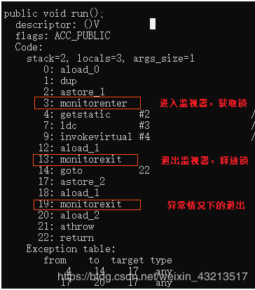
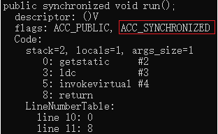

# synchronized的底层实现原理及各种优化

## synchronized的底层实现原理及各种优化

### synchronized概述

synchronized，单词译为同步，是Java的内建锁，用来确保线程安全，是解决并发问题的一种重要手段。synchronized可以保证在多线程状态下，每次仅有一个线程访问共享资源。

synchronized的作用主要有以下三个：

* 原子性：线程互斥的访问同步代码块，可以将小原子合成大原子。
* 可见性：synchronized解锁之前，必须将工作内存中的数据同步到主内存，其它线程操作该变量时每次都可以看到被修改后的值。
* 有序性：一个线程的加锁，必须等到其它线程将锁释放；一个线程要释放锁，首先要加锁。

### synchronized同步原理
synchronized仅是Java中的一个关键字，在使用的过程中并没有看到显示的加锁和解锁过程。因此有必要通过javap命令，查看相应的字节码文件。

### synchronized修饰代码块
```
public class Test implements Runnable {
    @Override
    public void run() {
        // 加锁操作
        synchronized (this) {
            System.out.println("hello");
        }
    }

    public static void main(String[] args) {
        Test test = new Test();
        Thread thread = new Thread(test);
        thread.start();
    }
}
```
javap查看相应的class文件：


可以看出在执行同步代码块之前之后都有一个monitor字样，其中前面的是monitorenter，后面的是离开monitorexit，不难想象一个线程也执行同步代码块，首先要获取锁，而获取锁的过程就是monitorenter ，在执行完代码块之后，要释放锁，释放锁就是执行monitorexit指令。

### 为什么会有两个monitorexit呢？

这个主要是防止在同步代码块中线程因异常退出，而锁没有得到释放，这必然会造成死锁（等待的线程永远获取不到锁）。因此最后一个monitorexit是保证在异常情况下，锁也可以得到释放，避免死锁。

### synchronized修饰方法
```
public class Test implements Runnable {
    @Override
    public synchronized   void run() {
            System.out.println("hello again");
    }

    public static void main(String[] args) {
        Test test = new Test();
        Thread thread = new Thread(test);
        thread.start();
    }
}
```

仅有ACC_SYNCHRONIZED这么一个标志，该标记表明线程进入该方法时，需要monitorenter，退出该方法时需要monitorexit。

### synchronized可重入的原理
重入锁是指一个线程获取到该锁之后，该线程可以继续获得该锁。底层原理维护一个计数器，当线程获取该锁时，计数器加一，再次获得该锁时继续加一，释放锁时，计数器减一，当计数器值为0时，表明该锁未被任何线程所持有，其它线程可以竞争获取锁。

## 锁优化
JDK1.6之前，synchronized是一个重量级锁，何谓重量级锁？就是多个线程竞争同一把锁，未获得锁的线程都会被阻塞，等到持有锁的线程将锁释放之后，这些线程又被唤醒。其中线程的阻塞和唤醒都与操作系统有关，是一个极其耗费CPU资源的过程。因此为了提高synchronized的性能特地在JDK1.6做了优化。据说在JDK1.4已经优化完成，不过默认是关闭状态。

在了解锁优化之前需要先了解一些概念：
### Java对象内存模型


一个Java对象由，对象标记，类型指针，真实数据，内存对齐四部分组成。

* 对象标记也称Mark Word字段，存储当前对象的一些运行时数据。
* 类型指针，JVM根据该指针确定该对象是哪个类的实例化对象。
* 真实数据自然是对象的属性值。
* 内存补齐，是当数据不是对齐数的整数倍的时候，进行调整，使得对象的整体大小是对齐数的整数倍方便寻址。典型的以空间换时间的思想。

其中对象标记和类型指针统称为Java对象头。

### Mark Word字段
Mark Word用于存储对象自身运行时的数据，如hashcode，GC分代年龄，锁状态标志位，线程持有的锁，偏向线程ID，等等。


### 为什么Java的任意对象都可以作为锁？
在Java对象头中，存在一个monitor对象，每个对象自创建之后在对象头中就含有monitor对象，monitor是线程私有的，不同的对象monitor自然也是不同的，因此对象作为锁的本质是对象头中的monitor对象作为了锁。这便是为什么Java的任意对象都可以作为锁的原因。

### 优化手段
#### 偏向锁：
偏向锁针对的是锁不存在竞争，每次仅有一个线程来获取该锁，为了提高获取锁的效率，因此将该锁偏向该线程。提升性能。

#### 偏向锁的获取：
* 1.首先检测是否为可偏向状态（锁标识是否设置成1，锁标志位是否为01）.
* 2.如果处于可偏向状态，测试Mark Word中的线程ID是否指向自己，如果是，不需要再次获取锁，直接执行同步代码。
* 3.如果线程Id，不是自己的线程Id，通过CAS获取锁，获取成功表明当前偏向锁不存在竞争，获取失败，则说明当前偏向锁存在锁竞争，偏向锁膨胀为轻量级锁。

#### 偏向锁的撤销：

偏向锁只有当出现竞争时，才会出现锁撤销。

* 1.等待一个全局安全点，此时所有的线程都是暂停的，检查持有锁的线程状态，如果能找到说明当前线程还存活，说明还在执行同步块中的代码，首相将该线程阻塞，然后进行锁升级，升级到轻量级锁，唤醒该线程继续执行代同步码。
* 2.如果持有偏向锁的线程未存活，将对象头中的线程置null，然后直接锁升级。

#### 轻量级锁：
偏向锁考虑的是不存在多个线程竞争同一把锁，而轻量级锁考虑的是，多个线程不会在同一时刻来竞争同一把锁。

#### 轻量级锁的获取：

* 1.在线程的栈帧中创建用于存储锁记录得空间，
* 2.并将Mark Word复制到锁记录中，（这一步不论是否存在竞争都可以执行）。
* 3.尝试使用CAS将对象头中得Mark word字段变成指向锁记录得指针。
* 4.操作成功，不存在锁竞争，执行同步代码。
* 5.操作失败，锁已经被其它线程抢占了，这时轻量级锁膨胀为重量级锁。

#### 轻量级锁得释放：

反替换，使用CAS将栈帧中得锁录空间替换到对象头，成功没有锁竞争，锁得以释放，失败说明存在竞争，那块指向锁记录得指针有别的线程在用，因此锁膨胀升级为重量级锁。

#### 重量级锁：
重量级锁描述同一时刻有多个线程竞争同一把锁。

当多个线程共同竞争同一把锁时，竞争失败得锁会被阻塞，等到持有锁的线程将锁释放后再次唤醒阻塞的线程，因为线程的唤醒和阻塞是一个很耗费CPU资源的操作，因此此处采取自适应自旋来获取重量级锁来获取重量级锁。

#### 锁的升级
无锁 – > 偏向锁 -----> 轻量级锁 ---- > 重量级锁

### 其它优化
#### 自旋锁：
线程未获得锁后，不是一昧的阻塞，而是让线程不断尝试获取锁。

缺点：若线程占用锁时间过长，导致CPU资源白白浪费。

解决方式：当尝试次数达到每个值得时候，线程挂起。

#### 自适应自旋锁：
自旋得次数由上一次获取锁的自旋次数决定，次数稍微延长一点点。

#### 锁消除
对于线程的私有变量，不存在并发问题，没有必要加锁，即使加锁编译后，也会去掉。

#### 锁粗化
当一个循环中存在加锁操作时，可以将加锁操作提到循环外面执行，一次加锁代替多次加锁，提升性能。